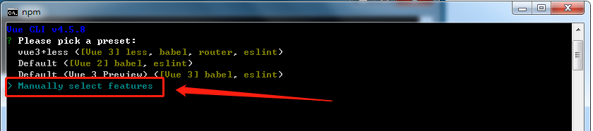
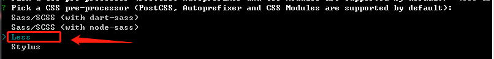
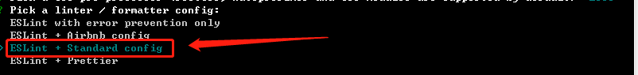
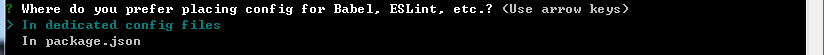
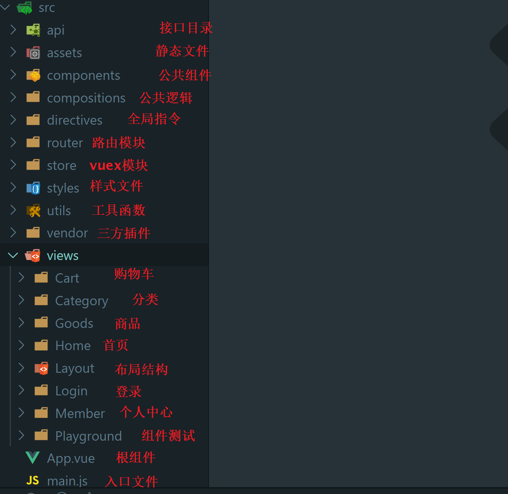
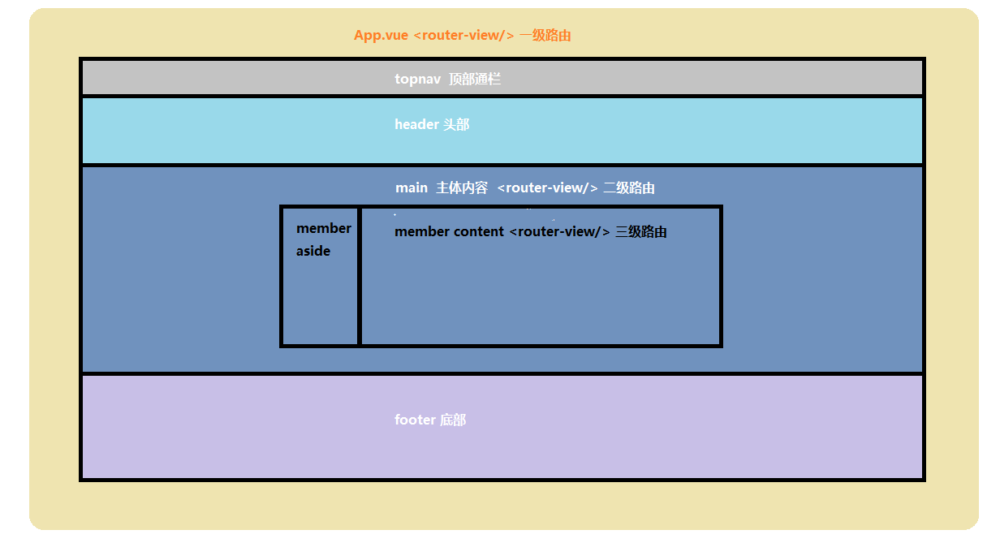

# 项目初始化

`本节目标:`  使用vue-cli初始化小兔仙项目

第一步：打开命令行窗口


- 注意，所在目录将会是你创建项目的目录

第二步：执行创建项目命令行


第三步：选择自定义创建



第四步：选中vue-router，vuex，css Pre-processors选项


第五步：选择vue3.0版本


第六步：选择hash模式的路由


第七步：选择less作为预处理器



第八步：选择 standard 标准代码风格



第九步：保存代码校验代码风格，代码提交时候校验代码风格


第十步：依赖插件或者工具的配置文件分文件保存



第十一步：是否记录以上操作，选择否


第十二步：等待安装...


最后：安装完毕


# 目录调整

`本节目标:`   熟悉变化文件并对项目功能模块进行初始拆分处理

**需要注意的一些文件有：**

`router/index.js`

```js
import { createRouter, createWebHashHistory } from 'vue-router'
const routes = []
// 创建路由实例
const router = createRouter({
  // 使用hash方式实现路由
  history: createWebHashHistory(),
  // 配置路由规则，写法和之前一样
  routes
})

export default router

```

vue3.0中createRouter来创建路由实例，createWebHashHistory代表使用hash模式的路由

2）`store/index.js`

```js
import { createStore } from 'vuex'

// 创建vuex仓库并导出
export default createStore({
  state: {
    // 数据
  },
  mutations: {
    // 改数据函数
  },
  actions: {
    // 请求数据函数
  },
  modules: {
    // 分模块
  },
  getters: {
    // vuex的计算属性
  }
})
```

vue3.0中createStore来创建vuex实例

3）`main.js`

```js
import { createApp } from 'vue'
import App from './App.vue'
import router from './router'
import store from './store'

// 创建一个vue应用实例
createApp(App).use(store).use(router).mount('#app')
```

**额外增加两个配置文件：**

1）`jsconfig.json`

```json
{
  "compilerOptions": {
    "baseUrl": ".",
    "paths": {
      "@/*": ["./src/*"],
    }
  },
  "exclude": ["node_modules", "dist"]
}
```

当我们使用路径别名@的时候可以提示路径

2）`.eslintignore`

```text
/dist
/src/vender
```

eslint在做风格检查的时候忽略 dist 和 vender 不去检查

**目录初始化**




# Vuex-持久化

> 在开发的过程中，像用户信息（名字，头像，token）需要vuex中存储且需要本地存储，再例如，购物车如果需要未登录状态下也支持，如果管理在vuex中页需要存储在本地
>

`本节目标:`  使用插件让在vuex中管理的状态数据自动同时存储在本地免去自己存储的环节

**实现步骤**

1. 安装`vuex-persistedstate` 插件
2. vuex中准备`user模块`和`cart模块`
3. 将插件配置到vuex的`plugins`选项中，配置user模块和cart模块进行状态持久化
4. 修改state数据就会触发自动同步机制，修改一下数据检测是否同步成功

**代码落地**

1）安装一个vuex的插件`vuex-persistedstate`来支持vuex的状态持久化

```bash
npm i vuex-persistedstate
```

2）在`src/store` 文件夹下新建 `modules` 文件，在 `modules` 下新建 `user.js`  和 `cart.js` 

`src/store/modules/user.js`     

```js
// 用户状态
export default {
  namespaced: true,
  state: () => ({
    id: '',
    nickname: '',
    avatar: '',
    token: '',
    mobile: ''
  })
}
```

`src/store/modules/cart.js  `    

```js
// 购物车状态
export default {
  namespaced: true,
  state: () => ({
      list:[]
  })
}
```

3）在 `src/store/index.js` 中导入 user 和 cart 模块

```js
import { createStore } from 'vuex'

import user from './modules/user'
import cart from './modules/cart'

export default createStore({
  modules: {
    user,
    cart
  }
})
```

4）使用vuex-persistedstate插件来进行持久化

```js
import { createStore } from 'vuex'
import createPersistedstate from 'vuex-persistedstate'

import user from './modules/user'
import cart from './modules/cart'

export default createStore({
  modules: {
    user,
    cart
  },
  plugins: [
    createPersistedstate({
      key: 'erabbit-client-pc-store',
      paths: ['user', 'cart']
    })
  ]
})
```

**插件说明**

1. 默认是存储在`localStorage`中，可以对存储的方法进行自定义

2. key是存储数据的键名

3. paths是存储state中的那些数据，如果是模块下具体的数据需要加上模块名称，如`user.token`

4. 修改state中的数据即可触发同步机制，可以看到本地存储数据的的变化

**测试效果** 

> user模块定义一个mutation在main.js去调用下，观察浏览器application的localStorage下是否已经有了数据

`src/store/modules/user.js`

```js
// 测试代码
mutations: {
    setUser (state) {
      state.id = 10001
    }
}
```

`src/main.js`

```js
store.commit('user/setUser')
```

# Axios封装处理

`本节目标:`    基于axios封装一个请求模块，调用接口时使用

1）安装 axios

```bash
npm i axios
```

2）新建 `src/utils/request.js` 模块

```js
import axios from 'axios'
// baseURL 超时时间配置
const instance = axios.create({})

// 全局注入token
instance.interceptors.request.use(config => {
  return config
}, e => Promise.reject(e))

// 处理返回数据 token失效跳回到登录页
instance.interceptors.response.use(
    (response)=>{ 
      return response
    },
    (error) => {
      return Promise.reject(error)
    }
)
```

3）添加基础配置

```js
import axios from 'axios'
import store from '@/store'
import router from '@/router'
// baseURL设置/超时时间设置
const instance = axios.create({
  baseURL: 'http://pcapi-xiaotuxian-front.itheima.net/',
  timeout: 5000
})

// 全局注入token
instance.interceptors.request.use(config => {
  // 1. 获取token
  const { token } = store.state.user.profile
  // 2. 请求头设置token
  if (token) config.headers.Authorization = `Bearer ${token}`
  return config
}, e => Promise.reject(e))

// token失效跳回到登录页
instance.interceptors.response.use(res => res.data, e => {
  if (e.response && e.response.status === 401) {
    const redirectUrl = encodeURIComponent(router.currentRoute.value.fullPath)
    router.push('/login?redirectUrl=' + redirectUrl)
  }
  return Promise.reject(e)
})

/**
 * @param {String} - url  请求地址
 * @param {String} - method  请求类型
 * @param {Object} - submitData  对象类型，提交数据
 */
const request = (url, method, submitData) => {
  return instance({
    url,
    method,
    [method.toLowerCase() === 'get' ? 'params' : 'data']: submitData
  })
}

export default request
```

**注意事项：**

1. 最新版本的路由获取完整路径需要加上额外的value - `router.currentRoute.value.fullPath`
2. 为避免url参数出现错误，我们使用`encodeURIComponent`方法进行编码

# 路由设计

`本节目标:`  了解项目路由层级的设计




| 路径               | 组件（功能）     | 嵌套级别 |
| ------------------ | ---------------- | -------- |
| /                  | 首页布局容器     | 1级      |
| /                  | 首页             | 2级      |
| /category/:id​      | 一级分类         | 2级      |
| /category/sub/:id  | 二级分类         | 2级      |
| /product/:id       | 商品详情         | 2级      |
| /login             | 登录             | 1级      |
| /login/callback    | 第三方登录回调   | 1级      |
| /cart              | 购物车           | 2级      |
| /member/checkout   | 填写订单         | 2级      |
| /member/pay        | 进行支付         | 2级      |
| /member/pay/result | 支付结果         | 2级      |
| /member            | 个人中心布局容器 | 2级      |
| /member            | 个人中心         | 3级      |
| /member/order      | 订单管理         | 3级      |
| /member/order/:id  | 订单详情         | 3级      |

# 调试工具配置

`本节目标:`  安装针对于vue3的开发调试环境

## 1. Dev-tools安装

> 作为vue框架官方调试工具，dev-tools提供了对于组件关系和数据状态方便的查看和调试功能，现在它也更新到了适配vue3的版本，我们这次的项目使用最新的版本进行预览调试开发

1. 打开chrome -> 更多工具 -> 扩展程序
2. 把课程资源下的dev-tools中的shell-chrome拖入即可

## 2. Logger Plugin 安装

> 当前的调试工具暂时不支持vuex的调试查看，需要我们额外进行log调试，vuex内置了一个logger模块，我们只需要引入并且注册为插件即可

```js
import { createLogger } from 'vuex'
export default createStore({
  modules: {
    user,
    cart,
    category
  },
  plugins: [
    createLogger()
  ]
})
```


安装好这个log插件之后，我们每次触发action函数和mutation函数都可以在控制台打印出当前本地提交的记录详细信息，包括`名称`  `参数`  `修改前后的state数据`