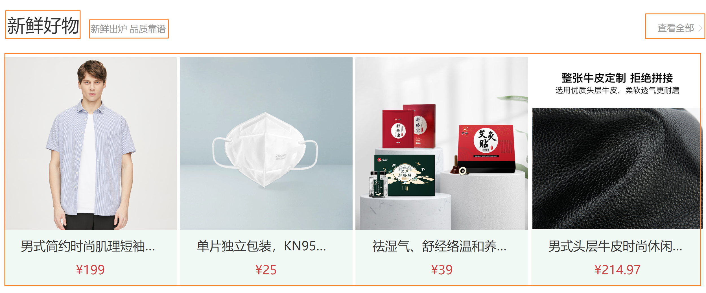

# 首页主体 - 分类和轮播图


## 整体组件拆分

`本节目标:`  从整体角度按照模块功能进行组件拆分

1）拆分左侧分类组件

`home/components/home-categroy.vue`

```html
<template>
  <div class="home-category">
     分类组件
  </div>
</template>

<script>
export default {
  name: 'HomeCategory',
  data () {
    return {
      categoryId: null
    }
  }
}
</script>
```

2）拆分banner组件

`home/components/home-banner.vue`

```html
<template>
  <div class="home-banner">
    banner
  </div>
</template>

<script>
export default {
  name: 'HomeBanner'
}
</script>

<style scoped lang='less'>
.home-banner {
  width: 1240px;
  height: 500px;
  position: absolute;
  left: 0;
  top: 0;
  z-index: 98;
}
</style>
```

3）home组件中引入使用

```html
<template>
  <div class="page-home">
    <div class="home-entry">
      <div class="container">
        <!-- 左侧分类 -->
        <HomeCategory />
        <!-- banner轮播图 -->
        <HomeBanner/>
      </div>
    </div>
  </div>
</template>
<script>
import HomeCategory from './components/home-categroy'
import HomeBanner from './components/home-banner'
export default {
  name: 'PageHome',
  components: { HomeCategory, HomeBanner }
}
</script>
```

## 左侧分类实现


### 1. 导航menu数据渲染

`src/views/home/components/home-categroy.vue`

```html
<template>
  <div class='home-category'>
    <ul class="menu">
      <li v-for="item in menuList" :key="item.id">
        <RouterLink to="/">{{item.name}}</RouterLink>
        <template v-if="item.children">
          <RouterLink
            v-for="sub in item.children"
            :key="sub.id"
            to="/"
          >
            {{sub.name}}
          </RouterLink>
        </template>
      </li>
    </ul>
  </div>
</template>

<script>
export default {
  name: 'HomeCategory',
  computed: {
    menuList () {
      const list = this.$store.state.category.list.map(item => {
        return {
          id: item.id,
          name: item.name,
          // 防止初始化没有children的时候调用slice函数报错
          children: item.children && item.children.slice(0, 2)
        }
      })
      return list
    }
  }
}
</script>
<style scoped lang='less'>
.home-category {
  width: 250px;
  height: 500px;
  background: rgba(0, 0, 0, 0.8);
  position: relative;
  z-index: 99;
  .menu {
    li {
      padding-left: 40px;
      height: 55px;
      line-height: 55px;
      &:hover {
        background: @xtxColor;
      }
      a {
        margin-right: 4px;
        color: #fff;
        &:first-child {
          font-size: 16px;
        }
      }
      .layer {
        width: 990px;
        height: 500px;
        background: rgba(255, 255, 255, 0.8);
        position: absolute;
        left: 250px;
        top: 0;
        display: none;
        padding: 0 15px;
        h4 {
          font-size: 20px;
          font-weight: normal;
          line-height: 80px;
          small {
            font-size: 16px;
            color: #666;
          }
        }
        ul {
          display: flex;
          flex-wrap: wrap;
          li {
            width: 310px;
            height: 120px;
            margin-right: 15px;
            margin-bottom: 15px;
            border: 1px solid #eee;
            border-radius: 4px;
            background: #fff;
            &:nth-child(3n) {
              margin-right: 0;
            }
            a {
              display: flex;
              width: 100%;
              height: 100%;
              align-items: center;
              padding: 10px;
              &:hover {
                background: #e3f9f4;
              }
              img {
                width: 95px;
                height: 95px;
              }
              .info {
                padding-left: 10px;
                line-height: 24px;
                overflow: hidden;
                .name {
                  font-size: 16px;
                  color: #666;
                }
                .desc {
                  color: #999;
                }
                .price {
                  font-size: 22px;
                  color: @priceColor;
                  i {
                    font-size: 16px;
                  }
                }
              }
            }
          }
        }
      }
      &:hover {
        .layer {
          display: block;
        }
      }
    }
  }
}
</style>
```

### 2. 鼠标移除layer展示

**实现步骤**

- 布局交互
  - 每个Li标签对应一个自己的layer弹层，默认全部隐藏
  - Li标签hover状态的时候让自己下面的layer弹层展示出来
- 数据渲染 - 鼠标移入显示当前对应的所有推荐
  - 鼠标经过记录ID
  - 通过ID得到分类推荐商品，使用计算属性
  - 完成模板渲染

**代码落地**

1）准备布局

```html
<!-- 弹层 -->
<div class="layer">
  <h4>分类推荐 <small>根据您的购买或浏览记录推荐</small></h4>
  <ul>
    <li v-for="i in 9" :key="i">
      <RouterLink to="/">
        
        <div class="info">
          <p class="name ellipsis-2">【定金购】严选零食大礼包（12件）</p>
          <p class="desc ellipsis">超值组合装，满足馋嘴欲</p>
          <p class="price"><i>¥</i>100.00</p>
        </div>
      </RouterLink>
    </li>
  </ul>
</div>
```

2）使用vuex中的分类数据进行渲染

添加鼠标移入事件，记录当前id

```html
<ul class="menu">
   <li v-for="item in menuList" :key="item.id" @mouseenter="categoryId=item.id">
</ul>
```

使用计算属性得到当前的分类推荐商品数据

```js
computed: {
   currCategory () {
     return this.$store.state.category.list.find(item => item.id === this.categoryId)
   }
}
```

> 可以这样测试：鼠标移入菜单，通过dev-tools调试工具查看当前计算属性的值

使用计算属性渲染模板

```html
 <!-- 弹层 -->
<div class="layer">
  <h4>分类推荐 <small>根据您的购买或浏览记录推荐</small></h4>
  <!-- 
     v-if 真实dom的加入销毁
     v-show css样式上的display转换
  -->
  <ul v-if="currCategory && currCategory.goods && currCategory.goods.length">
    <li v-for="item in currCategory.goods" :key="item.id">
      <RouterLink to="/">
        
        <div class="info">
          <p class="name ellipsis-2">{{item.name}}</p>
          <p class="desc ellipsis">{{item.desc}}</p>
          <p class="price"><i>¥</i>{{item.price}}</p>
        </div>
      </RouterLink>
    </li>
  </ul>
</div>
```

## 骨架组件封装

> 为了更好的用户体验，我们经常在数据还没正式返回之前，使用类似于占位符的UI来告知用户这里即将出现数据，以减少用户的等待焦虑感 

`本节目标:`  实现一个可定制可复用的骨架占位组件


**实现思路**

1. 搭建基础静态结构
2. 把容许用户自定义传入的属性定义为props
3. 测试组件是否按照传入的props进行展示

**代码落地**

1）定义基础骨架组件结构

`components/Skeleton/index.vue`

```html
<template>
  <div
    class="xtx-skeleton shan"
    :style="{ width: '60px', height: '30px' }"
  >
    <!-- 1 盒子-->
    <div class="block" :style="{ backgroundColor: '#efefef'}"></div>
    <!-- 2 闪效果 xtx-skeleton 伪元素 --->
  </div>
</template>
<script>
export default {
  name: 'XtxSkeleton'
}
</script>
<style scoped lang="less">
.xtx-skeleton {
  display: inline-block;
  position: relative;
  overflow: hidden;
  vertical-align: middle;
  .block {
    width: 100%;
    height: 100%;
    border-radius: 2px;
  }
}
.shan {
  &::after {
    content: "";
    position: absolute;
    animation: shan 1.5s ease 0s infinite;
    top: 0;
    width: 50%;
    height: 100%;
    background: linear-gradient(
      to left,
      rgba(255, 255, 255, 0) 0,
      rgba(255, 255, 255, 0.3) 50%,
      rgba(255, 255, 255, 0) 100%
    );
    transform: skewX(-45deg);
  }
}
@keyframes shan {
  0% {
    left: -100%;
  }
  100% {
    left: 120%;
  }
}
</style>
```

2）props设计

> 我们把骨架的宽度（width）、高度（height）、背景色（backgroundColor）定义为props，由用户自定义传入定制效果

```html
<template>
  <div
    class="xtx-skeleton shan"
    :style="{ width: width + 'px', height: height + 'px' }"
  >
    <!-- 1 盒子-->
    <div class="block" :style="{ backgroundColor: bg }"></div>
    <!-- 2 闪效果 xtx-skeleton 伪元素 --->
  </div>
</template>
<script>
export default {
  name: 'XtxSkeleton',
  // 容许定制的参数包括: 背景/宽度/高度
  props: {
    bg: {
      type: String,
      default: '#efefef'
    },
    width: {
      type: String,
      default: '100'
    },
    height: {
      type: String,
      default: '100'
    }
  }
}
</script>
```

3）测试组件props

`playground/index.vue`

```html
<!-- 骨架组件测试 -->
<XtxSkeleton width="100" height="30" bg="blue"/>
```


## 骨架组件业务使用

`本节目标:`  在分类模块中使用我们定义好的骨架组件增强用户体验

**实现思路**

1. 定义为全局组件
2. 在业务组件中根据数据是否返回来渲染不同的模板（有数据渲染正常模板，没有数据渲染骨架屏）

**代码落地**

1）以插件的形式注册为全局可用

`components/index.js`

```js
import Skeleton from './Skeleton'

export default {
  install (app) {
    app.component('XtxSkeleton', Skeleton)
  }
}
```

2）注册插件

> vue3.0之后采用链式调用的方式进行各种插件注册

`main.js`

```js
import ui from '@/components'
createApp(App).use(store).use(router).use(ui).mount('#app')
```

3）业务组件使用

```html
<!-- 正式模板 -->
<template v-if="menuList.length > 0">
  <ul class="menu">
    <li
      v-for="item in menuList"
      :key="item.id"
      @mouseenter="mouseEnter(item.id)"
    >
      <RouterLink to="/">{{ item.name }}</RouterLink>
      <template v-if="item.children">
        <RouterLink v-for="sub in item.children" :key="sub.id" to="/">
          {{ sub.name }}
        </RouterLink>
      </template>
      <!-- 弹层 -->
      <div class="layer">
        <h4>分类推荐 <small>根据您的购买或浏览记录推荐</small></h4>
        <!--
        这个表示 只有当currCategory && currCategory.goods && currCategory.goods.length 为true的时候
        ul元素才会真正渲染
        经常用在一些依赖数据不是一直存在刚开始可能为空可能为null可能为undefined
       -->
        <ul
          v-if="
            currCategoryList &&
            currCategoryList.goods &&
            currCategoryList.goods.length
          "
        >
          <li v-for="item in currCategoryList.goods" :key="item.id">
            <RouterLink to="/">
              
              <div class="info">
                <p class="name ellipsis-2">{{ item.name }}</p>
                <p class="desc ellipsis">{{ item.desc }}</p>
                <p class="price"><i>¥</i>{{ item.price }}</p>
              </div>
            </RouterLink>
          </li>
        </ul>
      </div>
    </li>
  </ul>
</template>
<!-- 骨架屏模板 -->
<template v-else>
  <ul class="menu">
    <li v-for="i in 9" :key="i">
      <XtxSkeleton
        width="40px"
        height="20px"
        style="margin-right: 5px"
        bg="rgba(255,255,255,0.2)"
      />
      <XtxSkeleton
        width="50px"
        height="20px"
        bg="rgba(255,255,255,0.2)"
        style="margin-right: 5px"
      />
      <XtxSkeleton width="50px" height="20px" bg="rgba(255,255,255,0.2)" />
    </li>
  </ul>
</template>
```

## 轮播图组件封装

> 我们接下来实现右侧banner的部分，这个部分主要是一个轮播图的展示，轮播图的实现稍稍有些复杂，所以我们按照，先实现组件，再业务使用的方式分步骤来实现


**轮播图思路分析**

1. 图片数量和操作按钮数量一致，保持一一对应关系
2. 点击操作按钮时动态记录当前应该显示的图片下标值
3. 通过控制类名的有无控制图片的显示（透明度）
4. 通过控制类名的有无控制操作按钮的样式

### 1. 组件结构搭建

`本节目标:`  搭建轮播图组件必要的静态结构

> 说明：多张轮播图片通过绝对定位放到同一个位置，先统一把透明度设置为0，统一不显示，如果某一项符合要求就加上类名fade，透明度会转成1，即会显示

1）搭建静态模板

`components/Slider/index.vue`

```html
<template>
  <div class="box" style="height:500px">
    <div class="xtx-slider">
      <ul class="slider-body">
        <li
          class="slider-item"
          v-for="(item, i) in sliders"
          :key="i"
          :class="{ fade: index === i }"
        >
          
        </li>
      </ul>
      <div class="slider-indicator">
        <span class="active"></span>
        <span></span>
      </div>
    </div>
  </div>
</template>

<script>
export default {
  name: 'XtxSlider',
  data () {
    return {
      index: 0,
      sliders: [
        {
          hrefUrl: '/#/',
          id: '630000201807155635',
          imgUrl: 'http://zhoushugang.gitee.io/erabbit-client-pc-static/images/b1.jpg'
        },
        {
          hrefUrl: '/#/',
          id: '650000201207058528',
          imgUrl: 'http://zhoushugang.gitee.io/erabbit-client-pc-static/images/b2.jpg'
        }
      ]
    }
  }
}
</script>

<style scoped lang='less'>
.xtx-slider {
  width: 100%;
  height: 100%;
  min-width: 300px;
  min-height: 150px;
  position: relative;
  .slider {
    &-body {
      width: 100%;
      height: 100%;
    }
    &-item {
      width: 100%;
      height: 100%;
      position: absolute;
      left: 0;
      top: 0;
      opacity: 0;
      transition: opacity 0.5s linear;
      &.fade {
        opacity: 1;
        z-index: 1;
      }
      img {
        width: 100%;
        height: 100%;
      }
    }
    &-indicator {
      position: absolute;
      left: 0;
      bottom: 20px;
      z-index: 2;
      width: 100%;
      text-align: center;
      span {
        display: inline-block;
        width: 12px;
        height: 12px;
        background: rgba(0, 0, 0, 0.2);
        border-radius: 50%;
        cursor: pointer;
        ~ span {
          margin-left: 12px;
        }
        &.active {
          background: #fff;
        }
      }
    }
    &-btn {
      width: 44px;
      height: 44px;
      background: rgba(0, 0, 0, 0.2);
      color: #fff;
      border-radius: 50%;
      position: absolute;
      top: 228px;
      z-index: 2;
      text-align: center;
      line-height: 44px;
      opacity: 0;
      transition: all 0.5s;
      &.prev {
        left: 20px;
      }
      &.next {
        right: 20px;
      }
    }
  }
  &:hover {
    .slider-btn {
      opacity: 1;
    }
  }
}
</style>
```

2） 渲染操作按钮

> 操作按钮的个数是跟着图片数量走的，图片有多少，按钮就有多少

```html
<div class="slider-indicator">
    <span
      v-for="(item, i) in sliders"
      :key="i"
    ></span>
</div>
```

### 2. 点击按钮切换图片显示和样式

`本节目标:`  实现点击操作小圆按钮的交互行为

1）切换图片显示

> 操作按钮点击的时候，只需要把当前点击的按钮序号交给index即可

```html
<span
  @click="index = i"
  v-for="(item, i) in sliders"
  :key="i"
></span>
```

2）更改操作图标激活样式

> 通过index匹配下标，如果相等就渲染类名`active`

```html
<span
  @click="index = i"
  v-for="(item, i) in sliders"
  :key="i"
  :class="{ active: index === i }"
></span>
```

### 3. 自动播放实现

`本节目标:`  实现轮播图的自动播放

> 核心思路：开启一个定时器，index自增
>
> 1. index自增到最大需要从零开始
> 2. 在组件卸载之前先清理一步定时器
> 3. 鼠标移入时暂停定时器，鼠标移除时再次开始定时器

```html
<template>
  <div class="box" style="height: 500px">
    <div class="xtx-slider" @mouseenter="stopLoop"  @mouseleave="startLoop">
      <ul class="slider-body">
        <li
          class="slider-item"
          v-for="(item, i) in sliders"
          :key="i"
          :class="{ fade: index === i }"
        >
          
        </li>
      </ul>
      <div class="slider-indicator">
        <span
          @click="index = i"
          v-for="(item, i) in sliders"
          :key="i"
          :class="{ active: index === i }"
        ></span>
      </div>
    </div>
  </div>
</template>

<script>
export default {
  name: 'Xtxslider',
  data () {
    return {
      index: 0, // 当前应该显示哪张图片
      sliders: [
        {
          hrefUrl: '/#/',
          id: '630000201807155635',
          imgUrl: 'http://zhoushugang.gitee.io/erabbit-client-pc-static/images/b1.jpg'
        },
        {
          hrefUrl: '/#/',
          id: '650000201207058528',
          imgUrl: 'http://zhoushugang.gitee.io/erabbit-client-pc-static/images/b2.jpg'
        }
      ]
    }
  },
  methods: {
    // 开始
    startLoop () {
      this.timer = setInterval(() => {
        this.index++
        // 如果超过最大下标值 从零开始
        if (this.index > this.sliders.length - 1) {
          this.index = 0
        }
      }, 1000)
    },
    // 暂停
    stopLoop () {
      if (this.timer) window.clearInterval(this.timer)
    }
  },
  beforeUnmount () {
    // 清除定时器
    window.clearInterval(this.timer)
  },
  mounted () {
    this.startLoop()
  }
}
</script>
```

### 4. props设计

`本节目标:`  把轮播的图片素材和是否需要开启自动轮播设计为props由用户传入定制功能

> 大家思考一下下面的情况
>
> 1. 不同的场景轮播的图片相同吗？
> 2. 有的场景需要自动轮播，有的不需要，怎么办？
>
> 为了组件更加通用，我们需要把那些可变的部分抽成props由使用者决定传入的数据

```html
<template>
  <div class="xtx-slider" @mouseenter="stopLoop" @mouseleave="startLoop">
    <ul class="slider-body">
      <li
        class="slider-item"
        v-for="(item, i) in sliders"
        :key="i"
        :class="{ fade: index === i }"
      >
        
      </li>
    </ul>
    <div class="slider-indicator">
      <span
        @click="index = i"
        v-for="(item, i) in sliders"
        :key="i"
        :class="{ active: index === i }"
      ></span>
    </div>
  </div>
</template>

<script>
export default {
  name: 'Xtxslider',
  props: {
    // 轮播素材
    sliders: {
      type: Array,
      default () {
        return []
      }
    },
    // 是否自动轮播
    autoPlay: {
      type: Boolean,
      default: false
    }
  },
  data () {
    return {
      index: 0 // 当前应该显示哪张图片
    }
  },
  methods: {
    startLoop () {
      // 如果不开启自动轮播
      if (!this.autoPlay) {
        return false
      }
      this.timer = setInterval(() => {
        this.index++
        // 如果超过最大下标值 从零开始
        if (this.index > this.sliders.length - 1) {
          this.index = 0
        }
      }, 2000)
    },
    stopLoop () {
      if (this.timer) window.clearInterval(this.timer)
    }
  },
  beforeUnmount () {
    this.stopLoop()
  },
  mounted () {
    this.startLoop()
  }
}
</script>
```

## 轮播图业务使用

`本节目标:`  在实际banner模块中使用我们封装好的轮播图组件

> 轮播图的所有功能我们都单独的实现完毕并进行了功能测试，现在我们可以在业务里使用我们的轮播图了

1）封装获取bannerApi

`src/api/home.js`

```js
/**
 * @description: 获取banner图
 * @param {*}
 * @return {*}
 */
export const findBanner = () => {
  return request('home/banner', 'get')
}

```

2）业务组件使用

`views/Home/components/home-banner.vue`

```html
<template>
  <div class="home-banner">
    <!-- 传入数据 开启自动轮播 -->
    <XtxSlider :sliders="sliders" :autoPlay="true" />
  </div>
</template>

<script>
// 准备接口
import { findBanner } from '@/api/home'
export default {
  name: 'HomeBanner',
  data () {
    return {
      sliders: [] // banner列表
    }
  },
  async created () {
    const data = await findBanner()
    this.sliders = data.result
  }
}
</script>

<style scoped lang='less'>
.home-banner {
  width: 1240px;
  height: 500px;
  position: absolute;
  left: 0;
  top: 0;
  z-index: 98;
}
</style>
```

# 首页主体 - 面板封装

> 新鲜好物、人气推荐俩个模块的布局结构上非常类似，我们可以抽离出一个通用的面板组件来进行复用

`本节目标:`  封装一个通用的面板组件



**思路分析**

1. 图中标出的四个部分都是可能会发生变化的，需要我们定义为可配置
2. 主标题和副标题由于是纯文本，我们定义成props即可
3. 右侧内容和主体内容由于可能会传入较为复杂的自定义模板，我们定义成slot利用插槽渲染

**代码落地**

1）组件编写

`Home/components/home-panel.vue`

```html
<template>
  <div class="home-panel">
    <div class="container">
      <div class="head">
        <h3>
          {{ title }}<small>{{ subTitle }}</small>
        </h3>
        <!-- 右侧内容区域 -->
        <slot name="right" />
      </div>
      <!-- 主体内容区域 -->
      <slot />
    </div>
  </div>
</template>

<script>
export default {
  name: 'HomePanel',
  props: {
    // 主标题
    title: {
      type: String,
      default: ''
    },
    // 副标题
    subTitle: {
      type: String,
      default: ''
    }
  }
}
</script>

<style scoped lang='less'>
.home-panel {
  background-color: #fff;
  .head {
    padding: 40px 0;
    display: flex;
    align-items: flex-end;
    h3 {
      flex: 1;
      font-size: 32px;
      font-weight: normal;
      margin-left: 6px;
      height: 35px;
      line-height: 35px;
      small {
        font-size: 16px;
        color: #999;
        margin-left: 20px;
      }
    }
  }
}
</style>
```

2）组件测试

`views/playground/index.vue`

```html
<template>
  <!-- 面板组件测试 -->
  <home-panel title="人气推荐" sub-title="人气爆款 不容错过">
    <template #right>
      <span>查看更多</span>
    </template>
    <template>
       <div>我是主体内容</div>
    </template>
  </home-panel>
</template>

<script>
import HomePanel from '@/views/Home/components/home-panel'
export default {
  components: {
    HomePanel
  }
}
</script>
```


# 首页主体 - 查看更多

`本节目标:`  封装一个支持自定义跳转路径的查看全部组件


> 查看全部组件可定制的内容非常少，只有一个path路径是根据不同模板来进行不同传入的，所以我们只需要将path设计为prop即可

1）定义组件

```html
<template>
  <RouterLink :to="path" class="xtx-more">
    <span>查看全部</span>
    <i class="iconfont icon-angle-right"></i>
  </RouterLink>
</template>

<script>
export default {
  name: 'XtxMore',
  props: {
    path: {
      type: String,
      default: '/'
    }
  }
}
</script>

<style scoped lang='less'>
.xtx-more {
  margin-bottom: 2px;
  span {
    font-size: 16px;
    vertical-align: top;
    margin-right: 4px;
    color: #999;
  }
  i {
    font-size: 14px;
    vertical-align: top;
    position: relative;
    top: 2px;
    color: #ccc;
  }
  &:hover {
    span,i {
      color: @xtxColor;
    }
  }
}
</style>
```

2）注册为全局可用

`components/index.js`

```js
import More from './More'
export default {
  install (app) {
    app.component('XtxMore', More)
  }
}
```

3）测试组件

`views/playground/index.vue`

```html
<!-- 测试查看更多 -->
<xtx-more path="/login"></xtx-more>
```


# 首页主体 - 新鲜好物

`本节目标:`  使用封装好的面板组件实现新鲜好物数据渲染显示


1）封装接口

`api/home.js`

```js

/**
 * @description: 获取新鲜好物
 * @param {*}
 * @return {*}
 */
export const findNew = () => {
  return request('home/new', 'get')
}

```

2）使用面板组件渲染

`Home/components/home-new.vue`

```html

 <template>
  <!--
    面板组件
      主标题
      副标题
      右侧内容 自定义模板 查看更多组件
      主体内容 四个商品
     -->
  <HomePanel title="新鲜好物" sub-title="新鲜出炉 品质靠谱">
    <template #right>
      <xtx-more></xtx-more>
    </template>
    <template #default>
      <ul ref="pannel" class="goods-list">
        <li v-for="item in list" :key="item.id">
          <RouterLink to="/">
            
            <p class="name">{{ item.name }}</p>
            <p class="price">&yen;{{ item.price }}</p>
          </RouterLink>
        </li>
      </ul>
    </template>
  </HomePanel>
</template>

<script>
import HomePanel from './home-panel'
import { findNew } from '@/api/home'
import { onMounted, ref } from 'vue'
export default {
  components: {
    HomePanel
  },
  setup () {
    // 1.定义响应式数据
    const list = ref([])
    // 2.定义函数 函数内部调用接口函数
    async function getList () {
      const res = await findNew()
      console.log(res)
      list.value = res.data.result
    }
    // 3. onMounted中调用getList
    onMounted(() => {
      getList()
    })
    return {
      list
    }
  }
}
</script>

<style scoped lang='less'>
.goods-list {
  display: flex;
  justify-content: space-between;
  height: 406px;
  li {
    width: 306px;
    height: 406px;
    background: #f0f9f4;
    img {
      width: 306px;
      height: 306px;
    }
    p {
      font-size: 22px;
      padding-top: 12px;
      text-align: center;
      text-overflow: ellipsis;
      overflow: hidden;
      white-space: nowrap;
    }
    .price {
      color: @priceColor;
    }
  }
}
</style>
```

3）home组件首页使用

```html
<template>
  <div class="page-home">
    <div class="home-entry">
      <div class="container">
        <!-- 左侧分类 -->
        <HomeCategory />
        <!-- banner轮播图 -->
        <HomeBanner/>
        <!-- 新鲜好物 -->
        <HomeNew/>
      </div>
    </div>
  </div>
</template>
<script>
import HomeCategory from './components/home-categroy'
import HomeBanner from './components/home-banner'
// 新鲜好物
import HomeNew from './components/home-new'
export default {
  name: 'PageHome',
  components: { HomeCategory, HomeBanner, HomeNew }
}
</script>
```


# 首页主体 - 人气推荐

`本节目标:`  使用封装好的面板组件实现新鲜好物数据渲染显示


1）封装接口

`api/home.js`

```js
/**
 * @description: 获取人气推荐
 * @param {*}
 * @return {*}
 */
export const findHot = () => {
  return request('home/hot', 'get')
}
```

2）使用面板组件渲染

`Home/components/home-hot.vue`

```html
<template>
  <HomePanel title="人气推荐" sub-title="人气爆款 不容错过">
    <ul  class="goods-list">
      <li v-for="item in goods" :key="item.id">
        <RouterLink to="/">
          
          <p class="name">{{item.title}}</p>
          <p class="desc">{{item.alt}}</p>
        </RouterLink>
      </li>
    </ul>
  </HomePanel>
</template>

<script>
import HomePanel from './home-panel'
import { findHot } from '@/api/home'
export default {
  name: 'HomeHot',
  components: { HomePanel },
  data () {
    return {
      goods: []
    }
  },
  async created () {
    const data = await findHot()
    this.goods = data.result
  }
}
</script>

<style scoped lang='less'>
.goods-list {
  display: flex;
  justify-content: space-between;
  height: 426px;
  li {
    width: 306px;
    height: 406px;
    img {
      width: 306px;
      height: 306px;
    }
    p {
      font-size: 22px;
      padding-top: 12px;
      text-align: center;
    }
    .desc {
      color: #999;
      font-size: 18px;
    }
  }
}
</style>
```

3）home组件首页使用

```html
<template>
  <div class="page-home">
    <div class="home-entry">
      <div class="container">
        <!-- 左侧分类 -->
        <HomeCategory />
        <!-- banner轮播图 -->
        <HomeBanner/>
        <!-- 新鲜好物 -->
        <HomeNew/>
        <!-- 人气推荐 -->
        <HomeHot/>
      </div>
    </div>
  </div>
</template>
<script>
import HomeCategory from './components/home-categroy'
import HomeBanner from './components/home-banner'
import HomeNew from './components/home-new'
import HomeHot from './components/home-hot'
export default {
  name: 'PageHome',
  components: { HomeCategory, HomeBanner, HomeNew, HomeHot }
}
</script>
```

# 首页主体 - 组件数据懒加载

## 1. 理解组件数据懒加载

`本节目标:`  从实际角度理解组件数据懒加载指的是什么

**思考俩个问题**

1. 我们一般的数据请求在哪里发起？
2. 生命周期钩子函数的特点是什么？

> 我们现在每个组件中发起ajax请求一般都是在created钩子函数或者mounted钩子函数中发起的，生命周期有一个特点：**跟着组件的初始化过程走自动执行，开发者无法控制**，所以我们现在首页中的人气推荐/新鲜好物等模块中的请求一旦组件渲染ajax请求就会发起，而电商类的首页页面一般会很长，有的模块组件甚至都不会出现在视口中，这样无脑的加载数据，显然是不合理的存在浪费，为了解决这个问题，我们引入了组件数组懒加载

**结论（何为组件数据懒加载？）**

只有组件正式进入到视口中时，才把组件内部的ajax请求发起，否则不请求数据

## 2. 如何判断组件进入视口

`本节目标:`  了解如何通过技术手段得知组件进入了视口

**技术方案：**

我们可以使用 `@vueuse/core` 中的 `useIntersectionObserver` 来实现监听组件进入可视区域行为，需要配合vue3.0的组合API的方式才能实现

https://vueuse.org/core/useIntersectionObserver/

先分析下这个`useIntersectionObserver` 函数：

```js
const { stop } = useIntersectionObserver(
  target,
  ([{ isIntersecting }], observerElement) => {
    targetIsVisible.value = isIntersecting
  }
)
/*
  1.stop 一个可执行的函数用来停止监听行为
  2.target 一个由ref api调用之后形成的RefImpl对象 也可以是一个dom对象
  3.isIntersecting 一个类型为布尔值的数据 当被监听元素进入视口区域时为true,离开视口区域时为false
*/
```

我们以`人气推荐模块`为例演示一下这个函数的使用方式

1）通过ref属性获得组件实例

```html
<template>
  <!-- 和模板关联 -->
  <HomePanel ref="hotRef" title="人气推荐" sub-title="人气爆款 不容错过">
    ...
  </HomePanel>
</template>

<script>
export default {
  name: 'HomeHot',
  components: { HomePanel },
  setup () {
    // 1.定义要监听的目标dom容器
    const targetRef = ref(null)
    onMounted(() => {
      console.log(hotRef)
    })
    // 2.return出去
    return {
      targetRef
    }
  },
  data () {
    return {
      goods: []
    }
  },
  async created () {
    const data = await findHot()
    this.goods = data.result
  }
}
</script>
```

2）使用`useIntersectionObserver`监听函数

```js
export default {
  name: 'HomeHot',
  components: { HomePanel },
  setup () {
    const targetRef = ref(null)
    onMounted(() => {
      console.log(targetRef)
    })
    useIntersectionObserver(
      // target 是观察的目标dom容器，必须是dom容器，而且是vue3.0方式绑定的dom对象
      targetRef,
      // isIntersecting 是否进入可视区域，true是进入 false是移出
      // observerElement 被观察的dom
      ([{ isIntersecting }], observerElement) => {
        // 在此处可根据isIntersecting来判断，然后做业务
        console.log(isIntersecting)
      }
    )
    return {
      targetRef
    }
  }
}
```

3）测试效果

打开浏览器，人气推荐模块还未进入到视口，打印值为false，然后我们滑动页面，当`人气模块`组件进入视口中时，再次发生打印，此时为true，到此我们就可以判断组件进入和移除视口了

**特别注意：**每次被监听的dom进入移出视口时都会触发一次，而不是只触发一次

## 3. 具体业务实现

`本节目标:`  利用我们捋清楚的发送请求的位置实现业务数据拉取完成实际业务功能

**实现步骤**

1. 把先前在onMouted钩子里发送的ajax请求在`isIntersecting` 为true时触发
2. 一旦触发一次之后停止监听，防止接口重复调用

**代码落地**

```jsx
<HomePanel ref="target" title="人气推荐" sub-title="人气爆款 不容错过"></HomePanel>

export default {
  name: 'HomeHot',
  components: { HomePanel },
  setup () {
    const list = ref([])
    async function getList () {
      const res = await findHot()
      list.value = res.data.result
    }
    const target = ref(null)
    const { stop } = useIntersectionObserver(
      // target 是观察的目标dom容器，必须是dom容器，而且是vue3.0方式绑定的dom对象
      target,
      // isIntersecting 是否进入可视区域，true是进入 false是移出
      // observerElement 被观察的dom
      ([{ isIntersecting }], observerElement) => {
        // 在此处可根据isIntersecting来判断，然后做业务
        if (isIntersecting) {
          // 停止监听防止重复调用接口
          stop()
          console.log('正式发起接口请求')
          getList()
        }
      }
    )
    return {
      target,
      goodsRef
    }
}
```

## 4. 组件数据懒加载逻辑复用

`本节目标:`  抽离组件数据懒加载可复用的逻辑

### 现存问题

> 首页中，很多地方都应该使用组件数据懒加载这个功能，不管是哪个模块使用，下面代码都会重复书写，事实上，唯一可能会随着业务使用发生变化的是getList函数也就是ajax接口的调用，其余的部分我们进行重复使用，抽离为可复用逻辑


### 抽离通用逻辑

1）抽离逻辑

`compositions/index.js`

```js
// 封装监听目标元素进入视口的通用逻辑
import { useIntersectionObserver } from '@vueuse/core'
import { ref } from 'vue'
export function useObserver (apiFn) {
  // 监听的目标对象
  const target = ref(null)
  // stop 是一个可执行的方法 调用就会停止监听
  // 不管元素进入还是离开视口区域都不会再执行回调函数
  // 注意：不会只监听一次  只有进入视口或者离开视口回调函数都会执行
  const { stop } = useIntersectionObserver(
    // 监听目标元素
    target,
    ([{ isIntersecting }], observerElement) => {
      // isIntersecting 布尔值 代表当前监听的元素是否进入视口区域
      console.log(isIntersecting)
      // ...判断  一旦为true 就发送ajax
      if (isIntersecting) {
        // 发起网络请求
        apiFn()
        // 请求数据完毕停止监听
        stop()
      }
    }
  )
  return {
    target
  }
}

/**
 * 组件数据懒加载
 *  1.解决的问题
 *    网络层面的优化 只有组件进入视口才会获取数据 (渲染层面优化)
 *
 *  2.实现思路
 *    监听组件是否已经进入到视口区域 在进入之后发送ajax
 *
 *  3.技术手段
 *    useIntersectionObserver
 *    对目标元素进行监听  然后满足条件执行回调  回调中就可以发送ajax
 *
 *  4.注意点
 *    1. target ref对象
 *    2. 正常情况下 每次进入视口移出视口都会再次执行回调
 *    3. 正常逻辑下 不应执行多次  可以使用stop在执行了首次加载之后 停止监听
 */
```

2）业务改写

```html
<script>
import HomePanel from './home-panel'
import { findHot } from '@/api/home'
import { ref } from 'vue'
import { useObserver } from '@/compositions'
export default {
  name: 'HomeHot',
  components: { HomePanel },
  setup () {
    const list = ref([])
    async function getList () {
      const res = await findHot()
      list.value = res.data.result
    }
    const { target } = useObserver(getList)
    return {
      list,
      target
    }
  }
}
</script>
```

# 首页主体 - 商品区块

`本节目标:`  实现商品区域的结构布局和数据渲染


**实现步骤**

1. 准备一个商品盒子组件 `home-goods` 展示单个商品
2. 定义产品区块组件 `home-product` 使用 `home-goods` 完成基础布局
3. 在首页中使用 `home-product` 组件
4. 定义API函数，获取数据，进行渲染
5. 处理板块需要进入可视区才能加载数据问题

**代码落地**

1）新建单个商品组件

`src/views/home/components/home-goods.vue`

```vue
<template>
  <div class="goods-item">
    <RouterLink to="/" class="image">
      
    </RouterLink>
    <p class="name ellipsis-2">美威 智利原味三文鱼排 240g/袋 4片装</p>
    <p class="desc">海鲜年货</p>
    <p class="price">&yen;108.00</p>
    <div class="extra">
      <RouterLink to="/">
        <span>找相似</span>
        <span>发现现多宝贝 &gt;</span>
      </RouterLink>
    </div>
  </div>
</template>

<script>
export default {
  name: 'HomeGoods'
}
</script>

<style scoped lang='less'>
.goods-item {
  width: 240px;
  height: 300px;
  padding: 10px 30px;
  position: relative;
  overflow: hidden;
  border: 1px solid transparent;
  transition: all .5s;
  .image {
    display: block;
    width: 160px;
    height: 160px;
    margin: 0 auto;
    img {
      width: 100%;
      height: 100%;
    }
  }
  p {
    margin-top: 6px;
    font-size: 16px;
    &.name {
      height: 44px;
    }
    &.desc {
      color: #666;
      height: 22px;
    }
    &.price {
      margin-top: 10px;
      font-size: 20px;
      color: @priceColor;
    }
  }
  .extra {
    position: absolute;
    left: 0;
    bottom: 0;
    height: 86px;
    width: 100%;
    background: @xtxColor;
    text-align: center;
    transform: translate3d(0,100%,0);
    transition: all .5s;
    span {
      display: block;
      color: #fff;
      width: 120px;
      margin: 0 auto;
      line-height: 30px;
      &:first-child {
        font-size: 18px;
        border-bottom:1px solid #fff;
        line-height: 40px;
        margin-top: 5px;
      }
    }
  }
  &:hover {
    border-color: @xtxColor;
    .extra {
      transform: none;
    }
  }
}
</style>
```

2）新建产品区块组件

`src/views/home/components/home-product.vue`

```vue
<template>
  <div class="home-product">
    <!-- 面板组件 -->
    <HomePanel title="生鲜" v-for="i in 4" :key="i">
      <template #right>
        <div class="sub">
          <RouterLink to="/">海鲜</RouterLink>
          <RouterLink to="/">水果</RouterLink>
          <RouterLink to="/">蔬菜</RouterLink>
          <RouterLink to="/">水产</RouterLink>
          <RouterLink to="/">禽肉</RouterLink>
        </div>
        <XtxMore />
      </template>
      <div class="box">
        <RouterLink class="cover" to="/">
          
          <strong class="label">
            <span>生鲜馆</span>
            <span>全场3件7折</span>
          </strong>
        </RouterLink>
        <ul class="goods-list">
          <li v-for="i in 8" :key="i">
            <!-- 商品组件 -->
            <HomeGoods />
          </li>
        </ul>
      </div>
    </HomePanel>
  </div>
</template>

<script>
import HomePanel from './home-panel'
import HomeGoods from './home-goods'
export default {
  name: 'HomeProduct',
  components: { HomePanel, HomeGoods }
}
</script>

<style scoped lang='less'>
.home-product {
  background: #fff;
  height: 2900px;
  .sub {
    margin-bottom: 2px;
    a {
      padding: 2px 12px;
      font-size: 16px;
      border-radius: 4px;
      &:hover {
        background: @xtxColor;
        color: #fff;
      }
      &:last-child {
        margin-right: 80px;
      }
    }
  }
  .box {
    display: flex;
    .cover {
      width: 240px;
      height: 610px;
      margin-right: 10px;
      position: relative;
      img {
        width: 100%;
        height: 100%;
      }
      .label {
        width: 188px;
        height: 66px;
        display: flex;
        font-size: 18px;
        color: #fff;
        line-height: 66px;
        font-weight: normal;
        position: absolute;
        left: 0;
        top: 50%;
        transform: translate3d(0,-50%,0);
        span {
          text-align: center;
          &:first-child {
            width: 76px;
            background: rgba(0,0,0,.9);
          }
          &:last-child {
            flex: 1;
            background: rgba(0,0,0,.7);
          }
        }
      }
    }
    .goods-list {
      width: 990px;
      display: flex;
      flex-wrap: wrap;
      li {
        width: 240px;
        height: 300px;
        margin-right: 10px;
        margin-bottom: 10px;
        &:nth-last-child(-n+4) {
          margin-bottom: 0;
        }
        &:nth-child(4n) {
          margin-right: 0;
        }
      }
    }
  }
}
</style>
```

3）home组件中使用

`src/views/home/index.vue`

```html
<template>
  <div class="page-home">
    <div class="home-entry">
      <div class="container">
        <!-- 左侧分类 -->
        <HomeCategory />
        <!-- banner轮播图 -->
        <HomeBanner/>
        <!-- 新鲜好物 -->
        <HomeNew/>
        <!-- 人气推荐 -->
        <HomeHot/>
        <!-- 商品模块 -->
        <HomeProduct/>
      </div>
    </div>
  </div>
</template>
<script>
import HomeCategory from './components/home-categroy'
import HomeBanner from './components/home-banner'
import HomeNew from './components/home-new'
import HomeHot from './components/home-hot'
// 引入
import HomeProduct from './components/home-product'
export default {
  name: 'PageHome',
  components: { HomeCategory, HomeBanner, HomeNew, HomeHot, HomeProduct }
}
</script>
```

4）获取数据渲染

- 定义API   `src/api/home.js`

```js
/**
 * @description: 获取所有商品模块
 * @param {*}
 * @return {*}
 */
export const findGoods = () => {
  return request('home/goods', 'get')
}
```

- 进行渲染

`home/components/home-product.vue`

```html
<template>
  <div class="home-product">
    <HomePanel :title="cate.name" v-for="cate in goodsProduct" :key="cate.id">
      <template v-slot:right>
        <div class="sub">
          <RouterLink v-for="sub in cate.children" :key="sub.id" to="/">{{
            sub.name
          }}</RouterLink>
        </div>
        <XtxMore />
      </template>
      <div class="box">
        <RouterLink class="cover" to="/">
          
          <strong class="label">
            <span>{{ cate.name }}馆</span>
            <span>{{ cate.saleInfo }}</span>
          </strong>
        </RouterLink>
        <ul class="goods-list">
          <!-- 把数据通过props传入HomeGoods组件 -->
          <li v-for="item in cate.goods" :key="item.id">
            <HomeGoods :goods="item" />
          </li>
        </ul>
      </div>
    </HomePanel>
  </div>
</template>

<script>
import HomePanel from './home-panel'
import HomeGoods from './home-goods'
import { findGoods } from '@/api/home'
import { onMounted, ref } from 'vue'
export default {
  name: 'HomeProduct',
  components: { HomePanel, HomeGoods },
  setup () {
    // 定义ref数据
    const goodsProduct = ref([])
    // 定义获取数据函数
    async function getGoods () {
      const { result } = await findGoods()
      goodsProduct.value = result
    }
    // mounted钩子函数中调用
    onMounted(() => {
      getGoods()
    })
    // return出去供模板使用
    return { goodsProduct }
  }
}
</script>
```

`home/components/home-goods.vue`

```html
<template>
  <div class="goods-item">
    <RouterLink to="/" class="image">
      
    </RouterLink>
    <p class="name ellipsis-2">{{ goods.name }}</p>
    <p class="desc">{{ goods.tag }}</p>
    <p class="price">&yen;{{ goods.price }}</p>
    <div class="extra">
      <RouterLink to="/">
        <span>找相似</span>
        <span>发现现多宝贝 &gt;</span>
      </RouterLink>
    </div>
  </div>
</template>

<script>
export default {
  name: 'HomeGoods',
  props: {
    goods: {
      type: Object,
      default: () => { }
    }
  }
}
</script>
```

5）组件数据懒加载

```html
<template>
  <!-- 创建绑定 -->
  <div class="home-product" ref="targetRef">
    ...
  </div>
</template>

<script>
import HomePanel from './home-panel'
import HomeGoods from './home-goods'
import { findGoods } from '@/api/home'
import { ref } from 'vue'
import { useObserver } from '@/compositions/index'
export default {
  name: 'HomeProduct',
  components: { HomePanel, HomeGoods },
  setup () {
    // 任务: 把这里变成组件懒加载形式
    const goodsList = ref([])
    async function getGoodsList () {
      const res = await findGoods()
      goodsList.value = res.data.result
    }
    const { target } = useObserver(getGoodsList)
    return {
      goodsList,
      target
    }
  }
}
</script>

```

6）加载时机优化

> 存在问题：产品区域需要滚动比较多才能去加载数据
>
> 解决方案：加一个`threshold`参数即可

```js
// 封装监听目标元素进入视口的通用逻辑
import { useIntersectionObserver } from '@vueuse/core'
import { ref } from 'vue'
export function useObserver (apiFn) {
  // 监听的目标对象
  const target = ref(null)
  // stop 是一个可执行的方法 调用就会停止监听
  // 不管元素进入还是离开视口区域都不会再执行回调函数
  // 注意：不会只监听一次  只有进入视口或者离开视口回调函数都会执行
  const { stop } = useIntersectionObserver(
    // 监听目标元素
    target,
    ([{ isIntersecting }], observerElement) => {
      // isIntersecting 布尔值 代表当前监听的元素是否进入视口区域
      console.log(isIntersecting)
      // ...判断  一旦为true 就发送ajax
      if (isIntersecting) {
        // 发起网络请求
        apiFn()
        // 请求数据完毕停止监听
        stop()
      }
    },
    // 进入可视区域的比例是多少才执行回调 0-1 值越大 代表需要进入的面积越大
    { threshold: 0 }
  )
  return {
    target
  }
}
```

说明：threshold 容器和可视区交叉的占比（进入的面积/容器完整面积） 取值为0-1 之间，默认比0大，所以需要滚动较多才能触发进入可视区域事件

# 首页主体 - 图片懒加载

> 商品区块虽然我们已经做了组件数据懒加载，但是由于它内部的图片非常多，如果一个组件内图片非常多的时候，我们依旧有必要做一下图片懒加载，把网络性能优化做到极致

**实现思路：** 只有成功进入到视口区域的img图片才正式发起图片网络请求

1）定义懒加载全局指令

`scr/directive/index.js`

```js

// vue3中 createApp方法每执行一次 都会生成一个独立的vue应用实例
// 而每一个独立的应用实例 各自拥有自己的`作用域` 并不会共享全局指令

// 如果想共享 这里必须使用由main.js中 有createApp方法产出的app实例

// 解决思路 把全局指令的定义写成插件的形式
// 依靠注册插件时的use方法就可以拿到main.js中的唯一实例

// 定制图片懒加载指令
// 1.引进来默认图片 在图片发生加载错误时使用
import defaltImg from '@/assets/images/200.png'
// 引入监听是否进入视口
import { useIntersectionObserver } from '@vueuse/core'
export default {
  // 需要拿到main.js中由createApp方法产出的app实例对象
  install (app) {
    console.log('全局指令位置要使用mainjs', app)
    // app实例身上有我们想要的全局注册指令方法  调用即可
    app.directive('imgLazy', {
      mounted (el, binding) {
        // el:img dom对象
        // binding.value  图片url地址
        // 使用vueuse/core提供的监听api 对图片dom进行监听 正式进入视口才加载
        // img.src = url
        console.log(el, binding)
        const { stop } = useIntersectionObserver(
          // 监听目标元素
          el,
          ([{ isIntersecting }], observerElement) => {
            console.log(isIntersecting)
            if (isIntersecting) {
              // 当图片url无效加载失败的时候使用默认图片替代
              el.onerror = function () {
                el.src = defaltImg
              }
              el.src = binding.value // 
              stop()
            }
          },
          // 刚进入视口区域就立刻执行回调 0 - 1 
          { threshold: 0 }
        )
      }
    })
  }
}

```

2）注册全局指令

`main.js`

```js
import defineDirective from '@/directives'
createApp(App).use(store).use(router).use(componentPlugin).use(directivePlugin).mount('#app')
```

3）商品模块使用指令改写img位置

`home-product.vue`

```html

```

`home-goods.vue`

```html

```

4）测试是否成功懒加载

> 打开chrome调试面板，network下的img请求，有没有随着滚动行为的发生图片的请求逐渐变多了起来


坑记录：

```
1. parameter 1 is not of type 'Element'
IntersectionObserver 这个函数的第一个参数要求必须是一个dom对象 元素节点对象

2. useIntersectionObserver 方法 第一个参数target 监听目标对象
   如果你传入的是一个真实dom <div ref="target"> 直接使用value
   如果你传入的是一个组件实例 <HomePanel ref="target"/>  会使用组件对象身上的$el属性 作为target参数的值
   
3. 当组件多了一行注释节点的时候 ref=“target” 拿到的不再是元素节点而是一个文本节点
```

