# 基础布局和路由

`本节目标:`   完成商品详情的基础布局和路由配置


1）新建页面组件

`src/views/goods/index.vue`

```vue
<template>
  <div class='xtx-goods-page'>
    <div class="container">
      <!-- 面包屑 -->
      <XtxBread>
        <XtxBreadItem to="/">首页</XtxBreadItem>
        <XtxBreadItem to="/">手机</XtxBreadItem>
        <XtxBreadItem to="/">华为</XtxBreadItem>
        <XtxBreadItem to="/">p30</XtxBreadItem>
      </XtxBread>
      <!-- 商品信息 -->
      <div class="goods-info"></div>
      <!-- 商品详情 -->
      <div class="goods-footer">
        <div class="goods-article">
          <!-- 商品+评价 -->
          <div class="goods-tabs"></div>
        </div>
        <!-- 24热榜+专题推荐 -->
        <div class="goods-aside"></div>
      </div>
    </div>
  </div>
</template>

<script>
export default {
  name: 'XtxGoodsPage'
}
</script>

<style scoped lang='less'>
.goods-info {
  min-height: 600px;
  background: #fff;
}
.goods-footer {
  display: flex;
  margin-top: 20px;
  .goods-article {
    width: 940px;
    margin-right: 20px;
  }
  .goods-aside {
    width: 280px;
    min-height: 1000px;
  }
}
.goods-tabs {
  min-height: 600px;
  background: #fff;
}
.goods-warn {
  min-height: 600px;
  background: #fff;
  margin-top: 20px;
}
</style>
```

2）路由配置

`src/router/index.js`

```js
const Goods = () => import('@/views/Goods/index')
children: [
  { path: '/', component: Home },
  { path: '/category/:id', component: TopCategory },
  { path: '/category/sub/:id', component: SubCategory },
  {
        path: '/goods/:id',
        component: Goods
    }
]
```

3）测试路由跳转

> 给新鲜好物模块，新增路由跳转链接

`views/Home/components/home-new.vue`

```html
<RouterLink :to="`/goods/${item.id}`">
  
  <p class="name">{{ item.name }}</p>
  <p class="price">&yen;{{ item.price }}</p>
</RouterLink>
```

# 面包屑导航渲染

`本节目标:`   使用真实数据渲染面包屑导航

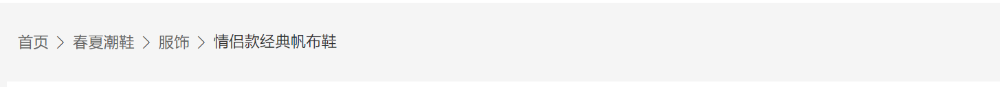

**实现步骤**

1. 定义获取商品详情API函数
2. 在组件setup中获取商品详情数据

**代码落地**

1）封装API函数 

`src/api/goods.js`

```js
import request from '@/utils/request'
/**
 * @description: 获取详情数据
 * @param {*} id
 * @return {*}
 */
export const findGoods = (id) => {
  return request('/goods', 'get', { id })
}
```

2）setup函数中书写逻辑  

`src/views/goods/index.vue`

```js
import { findGoods } from '@/api/goods'
import { ref, watch, onMounted } from 'vue'
import { useRoute } from 'vue-router'

setup () {
    const route = useRoute()
    const goods = ref({})
    async function getGoods () {
      const res = await findGoods(route.params.id)
      goods.value = res.data.result
    }
    onMounted(()=>{
       getGoods()
    })
    return { goods }
 }
```

3）渲染面包屑

```vue
<!-- 面包屑 -->
  <XtxBread v-if="goods.categories">
    <XtxBreadItem to="/">首页</XtxBreadItem>
    <XtxBreadItem :to="`/category/${goods.categories[1].id}`">
      {{goods.categories[1].name}}
    </XtxBreadItem>
    <XtxBreadItem :to="`/category/sub/${goods.categories[0].id}`">
      {{goods.categories[0].name}}
    </XtxBreadItem>
    <XtxBreadItem to="/">
      {{goods.name}}
    </XtxBreadItem>
  </XtxBread>
```

4）防止报错，加载完成goods再显示所有内容!!

```vue
<XtxBread v-if="goods.categories">
```


# 商品主要信息区域

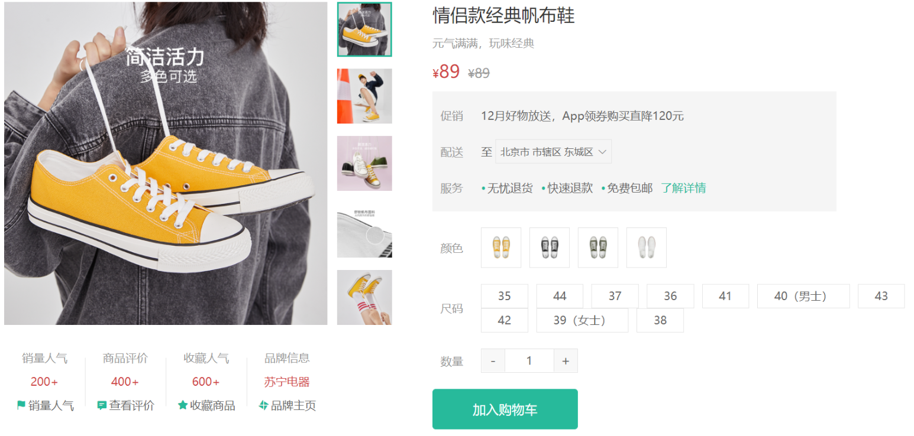

## 整体结构拆分

```html
<!-- 商品信息 -->
<div class="goods-info">
    <!-- 图片预览区 -->
    <div class="media"></div>
    <!-- 商品信息区 -->
    <div class="spec"></div>
</div>
<style>
  .goods-info {
      min-height: 600px;
      background: #fff;
      display: flex;
      .media {
        width: 580px;
        height: 600px;
        padding: 30px 50px;
      }
      .spec {
        flex: 1;
        padding: 30px 30px 30px 0;
      }
    }
</style>
```

## 图片预览组件

`本节目标:`  完成商品图片的预览和切换功能

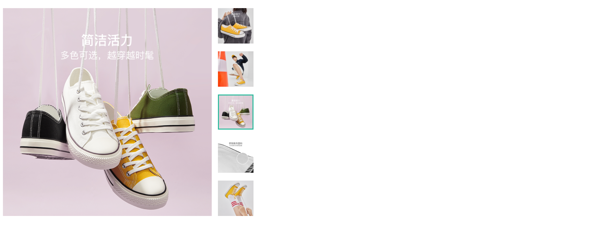

**实现步骤**

1. 搭建组件静态结构
2. 使用接口数据渲染
3. 实现鼠标移入小图大图切换 （控制curIndex）

**代码落地**

1）搭建组件基础结构

`views/Goods/components/goods-image.vue`

```vue
<template>
  <div class="goods-image">
    <div class="middle">
      
    </div>
    <ul class="small">
      <li v-for="(img,i) in 5" :key="i">
        
      </li>
    </ul>
  </div>
</template>
<script>
import { ref } from 'vue'
export default {
  name: 'GoodsImage'
}
</script>
<style scoped lang="less">
.goods-image {
  width: 480px;
  height: 400px;
  position: relative;
  display: flex;
  .middle {
    width: 400px;
    height: 400px;
    background: #f5f5f5;
  }
  .small {
    width: 80px;
    li {
      width: 68px;
      height: 68px;
      margin-left: 12px;
      margin-bottom: 15px;
      cursor: pointer;
      &:hover,&.active {
        border: 2px solid @xtxColor;
      }
    }
  }
}
</style>
```

2）使用接口数据渲染

> 数据由父组件传入，通过props接收

```html
<template>
  <div class="goods-image">
    <div class="middle">
      
    </div>
    <ul class="small">
      <li v-for="img in images" :key="img" >
        
      </li>
    </ul>
  </div>
</template>
<script>
import { ref } from 'vue'
export default {
  name: 'GoodsImage',
  props: {
    images: {
      type: Array,
      default: () => []
    }
  },
  setup(){
    const curIndex = ref(0)
    return { curIndex }
  }
}
</script>
```

3）图片切换逻辑

> 鼠标移除哪个，把currIndex设置为哪个的下标值

```html
<template>
  <div class="goods-image">
    <div class="middle">
      
    </div>
    <ul class="small">
      <li v-for="(img,i) in images" :key="img" :class="{active:i===currIndex}">
        
      </li>
    </ul>
  </div>
</template>
```

## 图片放大镜

`本节目标:`  完成商品图片的放大镜功能 （在图片预览组件中增强功能）

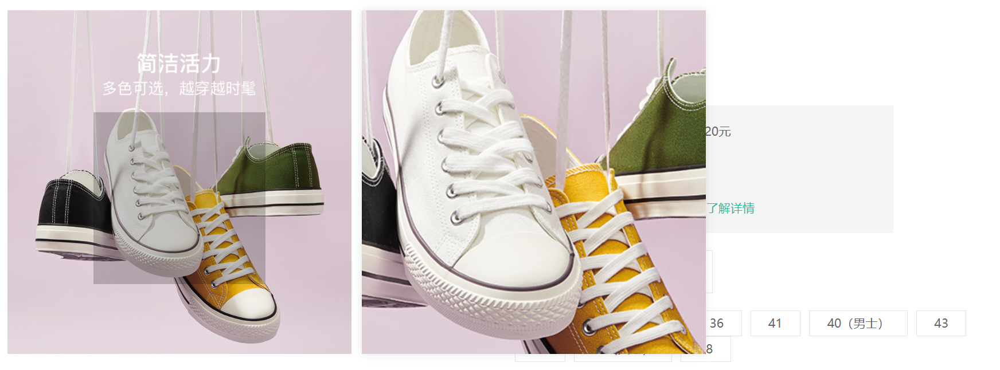

**实现思路**

1. 准备组件结构
2. 控制蒙层移动
3. 控制大图背景随着蒙层的移动而移动

### 1. 新增结构

1）准备右侧大图容器

> 默认以第一张图片作为背景图

```html
<div class="large" :style="[{backgroundImage:`url(${images[currIndex]})`}]"></div>
<div class="middle"></div>

<style>
 .large {
    position: absolute;
    top: 0;
    left: 412px;
    width: 400px;
    height: 400px;
    box-shadow: 0 0 10px rgba(0, 0, 0, 0.1);
    background-repeat: no-repeat;
    background-size: 800px 800px;
    background-color: #f8f8f8;
  }
</style>
```

2）准备滑块蒙层容器

```html
<div class="middle">
  
  <!-- 蒙层容器 -->
  <div class="layer"></div>
</div>

<style>
.layer {
  width: 200px;
  height: 200px;
  background: rgba(0, 0, 0, 0.2);
  left: 0;
  top: 0;
  position: absolute;
}
</style>
```

### 2. 熟悉核心API

> 因为整个交互都是随着鼠标的位置变化而变化的，所以我们最需要的就是可以实时的知道鼠标的坐标位置
>
> `useMouseInElement`： https://vueuse.org/core/usemouseinelement/#usemouseinelement

```js
setup () {
    const target = ref(null)
    // elementX 鼠标基于容器左上角X轴偏移
    // elementY 鼠标基于容器左上角Y轴偏移
    // isOutside 鼠标是否在模板容器外
    // 三个参数都是ref对象
    const { elementX, elementY, isOutside } = useMouseInElement(target)
    watch([elementX, elementY, isOutside], () => {
       // 监听处理
    })

    return { target }
  }
```

### 3. 控制滑块蒙层移动

1. 最大有效可移动范围

   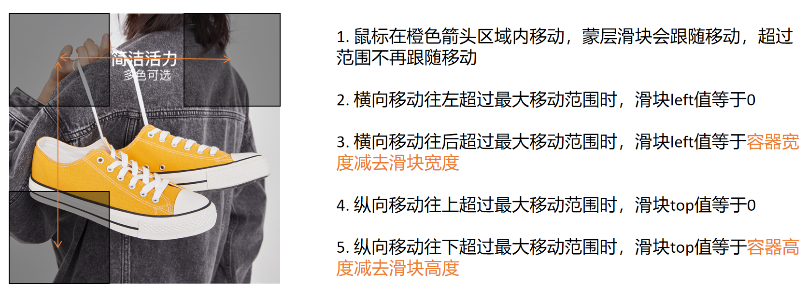

2. 有效移动范围内的换算关系

   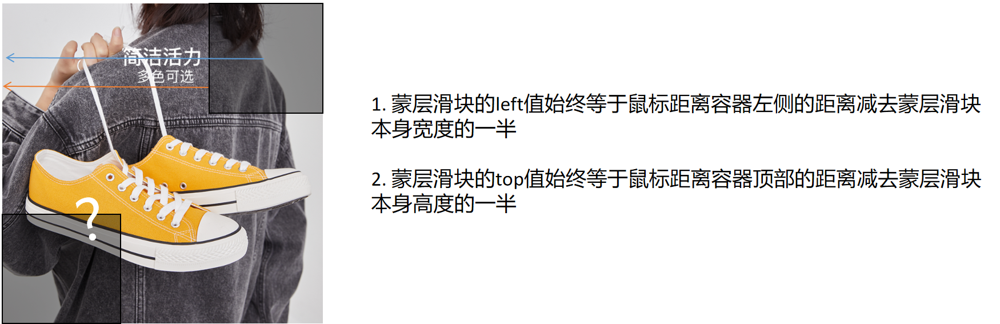


控制蒙层容器横向和纵向移动距离

```js
 setup () {
    const target = ref(null)
    // elementX 鼠标基于容器左上角X轴偏移
    // elementY 鼠标基于容器左上角Y轴偏移
    // isOutside 鼠标是否在模板容器外
    const { elementX, elementY, isOutside } = useMouseInElement(target)
    const left = ref(0) // 滑块距离左侧的距离
    const top = ref(0) // 滑块距离顶部的距离
    watch([elementX, elementY, isOutside], () => {
       // 横向移动
        if (elementX.value < 100) {
          // 左侧最小距离
          left.value = 0
        } else if (elementX.value > 300) {
          // 右侧最大距离
          left.value = 200
        } else {
          // 有效可移动距离下的换算关系
          left.value = elementX.value - 100
        }

        // 纵向移动
        if (elementY.value < 100) {
          top.value = 0
        } else if (elementY.value > 300) {
          top.value = 200
        } else {
          top.value = elementY.value - 100
        }
    })

    return { currIndex, target, top, left }
  }
```


### 4. 控制大图背景移动

> 思路：大图和小图比例为2:1  所以计算公式应该为小图的定位距离乘以2

```js
setup () {
    // elementX 鼠标基于容器左上角X轴偏移
    // elementY 鼠标基于容器左上角Y轴偏移
    // isOutside 鼠标是否在模板容器外
    const { elementX, elementY, isOutside } = useMouseInElement(target)
    const bgPosition = reactive({ backgroundPositionX: 0, backgroundPositionY: 0 })
    watch([elementX, elementY, isOutside], () => {
      // 设置大图背景移动
      bgPosition.backgroundPositionX = -left.value * 2 + 'px'
      bgPosition.backgroundPositionY = -top.value * 2 + 'px'
    })
    return { bgPosition }
}
```

### 5. 控制蒙层和大图显隐

> 思路：只有鼠标在模板容器内时才显示蒙层和大图，否则不显示
>
> 核心逻辑：通过判断`isOutside` 的值来判断

```jsx
<div
  class="large"
  v-show="isShow"
  :style="[{ backgroundImage: `url(${images[currIndex]})`},bgPosition]"
></div>
<div class="middle" ref="target">
  
  <div class="layer" :style="position" v-show="isShow"></div>
</div> 

setup () {
    const isShow = ref(false)
    // elementX 鼠标基于容器左上角X轴偏移
    // elementY 鼠标基于容器左上角Y轴偏移
    // isOutside 鼠标是否在模板容器外
    const { elementX, elementY, isOutside } = useMouseInElement(target)
    watch([elementX, elementY, isOutside], () => {
      isShow.value = !isOutside.value
    })
    return {  isShow }
 }
```

## 基础信息展示

`本节目标:`  实现两块基础内容的信息展示

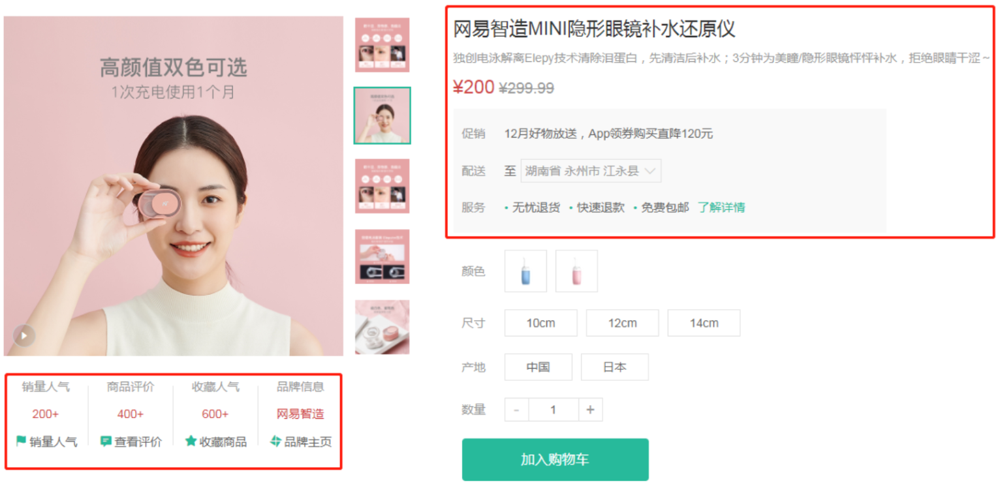

**实现步骤**

1. 定义左侧内容组件
2. 定义右侧内容组件
3. 在详情组件中使用这俩个组件
4. 使用真实数据渲染右侧区域内容

**代码落地**

1）定义左侧区域组件

 `src/views/goods/components/goods-sales.vue`

```vue
<template>
  <ul class="goods-sales">
    <li>
      <p>销量人气</p>
      <p>200+</p>
      <p><i class="iconfont icon-task-filling"></i>销量人气</p>
    </li>
    <li>
      <p>商品评价</p>
      <p>400+</p>
      <p><i class="iconfont icon-comment-filling"></i>查看评价</p>
    </li>
    <li>
      <p>收藏人气</p>
      <p>600+</p>
      <p><i class="iconfont icon-favorite-filling"></i>收藏商品</p>
    </li>
    <li>
      <p>品牌信息</p>
      <p>苏宁电器</p>
      <p><i class="iconfont icon-dynamic-filling"></i>品牌主页</p>
    </li>
  </ul>
</template>

<script>
export default {
  name: 'GoodsSales'
}
</script>

<style scoped lang='less'>
.goods-sales {
  display: flex;
  width: 400px;
  align-items: center;
  text-align: center;
  height: 140px;
  li {
    flex: 1;
    position: relative;
    ~ li::after {
      position: absolute;
      top: 10px;
      left: 0;
      height: 60px;
      border-left: 1px solid #e4e4e4;
      content: "";
    }
    p {
      &:first-child {
        color: #999;
      }
      &:nth-child(2) {
        color: @priceColor;
        margin-top: 10px;
      }
      &:last-child {
        color: #666;
        margin-top: 10px;
        i {
          color: @xtxColor;
          font-size: 14px;
          margin-right: 2px;
        }
        &:hover {
          color: @xtxColor;
          cursor: pointer;
        }
      }
    }
  }
}
</style>
```

2）定义右侧区域组件

 `src/views/goods/components/goods-name.vue`

```vue
<template>
  <p class="g-name">2件装 粉釉花瓣心意点缀 点心盘*2 碟子盘子</p>
  <p class="g-desc">花瓣造型干净简约 多功能使用堆叠方便</p>
  <p class="g-price">
    <span>108.00</span>
    <span>199.00</span>
  </p>
  <div class="g-service">
    <dl>
      <dt>促销</dt>
      <dd>12月好物放送，App领券购买直降120元</dd>
    </dl>
    <dl>
      <dt>配送</dt>
      <dd>至 </dd>
    </dl>
    <dl>
      <dt>服务</dt>
      <dd>
        <span>无忧退货</span>
        <span>快速退款</span>
        <span>免费包邮</span>
        <a href="javascript:;">了解详情</a>
      </dd>
    </dl>
  </div>
</template>

<script>
export default {
  name: 'GoodName'
}
</script>

<style lang="less" scoped>
.g-name {
  font-size: 22px
}
.g-desc {
  color: #999;
  margin-top: 10px;
}
.g-price {
  margin-top: 10px;
  span {
    &::before {
      content: "¥";
      font-size: 14px;
    }
    &:first-child {
      color: @priceColor;
      margin-right: 10px;
      font-size: 22px;
    }
    &:last-child {
      color: #999;
      text-decoration: line-through;
      font-size: 16px;
    }
  }
}
.g-service {
  background: #f5f5f5;
  width: 500px;
  padding: 20px 10px 0 10px;
  margin-top: 10px;
  dl {
    padding-bottom: 20px;
    display: flex;
    align-items: center;
    dt {
      width: 50px;
      color: #999;
    }
    dd {
      color: #666;
      &:last-child {
        span {
          margin-right: 10px;
          &::before {
            content: "•";
            color: @xtxColor;
            margin-right: 2px;
          }
        }
        a {
          color: @xtxColor;
        }
      }
    }
  }
}
</style>
```

3）详情组件里使用组件 

 `src/views/goods/index.vue`

```html
<template>
    <!-- 商品信息 -->
    <div class="goods-info">
        <div class="media">
          <GoodsImage :imageList="goods.mainPictures" />
          <!-- 销量组件 -->
          <GoodsSales />
        </div>
        <div class="spec">
          <!-- 信息组件 -->
          <GoodsName/>
        </div>
    </div>
</template>

<script>
  import GoodsSales from './components/goods-sales'
  import GoodsName from './components/goods-name'
  export default {
      components: { GoodsImage, GoodsSales, GoodsName }
  }
</script>  
```

4）渲染右侧区块数据

`src/views/goods/index.vue`

```html
<div class="goods-info">
<div class="media">
  <GoodsImage :imageList="goods.mainPictures" />
  <!-- 销量组件 -->
  <GoodsSale :goods="goods"/>
</div>
<div class="spec">
  <!-- 信息组件 -->
  <GoodsName :goods="goods"/>
</div>
</div>
```

`src/views/goods/components/goods-name.vue`

```html
<p class="g-name">{{ goods.name }}</p>
<p class="g-desc">{{ goods.desc }}</p>
<p class="g-price">
<span>{{ goods.price }}</span>
<span>{{ goods.oldPrice }}</span>
</p>

<script>
export default {
  name: 'GoodName',
  props: {
    goods: {
      type: Object,
      default () {
        return {}
      }
    }
  }
}
</script>
```

``src/views/goods/components/goods-sale.vue`

```html
<template>
  <ul class="goods-sales">
    <li>
      <p>销量人气</p>
      <p>{{goods.salesCount}}</p>
      <p><i class="iconfont icon-task-filling"></i>销量人气</p>
    </li>
    <li>
      <p>商品评价</p>
      <p>{{goods.commentCount}}</p>
      <p><i class="iconfont icon-comment-filling"></i>查看评价</p>
    </li>
    <li>
      <p>收藏人气</p>
      <p>{{goods.collectCount}}</p>
      <p><i class="iconfont icon-favorite-filling"></i>收藏商品</p>
    </li>
    <li>
      <p>品牌信息</p>
      <p>{{goods.brand.name}}</p>
      <p><i class="iconfont icon-dynamic-filling"></i>品牌主页</p>
    </li>
  </ul>
</template>
<script>
export default {
  name: 'GoodName',
  props: {
    goods: {
      type: Object,
      default () {
        return {}
      }
    }
  }
}
</script>
```


## 城市组件实现（难点）

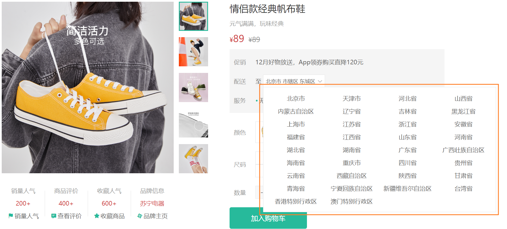

### 1. 基础布局交互实现

`本节目标:`  实现城市组件的基础布局和打开关闭交互

> 先不切换各种城市区域，先实现基础布局和弹框打开关闭交互

`src/components/City.vue`

- 结构

```vue
<template>
  <div class="xtx-city">
    <div class="select" @click="toggleDialog" :class="{active}">
      <span class="placeholder">请选择配送地址</span>
      <span class="value"></span>
      <i class="iconfont icon-angle-down"></i>
    </div>
    <div class="option" v-if="active">
      <span class="ellipsis" v-for="i in 24" :key="i">北京市</span>
    </div>
  </div>
</template>
```

- 逻辑

```html
<script>
import { ref } from 'vue'
export default {
  name: 'XtxCity',
  setup () {
     // 控制展开收起,默认收起
    const active = ref(false)
    // 打开弹框
    function open () {
      active.value = true
    }
    // 关闭弹框
    function close () {
      active.value = false
    }
    // 切换展开收起
    function toggleDialog () {
      if (active.value) {
        close()
      } else {
        open()
      }
    }
    return { active, toggleDialog }
  }
}
</script>
```

- 样式

```html
<style scoped lang="less">
.xtx-city {
  display: inline-block;
  position: relative;
  z-index: 400; 
  margin-left: 10px;
  .select {
    border: 1px solid #e4e4e4;
    height: 30px;
    padding: 0 5px;
    line-height: 28px;
    cursor: pointer;
    &.active {
      background: #fff;
    }
    .placeholder {
      color: #999;
    }
    .value {
      color: #666;
      font-size: 12px;
    }
    i {
      font-size: 12px;
      margin-left: 5px;
    }
  }
  .option {
    width: 542px;
    border: 1px solid #e4e4e4;
    position: absolute;
    left: 0;
    top: 29px;
    background: #fff;
    min-height: 30px;
    line-height: 30px;
    display: flex;
    flex-wrap: wrap;
    padding: 10px;
    > span {
      width: 130px;
      text-align: center;
      cursor: pointer;
      border-radius: 4px;
      padding: 0 3px;
      &:hover {
        background: #f5f5f5;
      }
    }
  }
}
</style>
```

- 使用城市组件

```html
<dl>
  <dt>配送</dt>
  <dd>至</dd>
  <dd>
    <xtx-city/>
  </dd>
</dl>
```

### 2. 获取数据渲染

`本节目标:`  实现城市数据的获取

> 城市数据的接口是一个对立的接口，不走我们request.js中的逻辑，我们单独来使用axios来进行数据获取

```html
<template>
  <div class="xtx-city" ref="target">
    <div class="option" v-if="active">
      <span class="ellipsis" v-for="item in dataList" :key="item.code">{{item.name}}</span>
    </div>
  </div>
</template>

<script>
import axios from 'axios'
import { onMounted, ref } from 'vue'
export default {
  name: 'XtxCity',
  setup () {
    const dataList = ref([])
    function getCityData () {
      // 兼容有缓存的操作 封装成一个promise
      return new Promise((resolve, reject) => {
        if (window.cityData) {
          // 有缓存直接把缓存数据返回
          resolve(window.cityData)
        } else {
          // 无缓存 请求数据返回
          const url = 'https://yjy-oss-files.oss-cn-zhangjiakou.aliyuncs.com/tuxian/area.json'
          axios.get(url).then(res => {
            // 加入缓存
            window.cityData = res.data
            resolve(window.cityData)
          })
        }
      })
    }
    onMounted(() => {
      getCityData().then(res => {
        dataList.value = res
      })
    })
    return { active, toggleDialog, dataList }
  }
}
</script>
```

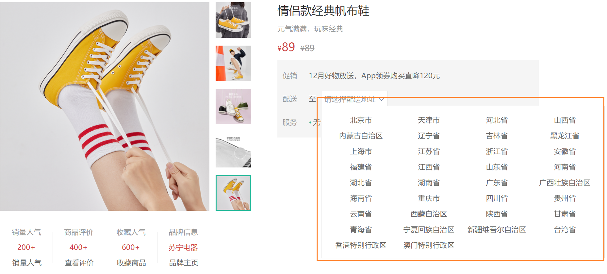

### 3. 交互实现（复杂）

`本节目标:`  实现城市组件的交互逻辑

 **实现步骤**

 1. 点击省份（城市）把当前省份数据记录下来，并把渲染列表变成当前省份下的市
 2. 点击城市把当前城市信息记录下来，并把渲染列表变成当前城市下的区域
 3. 点击区域把当前区域信息记录下来，并关闭弹框
 4. 每次重新点击城市框，清空已经记录的所有数据

**代码落地**

```js
const changeResult = reactive({
  provinceCode: '', // 省code
  provinceName: '', // 省名称
  cityCode: '', // 城市code
  cityName: '', // 城市名称
  countyCode: '', // 地区code
  countyName: '' // 地区名称
})

// 重置数据
watch(() => { return active.value }, (newVal) => {
  if (newVal === true) {
    changeResult.provinceCode = ''
    changeResult.provinceName = ''
    changeResult.cityCode = ''
    changeResult.cityName = ''
    changeResult.countyCode = ''
    changeResult.countyName = ''
    console.log(changeResult)
  }
})


function changeItem (item) {
  // 记录省份数据
  if (item.level === 0) {
    changeResult.provinceCode = item.code
    changeResult.provinceName = item.name
  }
  // 记录城市数据
  if (item.level === 1) {
    changeResult.cityCode = item.code
    changeResult.cityName = item.name
  }
  // 记录地区数据
  if (item.level === 2) {
    changeResult.countyCode = item.code
    changeResult.countyName = item.name
    close()
  }
}

// 定义计算属性
// 核心逻辑: 
// 1. 默认情况下provinceCode和cityCode都没有,所以直接返回list,渲染所有省份
// 2. 当provinceCode有数据之后,list变成了当前省份对应的所有城市数据
// 3. 当cityCode有数据之后,list变成了当前城市下所有的地区
const currList = computed(() => {
  // 省份
  let list = dataList.value
  // 城市
  if (changeResult.provinceCode) {
    list = currList.find(p => p.code === changeResult.provinceCode).areaList
  }
  // 地区
  if (changeResult.cityCode) {
    list = currList.find(c => c.code === changeResult.cityCode).areaList
  }
  return list
})
```

## 商品规格功能实现

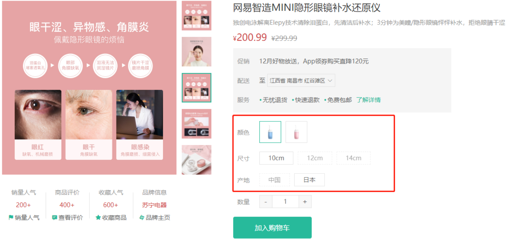

### 1. 理解基础sku概念

spu 和 sku 都是属性值的集合，举个栗子 >>

一部 iphone6S，它身上有很多的属性和值. 比如 :

- 毛重：420.00 g
- 产地：中国大陆
- 容量：16G，64G， 128G
- 颜色： 银，白， 玫瑰金

spu 属性（不会影响到库存和价格的属性, 又叫**关键属性**）

- 毛重： 420.00 g
- 产地：中国大陆


sku 属性（会影响到库存和价格的属性, 又叫**销售属性**）

- 容量：16G，64G， 128G
- 颜色： 银，白， 玫瑰金


### 2. sku组件认识

**props**

| 属性名 | 说明                                    | 默认值                  | 作用                     |
| ------ | --------------------------------------- | ----------------------- | ------------------------ |
| goods  | 商品信息对象必须包含specs数组和skus数组 | { specs: []，skus: [] } | 为渲染和交互提供数据支持 |
| skuId  | sku唯一标识id                           | 空字符串                | 回显默认规格数据时使用   |

**事件**

| 名称   | 说明                                                         |
| ------ | ------------------------------------------------------------ |
| change | 产出当前选择的商品规格信息，如果是完整的sku，产出完整的对象信息，如果不完整，则产出空对象 |

### 3. 业务使用

> 传入商品信息数据，并绑定自定义事件change，测试组件是否运行正常

```html
<!-- 商品信息区 -->
<div class="spec">
  <goods-sku
    :goods="goods"
    @change="skuChange"
  ></goods-sku>
</div>

<script>
  export default {
     setup(){
        function skuChange(sku){
            console.log(sku)
        }
     }
  }
</script>
```

特别注意：对象的具体属性数据依赖于异步的返回，当数据没有返回值非常容易出现 `undefined.属性`

```html
<div class="xtx-goods-page" v-if="goods.specs"></div>
```

## 数量组件实现

`本节目标:`  实现商品的数量操作组件的封装

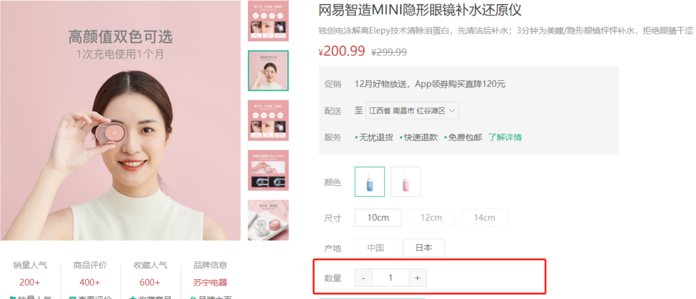

**实现步骤**

1. 搭建组件静态结构并实现增减逻辑
2. 通过props传入控制最大和最小值
3. 实现组件的v-model双向绑定

**代码落地**

1）基础布局代码

`src/components/Numbox.vue`

```html
<template>
  <div class="xtx-numbox">
    <div class="label">数量</div>
    <div class="numbox">
      <a href="javascript:;">-</a>
      <input type="text" readonly value="1">
      <a href="javascript:;">+</a>
    </div>
  </div>
</template>
<script>
export default {
  name: 'XtxNumbox'
}
</script>
<style scoped lang="less">
.xtx-numbox {
  display: flex;
  align-items: center;
  .label {
    width: 60px;
    color: #999;
    padding-left: 10px;
  }
  .numbox {
    width: 120px;
    height: 30px;
    border: 1px solid #e4e4e4;
    display: flex;
    > a {
      width: 29px;
      line-height: 28px;
      text-align: center;
      background: #f8f8f8;
      font-size: 16px;
      color: #666;
      &:first-of-type {
        border-right:1px solid #e4e4e4;
      }
      &:last-of-type {
        border-left:1px solid #e4e4e4;
      }
    }
    > input {
      width: 60px;
      padding: 0 5px;
      text-align: center;
      color: #666;
    }
  }
}
</style>
```

2）数量增减逻辑实现

```jsx
<a href="javascript:;" @click="decrease">-</a>
<input type="text" readonly :value="curNum" />
<a href="javascript:;" @click="add">+</a>

setup(){
    const curNum = ref(1)
    function add () {
      curNum.value++
    }
    function decrease () {
      curNum.value--
    }  
    return { add, decrease }
}
```

3）控制最大最小数量

```jsx
props: {
    min: {
      type: Number,
      default: 1
    },
    max: {
      type: Number,
      default: 10
    }
},
setup(){
    const curNum = ref(1)
    function add () {
      if (curNum.value === props.max) return false
      curNum.value++
    }

    function decrease () {
      if (curNum.value === props.min)  return false
      curNum.value--
    }
}
```

4）实现v-model双向绑定

**前置知识点**

> vue2.x  组件身上写了v-model = "name"
>
> 1. 在组件身上定义了一个属性名为`value`  prop
> 2. 绑定一个默认的自定义事件  `input` 事件
> 3. 在自定义事件绑定的函数中 完成了对于name属性的赋值
>
> 
>
> vue3.0中的v-model语法有所变化，如果我们给一个组件书写了v-model之后，相当于完成了俩件事情
>
> 1. 给子组件传递了一个名称为`modelValue` 的prop
> 2. 给子组件绑定了一个名称为`update:modelValue` 的自定义事件

**实现步骤**

1. 每次修改number之后，通过调用`emit`方法触发自定义事件把值同步给父组件 （子 =》父）
2. 通过watch监听传入的`modelValue`的变化 ，把modelValue最新的值赋值给number （ 父=》子）

**代码落地**

```jsx
<script>
import { ref, watch } from 'vue'
export default {
  name: 'XtxNumbox',
  props: {
    modelValue: {
      type: Number,
      default: 1
    },
    min: {
      type: Number,
      default: 1
    },
    max: {
      type: Number,
      default: 10
    }
  },
  setup (props, { emit }) {
    const curNum = ref(1)
    function add () {
      if (curNum.value === props.max) return false
      curNum.value++
      emit('update:modelValue', curNum.value)
    }

    function decrease () {
      if (curNum.value === props.min) {
        return false
      }
      curNum.value--
      emit('update:modelValue', curNum.value)
    }
    // 监听props传入值的变化,一旦发生变化就赋值给curNum
    watch(() => props.modelValue, () => {
      curNum.value = props.modelValue
    }, { immediate: true })
    return { curNum, add, decrease }
  }
}
</script>
```

## 按钮组件封装

`本节目标:`  实现按钮组件的封装，支持大小/类型/文案的自定义

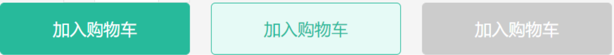

**实现步骤**

1. 把大小和类型的样式控制设计为props，通过不同传入匹配不一样的样式
2. 把文案的自定义设计为插槽，支持自定义按钮文案展示

**代码落地**

1）定义组件并全局注册

`src/components/Button.vue`

```html
<template>
  <button class="xtx-button ellipsis" :class="[size, type]">
    <slot />
  </button>
</template>
<script>
export default {
  name: 'XtxButton',
  props: {
    size: {
      type: String,
      default: 'middle'
    },
    type: {
      type: String,
      default: 'default'
    }
  }
}
</script>
<style scoped lang="less">
.xtx-button {
  appearance: none;
  border: none;
  outline: none;
  background: #fff;
  text-align: center;
  border: 1px solid transparent;
  border-radius: 4px;
  cursor: pointer;
}
// 大
.large {
  width: 240px;
  height: 50px;
  font-size: 16px;
}
// 中
.middle {
  width: 180px;
  height: 50px;
  font-size: 16px;
}
// 小
.small {
  width: 100px;
  height: 32px;
}
//超小
.mini {
  width: 60px;
  height: 32px;
}
.default {
  border-color: #e4e4e4;
  color: #666;
}
// 确认
.primary {
  border-color: @xtxColor;
  background: @xtxColor;
  color: #fff;
}
// 普通
.plain {
  border-color: @xtxColor;
  color: @xtxColor;
  background: lighten(@xtxColor, 50%);
}
// 灰色
.gray {
  border-color: #ccc;
  background: #ccc;
  color: #fff;
}
</style>
```

2）使用组件

`src/views/goods/index.vue`

```html
<div class="spec">
  ...
  <XtxButton type="primary" style="margin-top:20px;">加入购物车</XtxButton>
</div>
```

到此，我们的商品主要信息展示区域就都完成咯，接下来我们开始完成详情区域和热榜区域

# 商品详情区域

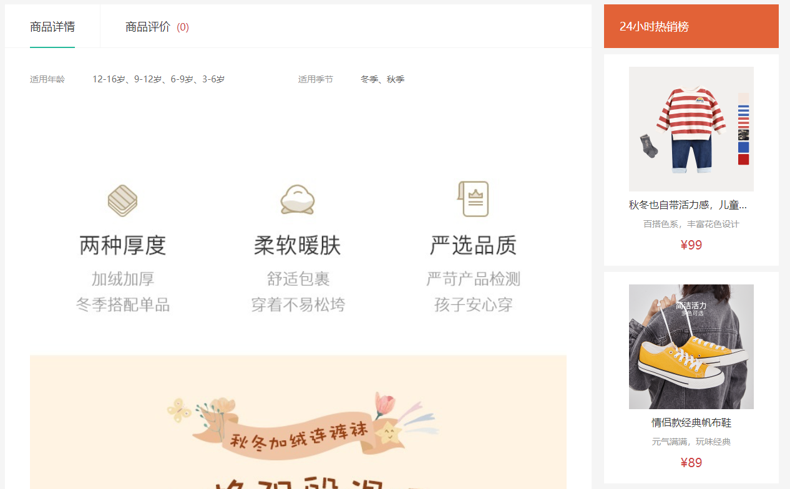

## 标签页组件实现

`本节目标:`  实现标签页组件的封装

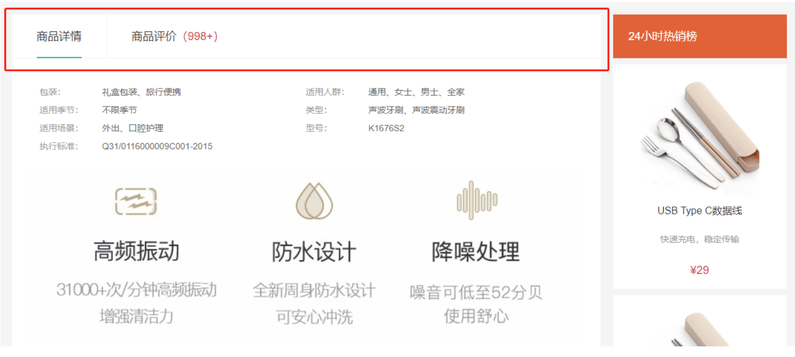

**实现步骤**

1. 完成基础的tab的导航布局
2. 完成tab标签页的切换样式效果
3. 完成详情和评论组件的切换 `component`

### 1. 定义组件基础结构

1）定义tabs组件 `src/vies/goods/components/goods-tabs.vue`

```html
<template>
  <div class="goods-tabs">
    <nav>
      <a href="javascript:;">商品详情</a>
      <a href="javascript:;">商品评价<span></span></a>
    </nav>
    <!-- 这个位置显示对应的组件 GoodsDetail 或者 GoodsComment -->
  </div>
</template>
<script>
export default {
  name: 'GoodsTabs'
}
</script>
<style scoped lang="less">
.goods-tabs {
  min-height: 600px;
  background: #fff;
  nav {
    height: 70px;
    line-height: 70px;
    display: flex;
    border-bottom: 1px solid #f5f5f5;
    a {
      padding: 0 40px;
      font-size: 18px;
      position: relative;
      > span {
        color: @priceColor;
        font-size: 16px;
        margin-left: 10px;
      }
      &:first-child {
        border-right: 1px solid #f5f5f5;
      }
      &.active {
        &::before {
          content: "";
          position: absolute;
          left: 40px;
          bottom: -1px;
          width: 72px;
          height: 2px;
          background: @xtxColor;
        }
      }
    }
  }
}
</style>
```

2）使用tabs组件

`src/views/goods/index.vue`

```jsx
// 导入
import GoodsTabs from './components/goods-tabs'
// 注册
components: { GoodsTabs }
// 模板使用
<div class="goods-article">
  <!-- 商品+评价 -->
  <GoodsTabs/>
  <!-- 注意事项 -->
  <div class="goods-warn"></div>
</div>
```

### 2. 实现tab激活样式切换

> 实现思路：
>
> 1. 确定一个标识`activeName`，值为detail时表示激活详情，值为comment时表示激活评论
> 2. 通过控制active类名的显示来控制样式的切换

```html
<template>
  <div class="goods-tabs">
    <nav>
      <a
        :class="{ active: activeName === 'detail' }"
        href="javascript:;"
        @click="clickTab('detail')"
        >商品详情</a
      >
      <a
        :class="{ active: activeName === 'comment' }"
        href="javascript:;"
        @click="clickTab('comment')"
        >商品评价<span>(500+)</span></a
      >
    </nav>
  </div>
</template>
<script>
import { ref } from 'vue'
export default {
  name: 'GoodsTabs',
  setup () {
    // detail-->详情   comment-->评价
    const activeName = ref('detail')
    const clickTab = (name) => {
      activeName.value = name
    }
    return { activeName, clickTab }
  }
}
</script>
```

### 3. 切换详情组件和评论组件

> 实现思路：
>
> 1. 定义俩个组件，详情组件和评论组件
> 2. 通过内置组件`component`  的is属性的切换来渲染不同组件

1）新建详情和评论组件

`src/vies/goods/components/goods-detail.vue`

```html
<template>
  <div class="goods-detail">详情</div>
</template>
<script>
export default {
  name: 'GoodsDetail'
}
</script>
<style scoped lang="less"></style>
```

`src/vies/goods/components/goods-comment.vue`

```html
<template>
  <div class="goods-comment">评价</div>
</template>
<script>
export default {
  name: 'GoodsComment'
}
</script>
<style scoped lang="less"></style>
```

2）通过component切换组件渲染

> <component :is="组件引用" />

```jsx
import GoodsDetail from './goods-detail'
import GoodsComment from './goods-comment'
// 创建枚举
const component = {
  detail: GoodsDetail,
  comment: GoodsComment
}
setup(){
   // 浅代理 .value属性是一个普通的对象 不再是一个Proxy对象
   const componentName = shallowRef(component)
   return {
      componentName 
   }
}

<component :is="componentName[activeType]"></component>
```

## 详情组件实现

`本节目标:`  完成详情组件的数据展示

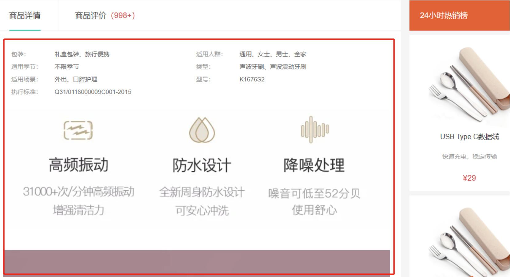

### 1. 实现详情信息展示

`Goods/components/goods-detail.vue`

```html
<template>
  <div class="goods-detail" v-if="goods.details">
    <!-- 属性 -->
    <ul class="attrs">
      <li v-for="item in goods.details.properties" :key="item.value">
        <span class="dt">{{item.name}}</span>
        <span class="dd">{{item.value}}</span>
      </li>
    </ul>
    <!-- 图片 -->
    
  </div>
</template>

<script>
import { findGoods } from '@/api/goods'
import { ref, watch } from 'vue'
import { useRoute } from 'vue-router'
export default {
  name: 'GoodsDetail',
  setup () {
    const route = useRoute()
    const goods = ref({})
    async function getGoods () {
      const { result } = await findGoods(route.params.id)
      goods.value = result
    }
    return {
      goods
    }
  }
}
</script>
<style scoped lang="less">
.goods-detail {
  padding: 40px;
  .attrs {
    display: flex;
    flex-wrap: wrap;
    margin-bottom: 30px;
    li {
      display: flex;
      margin-bottom: 10px;
      width: 50%;
      .dt {
        width: 100px;
        color: #999;
      }
      .dd {
        flex: 1;
        color: #666;
      }
    }
  }
  > img {
    width: 100%;
  }
}
</style>
```

注意：别忘了通过v-if做渲染判断，保证二级属性是OK的，否则会报属性找不到的错误

`<div class="goods-detail" v-if="goods.details">`

### 2. 缓存详情组件

> 详情组件图片较多，如果切换的时候一直销毁重建组件，开销较大，我们可以通过给`component`组件添加缓存功能来优化

```html
<!-- 这个位置显示对应的组件 GoodsDetail 或者 GoodsComment -->
<keep-alive>
  <component :is="`goods-${activeName}`" />
</keep-alive>
```


## CheckBox组件封装

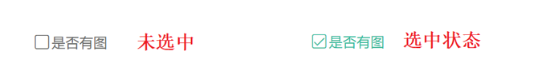

**基础思路**

1. 准备静态结构  选中图标非选中图标 + 自定义的文字
2. 定义一个状态表示当前是否选中的状态 （布尔值）
3. 使用v-model实现选中状态父子的同步

**代码落地**

```html
<template>
  <div class="xtx-checkbox" @click="changeChecked()">
    <!-- 选中小图标 -->
    <i v-if="checked" class="iconfont icon-checked"></i>
    <!-- 未选中小图标 -->
    <i v-else class="iconfont icon-unchecked"></i>
    <!-- 自定义文字 -->
    <span><slot/></span>
  </div>
</template>
<script>
import { ref, watch } from 'vue'
export default {
  name: 'XtxCheckbox',
  props: {
    modelValue: {
      type: Boolean,
      default: false
    }
  },
  setup (props, { emit }) {
    const checked = ref(false)
    const changeChecked = () => {
      checked.value = !checked.value
      emit('update:modelValue', checked.value)
    }
    watch(
      () => {
        return props.modelValue
      },
      () => {
        checked.value = props.modelValue
      },
      {
        immediate: true
      }
    )
    return { checked, changeChecked }
  }
}
</script>
<style scoped lang="less">
.xtx-checkbox {
  display: inline-block;
  margin-right: 2px;
  .icon-checked {
    color: @xtxColor;
    ~ span {
      color: @xtxColor;
    }
  }
  i {
    position: relative;
    top: 1px;
  }
  span {
    margin-left: 2px;
  }
}
</style>
```


## 评论组件实现

### 1. 头部实现

`本节目标:`  完成评价头部的数据渲染和基础交互

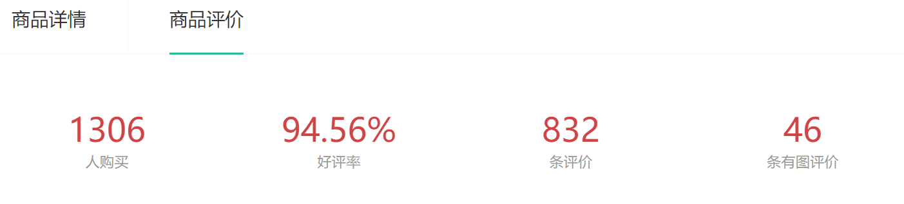

**实现步骤**

1. 完成静态布局
2. 定义API接口
3. 获取数据提供给模版
4. 渲染模版

**代码落地**

1）实现静态布局

`src/views/goods/components/goods-comment.vue`

```html
<template>
  <div class="goods-comment">
    <div class="head" v-if="commentInfo">
      <div class="data">
        <p>
          <span>1000</span
          ><span>人购买</span>
        </p>
        <p>
          <span>98</span
          ><span>好评率</span>
        </p>
        <p>
          <span>234</span
          ><span>条评价</span>
        </p>
        <p>
          <span>100</span>
          <span>条有图评价</span>
        </p>
      </div>
    </div>
  </div>
</template>
<script>
export default {
  name: 'GoodsComment'
}
</script>
<style scoped lang="less">
.goods-comment {
  .head {
    display: flex;
    padding: 30px 0;
    .data {
      flex:1;
      display: flex;
      padding: 20px;
      p {
        flex: 1;
        text-align: center;
        span {
          display: block;
          &:first-child {
            font-size: 32px;
            color: @priceColor;
          }
          &:last-child {
            color: #999;
          }
        }
      }
    }
  }
  .sort {
    height: 60px;
    line-height: 60px;
    border-top: 1px solid #f5f5f5;
    border-bottom: 1px solid #f5f5f5;
    margin: 0 20px;
    color: #666;
    > span {
      margin-left: 20px;
    }
    > a {
      margin-left: 30px;
      &.active,
      &:hover {
        color: @xtxColor;
      }
    }
  }
}
.list {
  padding: 0 20px;
  .item {
    display: flex;
    padding: 25px 10px;
    border-bottom: 1px solid #f5f5f5;
    .user {
      width: 160px;
      img {
        width: 40px;
        height: 40px;
        border-radius: 50%;
        overflow: hidden;
      }
      span {
        padding-left: 10px;
        color: #666;
      }
    }
    .body {
      flex: 1;
      .score {
        line-height: 40px;
        .iconfont {
          color: #ff9240;
          padding-right: 3px;
        }
        .attr {
          padding-left: 10px;
          color: #666;
        }
      }
    }
    .text {
      color: #666;
      line-height: 24px;
    }
    .time {
      color: #999;
      display: flex;
      justify-content: space-between;
      margin-top: 5px;
    }
  }
}
</style>
```

2）封装接口 

`src/api/goods.js`

> 评价详情需要我们单独封装接口处理

```js
/**
 * @description: 获取评价数据
 * @param {*} id  商品id
 * @return {*}
 */
export const findCommentInfoByGoods = (id) => {
  return request(`https://mock.boxuegu.com/mock/1175/goods/${id}/evaluate`, 'get')
}
```

3）获取处理数据 

`src/views/goods/components/goods-comment.vue`

```js
import { findCommentInfoByGoods } from '@/api/goods'
import { ref } from 'vue'
import { useRoute } from 'vue-router'
export default {
  name: 'GoodsComment',
  setup () {
    const { commentInfo } = useCommentInfo()
    return { commentInfo }
  }
}
// 获取评价数据
function useCommentInfo () {
  const commentInfo = ref(null)
  const route = useRoute()
  const getCommentInfo = async () => {
    const data = await findCommentInfoByGoods(route.params.id)
    commentInfo.value = data.result
  }
  onMounted(() => {
    getCommentInfo()
  })
  return { commentInfo }
}
```

4）渲染模板

```html
<div class="head" v-if="commentInfo">
  <div class="data">
    <p>
      <span>{{ commentInfo.salesCount }}</span
      ><span>人购买</span>
    </p>
    <p>
      <span>{{ commentInfo.praisePercent }}</span
      ><span>好评率</span>
    </p>
    <p>
      <span>{{ commentInfo.evaluateCount }}</span
      ><span>条评价</span>
    </p>
    <p>
      <span>{{ commentInfo.hasPictureCount}}</span>
      <span>条有图评价</span>
    </p>
  </div>
</div>
```

### 2. 列表基础实现

`本节目标:`  实现列表数据的基础展示（默认查询条件不加筛选条件）

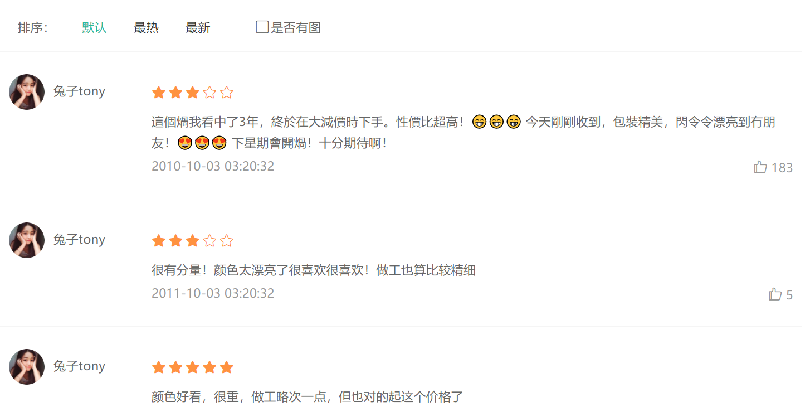


**实现步骤**

1. 筛选条件和列表基础布局
2. 筛选条件数据准备
3. 调用接口获取数据
4. 渲染列表

**代码落地**

1）列表基础布局

> 准备俩处布局，一处为提供筛选条件的区域，一处为列表区域

```vue
<!-- 排序 -->
<div class="sort">
  <span>排序：</span>
  <a
    href="javascript:;"
    :class="{ active: sortField === null }"
    >默认</a
  >
  <a
    href="javascript:;"
    :class="{ active: sortField === 'praiseCount' }"
    >最热</a
  >
  <a
    href="javascript:;"
    :class="{ active: sortField === 'createTime' }"
    >最新</a
  >
  <XtxCheckbox  style="margin-left:50px;">是否有图</XtxCheckbox>
</div>
<!-- 列表 -->
<div class="list">
  <div class="item">
    <div class="user">
      
      <span>兔****m</span>
    </div>
    <div class="body">
      <div class="score">
        <i class="iconfont icon-wjx01"></i>
        <i class="iconfont icon-wjx01"></i>
        <i class="iconfont icon-wjx01"></i>
        <i class="iconfont icon-wjx01"></i>
        <i class="iconfont icon-wjx02"></i>
        <span class="attr">颜色：黑色 尺码：M</span>
      </div>
      <div class="text">网易云app上这款耳机非常不错 新人下载网易云购买这款耳机优惠大 而且耳机🎧确实正品 音质特别好 戴上这款耳机 听音乐看电影效果声音真是太棒了 无线方便 小盒自动充电 最主要是质量好音质棒 想要买耳机的放心拍 音效巴巴滴 老棒了</div>
      <div class="time">
        <span>2020-10-10 10:11:22</span>
        <span class="zan"><i class="iconfont icon-dianzan"></i>100</span>
      </div>
    </div>
  </div>
</div>
<style>
 .list {
    padding: 0 20px;
    .item {
      display: flex;
      padding: 25px 10px;
      border-bottom: 1px solid #f5f5f5;
      .user {
        width: 160px;
        img {
          width: 40px;
          height: 40px;
          border-radius: 50%;
          overflow: hidden;
        }
        span {
          padding-left: 10px;
          color: #666;
        }
      }
      .body {
        flex: 1;
        .score {
          line-height: 40px;
          .iconfont {
            color: #ff9240;
            padding-right: 3px;
          }
          .attr {
            padding-left: 10px;
            color: #666;
          }
        }
      }
      .text {
        color: #666;
        line-height: 24px;
      }
      .time {
        color: #999;
        display: flex;
        justify-content: space-between;
        margin-top: 5px;
      }
    }
  }
</style>
```

2）准备筛选参数获取数据（基础默认条件）

> 因为评价列表还没有真实接口数据，我们采取单独的接口来获取列表

`api/goods.js`

```js
/**
 * @description: 获取评价列表
 * @param {*} id  商品id
 * @return {*}
 */
export const findCommentListByGoods = (id, data) => {
  return request(`https://mock.boxuegu.com/mock/1175/goods/${id}/evaluate/page`, 'get', data)
}
```

`goods-comment.vue`

```js
// 导入接口
import { findCommentListByGoods } from '@/api/goods'

// 获取评论数据
function useCommentList () {
  const route = useRoute()
  // 筛选条件准备
  const reqParams = reactive({
    page: 1,
    pageSize: 10,
    hasPicture: false,//是否有
    sortField: null, // 排序: praiseCount -> 最热 createTime -> 最新
  })
  // 评价列表
  const commentList = ref([])
  onMounted(async () => {
    const data = await findCommentListByGoods(route.params.id, reqParams)
    commentList.value = data.result.items
  })
  return { commentList }
}

setup () {
    const { commentList } = useCommentList()
    return { commentList }
}
```

3）渲染模板list

```html
 <!-- 列表 -->
<div class="list">
  <div class="item" v-for="item in commentList" :key="item.id">
    <div class="user">
      
      <span>{{ item.member.nickname }}</span>
    </div>
    <div class="body">
      <div class="score">
        <i
          v-for="i in item.score"
          :key="i + '1'"
          class="iconfont icon-wjx01"
        ></i>
        <i
          v-for="i in 5 - item.score"
          :key="i + '2'"
          class="iconfont icon-wjx02"
        ></i>
        <span class="attr">{{ item.orderInfo.specsText }}</span>
      </div>
      <div class="text">{{ item.content }}</div>
      <div class="time">
        <span>{{ item.createTime }}</span>
        <span class="zan"
          ><i class="iconfont icon-dianzan"></i>
          {{ item.praiseCount }}</span
        >
      </div>
    </div>
  </div>
</div>
```

### 3. 条件筛选(难点)

`本节目标:`  实现列表数据的自定义条件筛选

**实现思路**

1. 通过排序按钮收集排序查询字段
2. 通过多选框收集是否有图查询字段
3. 通过watch监听排序和多选框字段，有变化再次发起接口请求

```js
// 获取评论数据
function useCommentList () {
  const route = useRoute()
  // 筛选条件准备
  const reqParams = reactive({
    page: 1,
    pageSize: 10,
    hasPicture: false, // 是否右图
    sortField: null // 排序
  })
  // 切换排序
  function changeSort (field) {
    reqParams.sortField = field
  }
  // 监听查询条件变化重新拉取数据
  watch(() => {
    return reqParams
  }, () => {
    loadCommentList()
  }, { deep: true })

  // 评价列表
  const commentList = ref([])
  async function loadCommentList () {
    const data = await findCommentListByGoods(route.params.id, reqParams)
    commentList.value = data.result.items
  }
  onMounted(async () => {
    loadCommentList()
  })

  return { commentList, changeSort, reqParams }
}
```

### 4. 图片预览功能

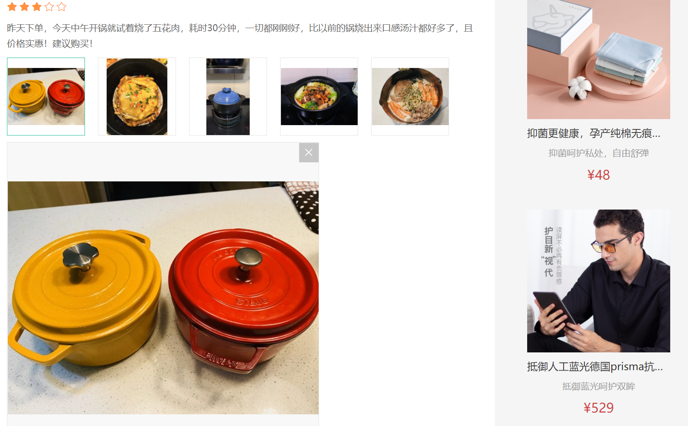

**实现步骤**

1. 准备一个组件导入`goods-comment.vue`使用起来
2. 将商品图片列表作为props传入
3. 展示图片列表实现选中图片功能
4. 提供图片预览功能和关闭图片预览

**代码落地**

1）新增图片查看组件

`src/views/goods/goods-comment-image.vue`

```html
<template>
  <div class="goods-comment-image">
    <div class="list">
      <a
        href="javascript:;"
        :class="{active:currImage===url}"
        @click="currImage=url"
        v-for="url in pictures"
        :key="url"
      >
        
      </a>
    </div>
    <div class="preview"></div>
  </div>
</template>
<script>
import { ref } from 'vue'
export default {
  name: 'GoodsCommentImage',
  props: {
    pictures: {
      type: Array,
      default: () => []
    }
  },
  setup () {
    // 当前显示图片url
    const currImage = ref(null)
    return { currImage }
  }
}
</script>
<style scoped lang="less">
.goods-comment-image {
  .list {
    display: flex;
    flex-wrap: wrap;
    margin-top: 10px;
    a {
      width: 120px;
      height: 120px;
      border:1px solid #e4e4e4;
      margin-right: 20px;
      margin-bottom: 10px;
      img {
        width: 100%;
        height: 100%;
        object-fit: contain;
      }
      &.active {
        border-color: @xtxColor;
      }
    }
  }
}
</style>
```

2）导入评论组件使用

```jsx
import GoodsCommentImage from './goods-comment-image'

components: {
    GoodsCommentImage
}

<div class="text">{{ item.content }}</div>
<!-- 使用图片预览组件 -->
<GoodsCommentImage v-if="item.pictures.length" :pictures="item.pictures" />
```

3）实现图片放大预览功能

> 思路：
>
> 1. 当currImage有值之后，显示预览区域
> 2. 点击关闭按钮，清空currImage

```html
<div class="preview" v-if="currImage">
  
  <i @click="currImage = null" class="iconfont icon-close-new"></i>
</div>
```

## 热榜组件实现

`本节目标:`  展示24小时热榜商品，和周热榜商品

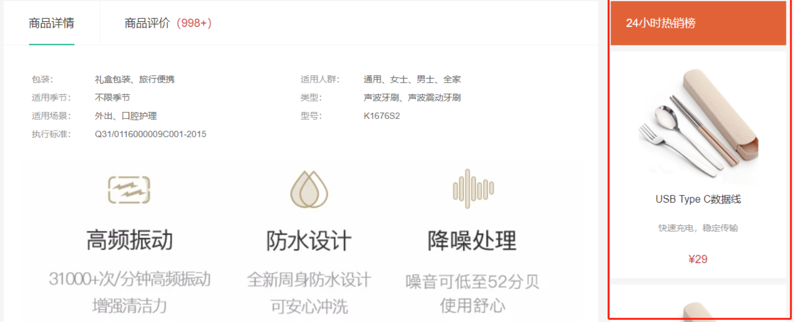

**实现步骤**

1. 定义一个组件，完成多个组件展现型态，根据传入组件的类型决定
   - 1代表24小时热销榜 	2代表周热销榜	 3代表总热销榜
2. 获取数据，完成商品展示和标题样式的设置

### 1. 定义组件

`src/views/goods/components/goods-hot.vue`

```html
<template>
  <div class="goods-hot">
    <h3>{{ title }}</h3>
    <!-- 商品区块 -->
    <goods-item v-for="good in 4"/>
  </div>
</template>
<script>
import { computed } from 'vue'
import GoodsItem from '@/views/Category/components/goods-item'
export default {
  name: 'GoodsHot',
  components: {
    GoodsItem
  },
  props: {
    type: {
      type: Number,
      default: 1
    }
  },
  setup (props) {
    const titleObj = { 1: '24小时热销榜', 2: '周热销榜', 3: '总热销榜' }
    const title = computed(() => {
      return titleObj[props.type]
    })
    return { title }
  }
}
</script>
<style scoped lang="less">
.goods-hot {
  h3 {
    height: 70px;
    background: @helpColor;
    color: #fff;
    font-size: 18px;
    line-height: 70px;
    padding-left: 25px;
    margin-bottom: 10px;
    font-weight: normal;
  }
}
</style>
```

2）使用组件

`src/views/goods/index.vue`

```jsx
import GoodsHot from './components/goods-hot'

components: { GoodsImage, GoodsSales, GoodsName, GoodsSku, GoodsHot }
    
<div class="goods-aside">
  <GoodsHot :type="1" />
  <GoodsHot :type="2" />
  <GoodsHot :type="3" />
</div>
```

### 2. 获取数据渲染组件

`src/api/goods.js`

```js
/**
 * 获取热榜商品
 * @param {Number} id - 商品id
 * @param {Number} type - 1代表24小时热销榜 2代表周热销榜 3代表总热销榜
 * @param {Number} limit - 获取个数
 */
export const findHotGoods = ({id, type, limit = 3}) => {
  return request('/goods/hot', 'get', {id, type, limit })
}
```

`src/views/goods/components/goot-hot.vue`

```jsx
import { computed, ref } from 'vue'
import { findHotGoods } from '@/api/goods'
import { useRoute } from 'vue-router'
export default {
  name: 'GoodsHot',
  props: {
    type: {
      type: Number,
      default: 1
    }
  },
  components: { GoodsItem },
  setup (props) {
    // 处理标题
    const titleObj = { 1: '24小时热销榜', 2: '周热销榜', 3: '总热销榜' }
    const title = computed(() => {
      return titleObj[props.type]
    })
    // 商品列表
    const route = useRoute()
    const goodsList = ref([])
    findHotGoods({ id: route.params.id, type: props.type }).then(data => {
      goodsList.value = data.result.map(item => {
        item.tag = item.desc
        return item
      })
    })
    return { title, goodsList }
  }
}

<template>
  <div class="goods-hot">
    <h3>{{ title }}</h3>
    <goods-item v-for="good in goodsList" :key="good.id" :goods="good" />
  </div>
</template>
```
