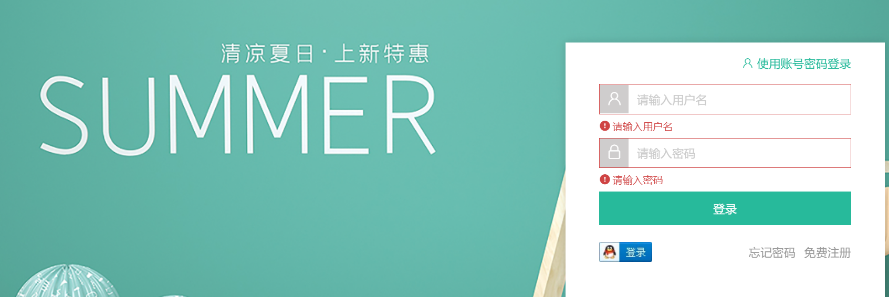
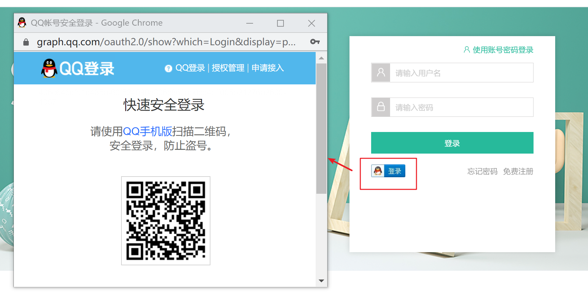
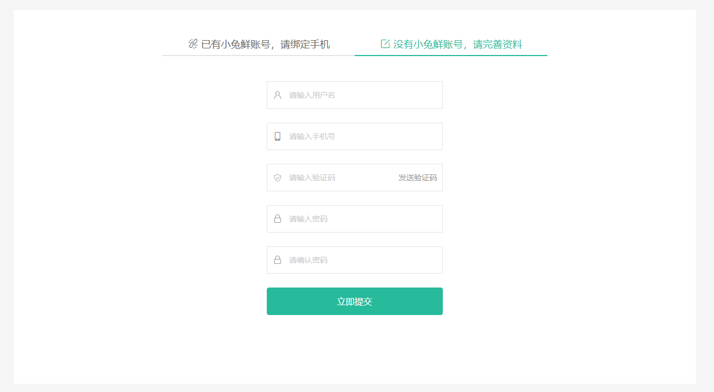

## 路由与组件

`本节目标:`  实现登录组件和路由绑定

1）新建组件

`src/views/login/index.vue`

```vue
<template>
  <div class="page-login">
    Login
  </div>
</template>
<script>
export default {
  name: 'PageLogin'
}
</script>
<style scoped lang="less"></style>
```

2）绑定路由（一级路由）

`src/router/index.js` 

```js
const Login = () => import('@/views/login/index')
const routes = [
  { path: '/login', component: Login }
]
```

3）跳转链接：`src/components/app-topnav.vue`

```html
<li><RouterLink to="/login">请先登录</RouterLink></li>
```

## 基础布局

`本节目标:`  实现登录页面的整体大结构布局

**结构分析：**

- 登录头部 LoginHeader 需要留出副标题插槽
- 登录主体 Login
- 登录底部 LoginFooter

1）新建头部组件 

`src/views/login/components/login-header.vue`

```vue
<template>
  <header class="login-header">
    <div class="container">
      <h1 class="logo"><RouterLink to="/">小兔鲜</RouterLink></h1>
      <h3 class="sub"><slot /></h3>
      <RouterLink class="entry" to="/">
        进入网站首页
        <i class="iconfont icon-angle-right"></i>
        <i class="iconfont icon-angle-right"></i>
      </RouterLink>
    </div>
  </header>
</template>

<script>
export default {
  name: 'LoginHeader'
}
</script>

<style scoped lang='less'>
.login-header {
  background: #fff;
  border-bottom: 1px solid #e4e4e4;
  .container {
    display: flex;
    align-items: flex-end;
    justify-content: space-between;
  }
  .logo {
    width: 200px;
    a {
      display: block;
      height: 132px;
      width: 100%;
      text-indent: -9999px;
      background: url(../../../assets/images/logo.png) no-repeat center 18px / contain;
    }
  }
  .sub {
    flex: 1;
    font-size: 24px;
    font-weight: normal;
    margin-bottom: 38px;
    margin-left: 20px;
    color: #666;
  }
  .entry {
    width: 120px;
    margin-bottom: 38px;
    font-size: 16px;
    i {
      font-size: 14px;
      color: @xtxColor;
      letter-spacing: -5px;
    }
  }
}
</style>
```

2）新建底部组件 

`src/views/login/components/login-footer.vue`

```vue
<template>
  <footer class="login-footer">
    <div class='container'>
      <p>
        <a href="javascript:;">关于我们</a>
        <a href="javascript:;">帮助中心</a>
        <a href="javascript:;">售后服务</a>
        <a href="javascript:;">配送与验收</a>
        <a href="javascript:;">商务合作</a>
        <a href="javascript:;">搜索推荐</a>
        <a href="javascript:;">友情链接</a>
      </p>
      <p>CopyRight &copy; 小兔鲜儿</p>
    </div>
  </footer>
</template>

<script>
export default {
  name: 'LoginFooter'
}
</script>

<style scoped lang='less'>
.login-footer {
  padding: 30px 0 50px;
  background: #fff;
  p {
    text-align: center;
    color: #999;
    padding-top: 20px;
    a {
      line-height: 1;
      padding:0 10px;
      color: #999;
      display: inline-block;
      ~ a {
        border-left: 1px solid #ccc;
      }
    }
  }
}
</style>
```

3）主体组件 
`src/views/login/index.vue`

> 将头部和底部组件引入并使用

```vue
<template>
  <!-- 头部 -->
  <LoginHeader>欢迎登录</LoginHeader>
  <!-- 主体登录区域 -->
  <section class="login-section">
    <div class="wrapper">
      <nav>
        <a href="javascript:;">账户登录</a>
        <a href="javascript:;">扫码登录</a>
      </nav>
    </div>
  </section>
  <!-- 顶部 -->
  <LoginFooter />
</template>

<script>
import LoginHeader from './components/login-header'
import LoginFooter from './components/login-footer'
export default {
  name: 'Login',
  components: {
    LoginHeader,
    LoginFooter
  }
}
</script>

<style scoped lang='less'>
.login-section {
  background: url(../../assets/images/login-bg.png) no-repeat center / cover;
  height: 488px;
  position: relative;
  .wrapper {
    width: 380px;
    background: #fff;
    min-height: 400px;
    position: absolute;
    left: 50%;
    top: 54px;
    transform: translate3d(100px,0,0);
    box-shadow: 0 0 10px rgba(0,0,0,.15);
    nav {
      height: 55px;
      border-bottom: 1px solid #f5f5f5;
      display: flex;
      padding: 0 40px;
      text-align: right;
      align-items: center;  
      a {
        flex: 1;
        line-height: 1;
        display: inline-block;
        font-size: 18px;
        position: relative;
        &:first-child {
          border-right: 1px solid #f5f5f5;
          text-align: left;
        }
        &.active{
          color: @xtxColor;
          font-weight: bold;
        }
      }
    }
  }
}
</style>
```

## 表单组件实现

`本节目标:`  实现表单组件的静态布局和基础交互


**实现步骤**

1. 提取表单组件（搭建静态结构）
2. 使用表单组件
3. 实现切换登录方式交互效果

### 1. 抽离并使用表单组件

`src/views/login/component/login-form.vue`

```vue
<template>
  <div class="account-box">
     <div class="toggle">
      <a href="javascript:;">
        <i class="iconfont icon-user"></i>
        使用账号密码登录
      </a>
    </div>
    <div class="form">
      <!-- 账号登录模板 -->
      <template >
        <div class="form-item">
          <div class="input">
            <i class="iconfont icon-user"></i>
            <input type="text" placeholder="请输入用户名或手机号" />
          </div>
          <div class="error"><i class="iconfont icon-warning" />请输入手机号</div>
        </div>
        <div class="form-item">
          <div class="input">
            <i class="iconfont icon-lock"></i>
            <input type="password" placeholder="请输入密码">
          </div>
        </div>
      </template>
      <!-- 手机号验证码登录模板 -->
      <template >
        <div class="form-item">
          <div class="input">
            <i class="iconfont icon-user"></i>
            <input type="text" placeholder="请输入手机号" />
          </div>
        </div>
        <div class="form-item">
          <div class="input">
            <i class="iconfont icon-code"></i>
            <input type="password" placeholder="请输入验证码">
            <span class="code">发送验证码</span>
          </div>
        </div>
      </template>
      
      <div class="form-item">
        <div class="agree">
          <xtx-checkbox/>
          <span>我已同意</span>
          <a href="javascript:;">《隐私条款》</a>
          <span>和</span>
          <a href="javascript:;">《服务条款》</a>
        </div>
      </div>
      <a href="javascript:;" class="btn">登录</a>
    </div>
    <div class="action">
      
      <div class="url">
        <a href="javascript:;">忘记密码</a>
        <a href="javascript:;">免费注册</a>
      </div>
    </div>
  </div>
</template>

<style lang="less" scoped>
// 账号容器
.account-box {
  .toggle {
    padding: 15px 40px;
    text-align: right;
    a {
      color: @xtxColor;
      i {
        font-size: 14px;
      }
    }
  }
  .form {
    padding: 0 40px;
    &-item {
      margin-bottom: 28px;
      .input {
        position: relative;
        height: 36px;
        > i {
          width: 34px;
          height: 34px;
          background: #cfcdcd;
          color: #fff;
          position: absolute;
          left: 1px;
          top: 1px;
          text-align: center;
          line-height: 34px;
          font-size: 18px;
        }
        input {
          padding-left: 44px;
          border: 1px solid #cfcdcd;
          height: 36px;
          line-height: 36px;
          width: 100%;
          &.error {
            border-color: @priceColor;
          }
          &.active,&:focus {
            border-color: @xtxColor;
          }
        }
        .code {
          position: absolute;
          right: 1px;
          top: 1px;
          text-align: center;
          line-height: 34px;
          font-size: 14px;
          background: #f5f5f5;
          color: #666;
          width: 90px;
          height: 34px;
          cursor: pointer;
        }
      }
      > .error {
        position: absolute;
        font-size: 12px;
        line-height: 28px;
        color: @priceColor;
        i {
          font-size: 14px;
          margin-right: 2px;
        }
      }
    }
    .agree {
      a {
        color: #069;
      }
    }
    .btn {
      display: block;
      width: 100%;
      height: 40px;
      color: #fff;
      text-align: center;
      line-height: 40px;
      background: @xtxColor;
      &.disabled {
        background: #cfcdcd;
      }
    }
  }
  .action {
    padding: 20px 40px;
    display: flex;
    justify-content: space-between;
    align-items: center;
    .url {
      a {
        color: #999;
        margin-left: 10px;
      }
    }
  }
}
</style>
```

`src/views/login/index.vue`

```jsx
<!-- 表单 -->
<LoginForm />

import LoginForm from './components/login-form'
export default {
  name: 'PageLogin',
  components: {
    LoginHeader,
    LoginFooter,
    LoginForm
}
```

### 2. 实现切换账户登录和短信登录

>需求描述：点击按钮如果当前为账户登录则切换到短信登录，否则切换到账户登录
>
>实现思路：
>
>1. 定义响应式属性`isMobileLogin` ，为true时，显示手机号登录，为false时显示以账号密码登录
>2. 点击按钮对`isMobileLogin`进行取反操作

```html
<div class="toggle">
  <a @click="toggle" href="javascript:;">
    <i class="iconfont icon-user"></i>
    {{isMobileLogin?'使用手机号登录':'使用账号密码登录'}}
  </a>
</div>
<div class="form">
  <!-- 用户名密码登录 -->
  <template v-if="!isMobileLogin">
	...
  </template>
  <!-- 手机登录 -->
  <template v-else>
	...
  </template>
 </div>
<script>
import { ref } from 'vue'
export default {
  setup () {
    const isMobileLogin = ref(false)
    function toggle () {
      isMobileLogin.value = !isMobileLogin.value
    }
    return {
      isMobileLogin, toggle
    }
  }
}
</script>
```

## 表单校验实现

`本节目标:`  使用`vee-validate`插件进行表单校验



1）安装校验插件`vee-validate`

```bash
npm i vee-validate@4.0.3
```

文档：https://vee-validate.logaretm.com/v4/ 支持vue3.0

2）导入校验组件 `src/views/login/index.vue`

```js
import { Form, Field } from 'vee-validate'
```

3）定义校验规则  `src/utils/vee-validate-schema.js` 

> 一般应用的表单校验可能多个地方都需要使用，所以我们有必要把所有的规则集中管理起来

```js
// 定义校验规则提供给vee-validate组件使用
export default {
  // 校验account
  account (value) {
    // value是将来使用该规则的表单元素的值
    // 1. 必填
    // 2. 6-20个字符，需要以字母开头
    // 如何反馈校验成功还是失败，返回true才是成功，其他情况失败，返回失败原因。
    if (!value) return '请输入用户名'
    if (!/^[a-zA-Z]\w{5,19}$/.test(value)) return '字母开头且6-20个字符'
    return true
  },
  password (value) {
    if (!value) return '请输入密码'
    if (!/^\w{6,24}$/.test(value)) return '密码是6-24个字符'
    return true
  },
  mobile (value) {
    if (!value) return '请输入手机号'
    if (!/^1[3-9]\d{9}$/.test(value)) return '手机号格式错误'
    return true
  },
  code (value) {
    if (!value) return '请输入验证码'
    if (!/^\d{6}$/.test(value)) return '验证码是6个数字'
    return true
  },
  isAgree (value) {
    if (!value) return '请勾选同意用户协议'
    return true
  }
}
```

4）使用`Form`组件配置校验规则和错误对象

>validation-schema :  配置校验规则
>
>v-slot：导出错误对象

```html
<Form
  class="form"
  :validation-schema="mySchema"
  v-slot="{ errors }"
  autocomplete="off"
>
 <!-- 表单元素 -->
</Form>
```

```html
<script>
  import schema from '@/utils/vee-validate-schema'
  setup () {
    // 表单对象数据
    const form = reactive({
      account: null, // 账号
      password: null, // 密码
      mobile: null, // 手机号
      code: null // 验证码
    })
    // 校验规则对象
    const mySchema = {
      account: schema.account,
      password: schema.password,
      mobile: schema.mobile,
      code: schema.code,
    }
    return { form, mySchema }
 } 
</script>
```

5）使用 `Field` 组件，添加表单项目校验

> 步骤说明：
>
> 1. 把input改成 `Field` 组件，默认解析成input
>
> 2. `Field` 添加name属性，作用是指定使用schema中哪个校验规则
> 3. `Field`添加v-model，作用是提供表单数据的双向绑定
> 4. 发生表单校验错误，显示错误类名`error`，提示红色边框

校验账号

```html
<div class="form-item">
  <div class="input">
    <i class="iconfont icon-user"></i>
    <Field
      v-model="form.account"
      name="account"
      type="text"
      placeholder="请输入用户名"
      :class="{ error: errors.account }"
    />
    <!-- <input type="text" placeholder="请输入用户名" /> -->
  </div>
  <div class="error" v-if="errors.account">
    <i class="iconfont icon-warning" />{{ errors.account }}
  </div>
</div>
```

校验密码

```html
<div class="form-item">
  <div class="input">
    <i class="iconfont icon-lock"></i>
    <Field
      :class="{ error: errors.password }"
      v-model="form.password"
      name="password"
      type="password"
      placeholder="请输入密码"
    />
    <!-- <input type="password" placeholder="请输入密码" /> -->
  </div>
  <div class="error" v-if="errors.password">
    <i class="iconfont icon-warning" />{{ errors.password }}
  </div>
</div>
```

校验手机号

```html
<div class="form-item">
  <div class="input">
    <i class="iconfont icon-user"></i>
    <Field
      :class="{ error: errors.mobile }"
      v-model="form.mobile"
      name="mobile"
      placeholder="请输入手机号"
    />
    <!-- <input type="text" placeholder="请输入手机号" /> -->
  </div>
  <div class="error" v-if="errors.mobile">
    <i class="iconfont icon-warning" />{{ errors.mobile}}
  </div>
</div>
```

校验验证码

```html
<div class="form-item">
  <div class="input">
    <i class="iconfont icon-code"></i>
    <Field
      :class="{ error: errors.code }"
      v-model="form.code"
      name="code"
      placeholder="请输入验证码"
    />
    <!-- <input type="password" placeholder="请输入验证码" /> -->
    <span class="code">发送验证码</span>
  </div>
   <div class="error" v-if="errors.code">
    <i class="iconfont icon-warning" />{{ errors.code}}
  </div>
</div>
```

7）切换短信与账户登录时候清空表单和校验结果

```jsx
<Form ref="target">...</Form>

setup(){
   const target = ref(null)
   watch(isMobileLogin, () => {
      // 还原数据
      form.isAgree = true
      form.account = null
      form.password = null
      form.mobile = null
      form.code = null
      // 补充校验效果清除，Form组件提供resetForm()
      target.value.resetForm()
    })
   return { target }
}
```

8）整体表单校验

> 实现步骤：
>
> 1. 通过ref获得表单组件对象
>
> 2. 执行组件对象身上的validate方法 （执行完毕返回promise对象）

```jsx
<a @click="submit" href="javascript:;" class="btn">登 录</a>

setup(){
    async submit () {
      const valid = await target.value.validate()
      console.log(valid)
    }
}
```

## 消息提示组件封装


### 1. 基础定义和使用

`本节目标:`  以普通组件的形式封装全局提示组件的基础样式

1）定义组件：`src/components/Message/index.vue`

```vue
<template>
  <div class="xtx-message" :style="style[type]">
    <!-- 上面绑定的是样式 -->
    <i class="iconfont" :class="[style[type].icon]"></i>
     <!-- 不同提示图标会变 -->
    <span class="text">{{text}}</span>
  </div>
</template>
<script>
export default {
  name: 'XtxMessage',
  props: {
    text: {
      type: String,
      default: ''
    },
    type: {
      type: String,
      // warn 警告  error 错误  success 成功
      default: 'warn'
    }
  },
  setup () {
    // 定义一个对象，包含三种情况的样式，对象key就是类型字符串
    const style = {
      warn: {
        icon: 'icon-warning',
        color: '#E6A23C',
        backgroundColor: 'rgb(253, 246, 236)',
        borderColor: 'rgb(250, 236, 216)'
      },
      error: {
        icon: 'icon-shanchu',
        color: '#F56C6C',
        backgroundColor: 'rgb(254, 240, 240)',
        borderColor: 'rgb(253, 226, 226)'
      },
      success: {
        icon: 'icon-queren2',
        color: '#67C23A',
        backgroundColor: 'rgb(240, 249, 235)',
        borderColor: 'rgb(225, 243, 216)'
      }
    }
    return { style }
  }
}
</script>
<style scoped lang="less">
.xtx-message {
  width: 300px;
  height: 50px;
  position: fixed;
  z-index: 9999;
  left: 50%;
  margin-left: -150px;
  top: 25px;
  line-height: 50px;
  padding: 0 25px;
  border: 1px solid #e4e4e4;
  background: #f5f5f5;
  color: #999;
  border-radius: 4px;
  i {
    margin-right: 4px;
    vertical-align: middle;
  }
  .text {
    vertical-align: middle;
  }
}
</style>
```

2）使用组件

```vue
<XtxMessage text="手机号或密码错误" type="error" />
```

### 2. 添加动画

`本节目标:`  弹框显示的时候增加简单动画

**前置知识**

> vue提供了内置组件  `Transition`  它可以在内部元素进行显式和隐藏切换的时候，自动为元素添加动画

**使用步骤**

1）使用内置组件把弹框元素包裹

```html
<Transition name="down">
    <div class="xtx-message" :style="style[type]">
      <!-- 上面绑定的是样式 -->
      <!-- 不同提示图标会变 -->
      <i class="iconfont" :class="[style[type].icon]"></i>
      <span class="text">{{ text }}</span>
    </div>
</Transition>

<style>
 // .down-enter-from{}   .down-enter-active{}  .down-enter-to{}
 .down {
  &-enter {
    // 进入前 往上移动75px 并且透明度为零
    &-from {
      transform: translate3d(0, -75px, 0);
      opacity: 0;
    }
    // 进入中 对所有的可以支持过滤效果的样式都应用过渡效果 整个过渡时长是0.5s
    &-active {
      transition: all 0.5s;
    }
    // 进入后
    &-to {
      transform: none;
      opacity: 1;
    }
  }
}
</style>
```

2）借助v-show让组件从隐藏到显示

```jsx
<div class="xtx-message" :style="style[type]" v-show="visible">
  <i class="iconfont" :class="[style[type].icon]"></i>
  <span class="text">{{ text }}</span>
</div>

setup () {
    // 默认隐藏
    const visible = ref(false)
    onMounted(() => {
      visible.value = true
    })
    return { visible }
}
```

### 3. 以函数形式调用

`本节目标:`  把弹框组件的显示修改为函数调用形式

**前置知识**

1. createVNode   生成虚拟dom节点 

   https://v3.cn.vuejs.org/guide/render-function.html#%E8%99%9A%E6%8B%9F-dom-%E6%A0%91

2. render  把虚拟dom节点渲染到真实的dom中

**实现步骤**

1）函数调用改写

`components/Message/index.js`

```js
// 实现使用函数调用xtx-message组件的逻辑
import { createVNode, render } from 'vue'
import XtxMessage from './index.vue'

// 准备dom容器
const div = document.createElement('div')
div.setAttribute('class', 'xtx-message-container')
document.body.appendChild(div)
// 定时器标识
let timer = null

// 导出使用方法
export default ({ type, text }) => {
  // 实现：根据xtx-message.vue渲染消息提示
  // 1. 导入组件
  // 2. 根据组件创建虚拟节点
  const vnode = createVNode(XtxMessage, { type, text })
  // 3. 准备一个DOM容器
  // 4. 把虚拟节点渲染DOM容器中
  render(vnode, div)
  // 5. 开启定时，移出DOM容器内容
  clearTimeout(timer)
  timer = setTimeout(() => {
    render(null, div)
  }, 2000)
}
```

2）验证使用

```js
import Message from '@/components/Message'
Message({ type: 'error', text: '登录失败' })
```

## 账户登录

`本节目标:`  实现账户名密码登录功能

1）定义API 

`src/api/user.js`

```js
import request from '@/utils/request'

/**
 * 帐号登录
 * @param {String} account - 用户名
 * @param {String} password - 密码
 * @returns Promise
 */

export const userAccountLogin = ({ account, password }) => {
  return request('/login', 'post', { account, password })
}
```

2）定义修改用户信息的mutation

`src/store/module/user.js`

```js
// 用户状态
export default {
  namespaced: true,
  state: () => ({
    profile: {
      id: '',
      account: '',
      nickname: '',
      avatar: '',
      token: '',
      mobile: ''
    }
  }),
  mutations: {
    setUser (state, payload) {
      state.profile = payload
    }
  }
}
```

3）实现登录逻辑

 `src/views/login/components/login-form.vue`

```js
import { userAccountLogin } from '@/api/user'
import Message from '@/components/library/Message'
import { useStore } from 'vuex'
import { useRoute, useRouter } from 'vue-router'

setup(){
    const store = useStore()
    const router = useRouter()
    const route = useRoute()
    function acountLogin () {
      // 帐号密码登录
      userAccountLogin(form).then(data => {
        // 成功
        const { id, account, nickname, avatar, token, mobile } = data.result
        store.commit('user/setUser', { id, account, nickname, avatar, token, mobile })
        Message({ type: 'success', text: '登录成功' })
        router.push(route.query.redirectUrl || '/')
      })
    }
    async function submit () {
      const valid = await target.value.validate()
      if (valid) {
        // 发送请求
        if (!isMobileLogin.value) {
          acountLogin()
        } else {
          // 短信登录
        }
      }
    }
}
```

## 退出登录

`本节目标:`  实现账户名密码登录功能

**实现步骤**

1. 清空用户数据 （本地和数据库）

2. 跳回到登录页 （记录当前发生退出登录行为时完整地址 fullPath path + 路径参数）

> 目前的vuex对于组合式API的配合不是很好，不太方便使用映射函数，此时我们就还使用选项式API风格即可

```html
<template v-if="profile.token">
  <li>
    <a href="javascript:;"><i class="iconfont icon-user"></i>
      {{profile.nickname||profile.account}}
    </a>
  </li>
  <li><a @click="logOut()" href="javascript:;">退出登录</a></li>
</template>

<script>
import { useStore } from 'vuex'
import { useRouter } from 'vue-router'
export default {
  name: 'AppTopnav',
  setup () {
    const store = useStore()
    const router = useRouter()
    function loginOut () {
      // 退出登录的逻辑
      // 1. 清空用户数据  vuex
      store.commit('user/clearProfile')
      // 2. 跳转到登录页
      router.push({
        path: '/login'
      })
    }
    return {
      loginOut
    }
  }
}
</script>
```

## 倒计时逻辑封装

`本节目标:`   封装一个通用的倒计时逻辑函数`useCountDown`

**需求描述**

1. 支持自定义参数传入定制倒计时初始值

   eg: ` useCountDown(60)`

2. 返回当前计数/暂停计时方法/开始计时方法供业务使用

   eg: `const {countTime, start, pause} = useCountDown()`

3. 未开始倒计时之前，countTime默认值为0

**逻辑实现**

> https://vueuse.org/shared/useIntervalFn/

```js
export function useCountDown (time) {
  // 不开启默认是0
  const countTime = ref(0)
  const { pause, resume } = useIntervalFn(() => {
    // 自减逻辑
    countTime.value--
    // 到零停止
    if (countTime.value <= 0) {
      pause()
    }
    // 每一秒执行一次
  }, 1000, false)
  // 开始计时方法 
  function start () {
    countTime.value = time
    resume()
  }
  return {
    countTime,
    start,
    pause
  }
}
```


## QQ三方登录 - 前置环境和交互

### 1. 登录简要流程梳理

`本节目标:`   掌握第三方登录的实现流程


1. 在登录页面，QQ登录按钮处，赋予其打开QQ登录页面功能
2. 回跳的页面得到QQ给的唯一标识openId，根据openId去后台查询是否已经绑定过账户
   - 如果绑定过，完成登录
   - 没有绑定过
     - 有账号的，绑定手机号，即为登录
     - 没账号的，完善账户信息，即为登录
3. 登录成功后，跳转首页，或者来源页面

### 2. 前置工作准备

1）参考文档

1. [准备工作(opens new window)](https://wiki.connect.qq.com/准备工作_oauth2-0)
2. [QQ互联JS_SDK(opens new window)](https://wiki.connect.qq.com/js_sdk使用说明#3..E8.87.AA.E5.AE.9A.E4.B9.89.E7.99.BB.E5.BD.95.E6.8C.89.E9.92.AE)

2）大概步骤

1. 准备一个已经**备案**的网站需要有QQ登录的逻辑（登录页面，回跳页面）

2. 然后在QQ互联上进行身份认证，并且审核通过

3. 在QQ互联上创建应用，应用需要域名，备案号，回调地址等然后等待审核通过得到`应用ID` `应用key` `回调地址`

- 注意：id和uri都不能修改，否则无效

```bash
# 测试用appid 
# 100556005
# 测试用redirect_uri
# http://www.corho.com:8080/#/login/callback
```

3）解决环境问题

> 由于本地我们的网站是访问`http://localhost:8080`，而回调地址的域名是`http://www.corho.com:8080`，俩个地址不一致是无法进行跳转的，需要我们修改本地的hosts文件，让域名访问时解析到我们本地的ip上
>
> DNS：
>
> 1. 作用是将域名地址解析成ip地址
> 2. 优先级  先以本地的host文件为主  然后才走线上的dns服务器

windows

```bash
1. 找到 C:\Windows\System32\drivers\etc 下hosts文件
2. 在文件中加入  127.0.0.1       www.corho.com
3. 保存即可
# 如果提示没有权限
1. 将hosts文件移到桌面，然后进行修改，确认保存。
2. 将桌面hosts文件替换c盘文件
```

mac OS

```bash
1. 打开命令行窗口
2. 输入：sudo vim /etc/hosts
3. 按下：i 键
4. 输入：127.0.0.1       www.corho.com
5. 按下：esc
6. 按下：shift + :
7. 输入：wq 回车即可
```

需要开启IP或域名访问webpack服务器权限，在vue.config.js中配置

```json
# 这个是给webpack-dev-server开启可IP和域名访问权限
chainWebpack: config => {
  config.devServer.disableHostCheck(true)
}
```


浏览器输入`http://www.corho.com:8080/#/`  如果也能正常访问页面则正面配置已经生效

### 3. 按钮跳转实现

1）在`public/index.html`添加sdk文件

```html
<script src="http://connect.qq.com/qc_jssdk.js" data-appid="100556005" data-redirecturi="http://www.corho.com:8080/#/login/callback"></script>
```

2）在vue.config.js添加

```json
# 这个是设置外部扩展，模块为qc变量名为QC，导入qc将不做打包
configureWebpack: {
    externals: {
      // 用来去除打包时候的常用不变模块 
      qc: 'QC'
    }
}
```

3）在 `src/views/login.vue`

```jsx
// 导入QC
import QC from 'qc'
// 准备一个id容器
<span id="qqLoginBtn"></span>
onMounted(() => {
  // 组件渲染完毕，使用QC生成QQ登录按钮
  QC.Login({
    btnId: 'qqLoginBtn'
  })
})
```

4）点击QQ登录按钮，点击后新窗口打开登录页面



以上我们按照QQ官方提示，完成了点击登录按钮唤起QQ登录弹框，我们发现现在的交互是打开新窗口，而不是在当前窗口中，这不符合我们的交互要求，接下来我们解决一下这个问题

### 4. 当前窗口登录实现

> 关键点：找到跳转链接
>
> 操作：审查元素查看`QQ登录`  按钮外面包裹的跳转链接

```html
<a
    href="https://graph.qq.com/oauth2.0/authorize?client_id=100556005&response_type=token&scope=all&redirect_uri=http%3A%2F%2Fwww.corho.com%3A8080%2F%23%2Flogin%2Fcallback"
  >
    
</a>
<!-- <span id="qqLoginBtn"></span> -->
```

### 5. 准备回跳组件


> 上一小节，我们实现了直接在当前窗口打开会跳地址，但是由于我们没有准备回跳组件，页面上面都不显示，借来我们就准备一下回跳的落地组件

1）新建组件

`views/Login/callback.vue`

```html
<template>
  <LoginHeader>联合登录</LoginHeader>
  <section class="container">
    <nav class="tab">
      <a
        href="javascript:;"
      >
        <i class="iconfont icon-bind" />
        <span>已有小兔鲜账号，请绑定手机</span>
      </a>
      <a
        href="javascript:;"
      >
        <i class="iconfont icon-edit" />
        <span>没有小兔鲜账号，请完善资料</span>
      </a>
    </nav>
  </section>
  <LoginFooter />
</template>

<script>

import LoginHeader from './components/login-header'
import LoginFooter from './components/login-footer'
export default {
  name: 'PageCallback',
  components: { LoginHeader, LoginFooter },
  setup () {

  }
}
</script>

<style scoped lang='less'>
.container {
  padding: 25px 0;
}
.tab {
  background: #fff;
  height: 80px;
  padding-top: 40px;
  font-size: 18px;
  text-align: center;
  a {
    color: #666;
    display: inline-block;
    width: 350px;
    line-height: 40px;
    border-bottom: 2px solid #e4e4e4;
    i {
      font-size: 22px;
      vertical-align: middle;
    }
    span {
      vertical-align: middle;
      margin-left: 4px;
    }
    &.active {
      color: @xtxColor;
      border-color: @xtxColor;
    }
  }
}
.tab-content {
  min-height: 600px;
  background: #fff;
}
</style>
```

2）绑定路由

```jsx
const LoginCallBack = () => import('@/views/Login/callback')

{
    path: '/login/callback',
    component: LoginCallBack
}
```

绑定好之后，我们发现页面已经可以正常访问了

3）准备绑定手机组件和完善信息组件

`src/views/Login/components/callback-bind.vue` 绑定手机

```vue
<template>
  <div class="xtx-form">
    <div class="user-info">
      
      <p>Hi，Tom 欢迎来小兔鲜，完成绑定后可以QQ账号一键登录哦~</p>
    </div>
    <div class="xtx-form-item">
      <div class="field">
        <i class="icon iconfont icon-phone"></i>
        <input class="input" type="text" placeholder="绑定的手机号" />
      </div>
      <div class="error"></div>
    </div>
    <div class="xtx-form-item">
      <div class="field">
        <i class="icon iconfont icon-code"></i>
        <input class="input" type="text" placeholder="短信验证码" />
        <span class="code">发送验证码</span>
      </div>
      <div class="error"></div>
    </div>
    <a href="javascript:;" class="submit">立即绑定</a>
  </div>
</template>

<script>
export default {
  name: 'CallbackBind'
}
</script>

<style scoped lang='less'>
.user-info {
    width: 320px;
    height: 70px;
    margin: 0 auto;
    display: flex;
    background: #f2f2f2;
    align-items: center;
    padding: 0 10px;
    margin-bottom: 25px;
    img {
      background: #f2f2f2;
      width: 50px;
      height: 50px;
    }
    p {
      padding-left: 10px;
    }
  }
  .code {
    position: absolute;
    right: 0;
    top: 0;
    line-height: 50px;
    width: 80px;
    color: #999;
    &:hover {
      cursor: pointer;
    }
  }
</style>
```

`src/views/Login/components/callback-patch.vue` 完善信息

```vue
<template>
  <div class="xtx-form">
    <div class="xtx-form-item">
      <div class="field">
        <i class="icon iconfont icon-user"></i>
        <input class="input" type="text" placeholder="请输入用户名" />
      </div>
      <div class="error"></div>
    </div>
    <div class="xtx-form-item">
      <div class="field">
        <i class="icon iconfont icon-phone"></i>
        <input class="input" type="text" placeholder="请输入手机号" />
      </div>
      <div class="error"></div>
    </div>
    <div class="xtx-form-item">
      <div class="field">
        <i class="icon iconfont icon-code"></i>
        <input class="input" type="text" placeholder="请输入验证码" />
        <span class="code">发送验证码</span>
      </div>
      <div class="error"></div>
    </div>
    <div class="xtx-form-item">
      <div class="field">
        <i class="icon iconfont icon-lock"></i>
        <input class="input" type="password" placeholder="请输入密码" />
      </div>
      <div class="error"></div>
    </div>
    <div class="xtx-form-item">
      <div class="field">
        <i class="icon iconfont icon-lock"></i>
        <input class="input" type="password" placeholder="请确认密码" />
      </div>
      <div class="error"></div>
    </div>
    <a href="javascript:;" class="submit">立即提交</a>
  </div>
</template>

<script>
export default {
  name: 'CallbackPatch'
}
</script>

<style scoped lang='less'>
.code {
  position: absolute;
  right: 0;
  top: 0;
  line-height: 50px;
  width: 80px;
  color: #999;
  &:hover {
    cursor: pointer;
  }
}
</style>
```

`src/styles/common.less` 公用样式

```less
// 表单
.xtx-form {
  padding: 50px 0;
  &-item {
    display: flex;
    align-items: center;
    width: 700px;
    margin: 0 auto;
    padding-bottom: 25px;
    .label {
      width: 180px;
      padding-right: 10px;
      text-align: right;
      color: #999;
      ~ .field {
        margin-left: 0;
      }
    }
    .field {
      width: 320px;
      height: 50px;
      position: relative;
      margin-left: 190px;
      .icon {
        position: absolute;
        left: 0;
        top: 0;
        width: 40px;
        height: 50px;
        text-align: center;
        line-height: 50px;
        color: #999;
        ~ .input {
          padding-left: 40px;
        }
      }
      .input{
        border: 1px solid #e4e4e4;
        width: 320px;
        height: 50px;
        line-height: 50px;
        padding: 0 10px;
        &.err {
          border-color: @priceColor;
        }
        &:focus,&:active{
          border-color: @xtxColor;
        }
      }
    }
    .error {
      width: 180px;
      padding-left: 10px;
      color: @priceColor;
    }
  }
  .submit {
    width: 320px;
    height: 50px;
    border-radius: 4px;
    background: @xtxColor;
    height: 50px;
    line-height: 50px;
    text-align: center;
    font-size: 16px;
    color: #fff;
    display: block;
    margin: 0 auto;
  }
}
```

### 6. 完成切换交互


> 实现思路 :  典型的tab类效果实现，声明一个响应式数据 hasAccount 通过它的值配合v-if实现对应的内容激活

**代码落地**

```html
<template>
  <LoginHeader>联合登录</LoginHeader>
  <section class="container">
    <nav class="tab">
      <a href="javascript:;" @click="hasAccount = true" :class="{active:hasAccount}">
        <i class="iconfont icon-bind" />
        <span>已有小兔鲜账号，请绑定手机</span>
      </a>
      <a href="javascript:;" @click="hasAccount = false" :class="{active:!hasAccount}">
        <i class="iconfont icon-edit" />
        <span>没有小兔鲜账号，请完善资料</span>
      </a>
    </nav>
    <!-- 有账号 -->
    <div class="tab-content" v-if="hasAccount">
      <CallbackBind />
    </div>
    <!-- 没有账号 -->
    <div class="tab-content" v-else>
      <CallbackPatch />
    </div>
  </section>
  <LoginFooter />
</template>

<script>

import LoginHeader from './components/login-header'
import LoginFooter from './components/login-footer'
import CallbackBind from './components/callback-bind'
import CallbackPatch from './components/callback-patch'
import { ref } from 'vue'
export default {
  name: 'PageCallback',
  components: { LoginHeader, LoginFooter, CallbackBind, CallbackPatch },
  setup ()  
    // 是否有账号
    const hasAccount = ref(true)
    return {
      hasAccount
    }
  }
}
</script>
```

## QQ三方登录 - 多状态实现

### 1. 有账号已绑定

**实现思路**

1. 回跳组件初始化的时候获取openId
2. 根据openId去自己后台尝试进行登录
3. 如果成功，就代表已注册已绑定，记录返回的用户信息，跳转到首页或者来源页面

**代码落地**

1）准备使用QQ uionId进行应用登录的接口

```js
/**
 * 第三方登录
 * @param {String} unionId - 第三方登录唯一标识 qq openId
 * @param {Integer} source - 来源 1为pc，2为webapp，3为微信小程序, 4为Android, 5为ios, 6为qq, 7为微信
 * @returns Promise
 */

export const userQQLogin = (unionId, source = 6) => {
  return request('https://pcapi-xiaotuxian-front-devtest.itheima.net/login/social', 'post', {   unionId, source })
}
```

2）在检验QQ登录之后进行接口调用

> js dk公开方法
>
> 1. QC.Login.check()  检查QQ是否已经登录  true
> 2. QC.Login.getMe()  获取用户标识openId 将来传给userQQLogin作为第一个参数

```js
// 已注册已绑定
const store = useStore()
const router = useRouter()
if (QC.Login.check()) {
  // 检查QQ是否登录
  QC.Login.getMe((openId) => {
    userQQLogin(openId).then(data => {
      // 使用qq登录成功
      // 1. 存储用户信息
      store.commit('user/setProfile', data)
      // 2. 跳转首页
      router.push('/')
      // 3. 成功提示
      Message({ type: 'success', text: 'QQ登录成功' })
    }).catch(e => {
      // 使用qq登录失败
      console.log('qq还未绑定过账号')
    })
  })
}
```

### 2. 有账号未绑定

> 有账号未绑定的状态，手动调用一下解绑接口
>
> http://pcapi-xiaotuxian-front-devtest.itheima.net/login/social/unbind?mobile=手机号


**实现思路**

1. 获取QQ用户的头像和昵称展示
2. 进行表单校验
3. 进行短信验证码发送
4. 进行绑定，完成后把当前用户数据存入vuex，跳转到首页

**代码落地**

#### 2.1 获取用户头像和昵称

> QC.api('get_user_info').success(( res )=>{})

`CallbackBind.vue`

```html
<template>
  <div class="xtx-form">
    <div class="user-info">
      
      <p>Hi，{{avatar}} 欢迎来小兔鲜，完成绑定后可以QQ账号一键登录哦~</p>
    </div>
  </div>
</template>

<script>
export default {
  name: 'CallbackBind',
  setup () {
    // 已注册未绑定
    // 名称和头像
    const nickname = ref('')
    const avatar = ref('')
    if (QC.Login.check()) {
      QC.api('get_user_info').success(res => {
        avatar.value = res.data.figureurl_qq_1
        nickname.value = res.data.nickname
      })
    }
    return {
        nickname,
        avatar
    }
  }
}
</script>
```

#### 2.2 校验表单数据

```html
<template>
  <Form
    ref="formCom"
    :validation-schema="mySchema"
    v-slot="{ errors }"
    autocomplete="off"
    class="xtx-form"
  >
    <div class="user-info">
      
      <p>Hi，{{ nickname }} 欢迎来小兔鲜，完成绑定后可以QQ账号一键登录哦~</p>
    </div>
    <div class="xtx-form-item">
      <div class="field">
        <i class="icon iconfont icon-phone"></i>
        <Field
          :class="{ err: errors.mobile }"
          v-model="form.mobile"
          name="mobile"
          class="input"
          type="text"
          placeholder="绑定的手机号"
        />
      </div>
      <div v-if="errors.mobile" class="error">{{ errors.mobile }}</div>
    </div>
    <div class="xtx-form-item">
      <div class="field">
        <i class="icon iconfont icon-code"></i>
        <Field
          :class="{ err: errors.code }"
          v-model="form.code"
          name="code"
          class="input"
          type="text"
          placeholder="短信验证码"
        />
        <span  class="code">
            发送验证码
        </span>
      </div>
      <div v-if="errors.code" class="error">{{ errors.code }}</div>
    </div>
    <a href="javascript:;" class="submit">立即绑定</a>
  </Form>
</template>

<script>
import { Form, Field } from 'vee-validate'
import schema from '@/utils/vee-validate-schema'
import { reactive, ref } from 'vue'
export default {
  name: 'CallbackBind',
  components: { Form, Field },
  setup () {
    // 表单数据对象
    const form = reactive({
      mobile: null,
      code: null
    })
    // 校验规则对象
    const mySchema = {
      mobile: schema.mobile,
      code: schema.code
    }
    return {
      form,
      mySchema
    }
  }
}
</script>
```

#### 2.3 发送验证码 （这个发送的动作必须要有！！！）

1）准备发送验证码接口

```js
/**
 * 获取QQ绑定的时候短信验证码
 * @param {String} mobile - 手机号
 * @returns promise
 */
export const userQQBindCode = (mobile) => {
  return request(
      '/login/social/code',
      'get', 
      { mobile }
  )
}
```

2）表单校验通过之后调用接口

> 对表单某项进行单独校验  `formCom.value.setFieldError('mobile', errorMsg)`  // （字段,错误信息）

```html
<script>
  import { useIntervalFn } from '@vueuse/core'
  import { userQQBindCode } from '@/api/user'
  import { useCountDown } from '@/compositions'
  export defalut {
     setup(){
        // 发送验证码
        const { countTime, start } = useCountDown(60)
        const formCom = ref(null)
        const send = async () => {
          const valid = mySchema.mobile(form.mobile)
          if (valid === true) {
            // 通过
            if (countTime.value === 0) {
              // 没有倒计时才可以发送
              await userQQBindCode(form.mobile)
              Message({ type: 'success', text: '发送成功' })
              // 开启倒计时
              start()
            }
          } else {
            // 失败，使用vee的错误函数显示错误信息 setFieldError(字段,错误信息)
            formCom.value.setFieldError('mobile', valid)
          }
        }
     }
  }
</script>

<span  class="code" @click="send">
     {{countTime===0?'发送验证码':`${countTime}秒后发送`}}
</span>
```

#### 2.4 立刻绑定实现

1）准备绑定接口

```js
/**
 * QQ登录-绑定帐号
 * @param {String} unionId - QQ唯一标识，openId
 * @param {String} mobile - 手机号
 * @param {String} code - 验证码
 * @returns
 */
export const userQQBindLogin = ({ unionId, mobile, code }) => {
  return request('/login/social/bind', 'post', { unionId, mobile, code })
}
```

2）绑定业务实现

```html
<script>
import { userQQBindLogin } from '@/api/user'
import Message from '@/components/Message'
import { useStore } from 'vuex'
import { useRouter } from 'vue-router'
export default {
  name: 'CallbackBind',
  components: { Form, Field },
  props: {
    unionId: {
      type: String
    }
  },
  setup (props) {
    // 立即绑定
    const store = useStore()
    const router = useRouter()
    const submit = async () => {
      const valid = formCom.value.validate()
      if (valid) {
        userQQBindLogin({
          unionId: props.unionId,
          ...form
        }).then(data => {
          // 实现和之前登录一样的逻辑
          // 1. 存储用户信息
          store.commit('user/setProfile', data)
          // 2. 跳转到来源页或者首页
          router.push('/')
          // 3. 成功提示
          Message({ type: 'success', text: 'QQ绑定成功' })
        }).catch(e => {
          Message({ type: 'error', text: '绑定失败' })
        })
      }
    }
    return {
      send
    }
  }
}
</script>
```

### 3. 无账号未绑定

> 无账号未绑定的状态，直接使用全新的手机号进行测试即可



**实现思路**

1. 完成表单校验，需要加两个校验规则，用户名和确认密码
2. 需要短信验证码功能，使用注册时候的接口
3. 进行完善，完成后为登录状态，跳转到首页或者来源页面

**代码落地**

1）准备相关接口

`api/user.js`

```js
/**
 * 获取QQ完善信息的时候短信验证码
 * @param {String} mobile - 手机号
 * @returns promise
 */
export const userQQPatchCode = (mobile) => {
  return request('/register/code', 'get', { mobile })
}

/**
 * QQ登录-完善信息
 * @param {String} unionId - QQ唯一标识，openId
 * @param {String} mobile - 手机号
 * @param {String} code - 验证码
 * @param {String} account - 帐号
 * @param {String} password - 密码
 * @returns
 */
export const userQQPatchLogin = ({ unionId, mobile, code, account, password }) => {
  return request(`/login/social/${unionId}/complement`, 'post', { unionId, mobile, code, account, password })
}

```

2）表单校验

```html
<template>
  <Form ref="formCom" :validation-schema="mySchema" v-slot="{errors}" class="xtx-form" autocomplete="off">
    <div class="xtx-form-item">
      <div class="field">
        <i class="icon iconfont icon-user"></i>
        <Field :class="{err:errors.account}" v-model="form.account" name="account" class="input" type="text" placeholder="请输入用户名" />
      </div>
      <div v-if="errors.account" class="error">{{errors.account}}</div>
    </div>
    <div class="xtx-form-item">
      <div class="field">
        <i class="icon iconfont icon-phone"></i>
        <Field :class="{err:errors.mobile}" v-model="form.mobile" name="mobile" class="input" type="text" placeholder="请输入手机号" />
      </div>
      <div v-if="errors.mobile" class="error">{{errors.mobile}}</div>
    </div>
    <div class="xtx-form-item">
      <div class="field">
        <i class="icon iconfont icon-code"></i>
        <Field :class="{err:errors.code}" v-model="form.code" name="code" class="input" type="text" placeholder="请输入验证码" />
        <span @click="send" class="code">
          {{time===0?'发送验证码':`${time}秒后发送`}}
        </span>
      </div>
      <div v-if="errors.code" class="error">{{errors.code}}</div>
    </div>
    <div class="xtx-form-item">
      <div class="field">
        <i class="icon iconfont icon-lock"></i>
        <Field :class="{err:errors.password}" v-model="form.password" name="password" class="input" type="password" placeholder="请输入密码" />
      </div>
      <div v-if="errors.password" class="error">{{errors.password}}</div>
    </div>
    <div class="xtx-form-item">
      <div class="field">
        <i class="icon iconfont icon-lock"></i>
        <Field :class="{err:errors.rePassword}" v-model="form.rePassword" name="rePassword" class="input" type="password" placeholder="请确认密码" />
      </div>
      <div v-if="errors.rePassword" class="error">{{errors.rePassword}}</div>
    </div>
    <a @click="submit()" href="javascript:;" class="submit">立即提交</a>
  </Form>
</template>

<script>
import { Form, Field } from 'vee-validate'
import { reactive, ref, onUnmounted } from 'vue'
import schema from '@/utils/vee-validate-schema'
import { userQQPatchCode, userQQPatchLogin } from '@/api/user'
import { useIntervalFn } from '@vueuse/core'
import Message from '@/components/Message'
import { useStore } from 'vuex'
import { useRouter } from 'vue-router'
export default {
  name: 'CallbackPatch',
  components: { Form, Field },
  props: {
    unionId: {
      type: String,
      default: ''
    }
  },
  setup (props) {
    // 表单数据对象
    const form = reactive({
      account: null,
      mobile: null,
      code: null,
      password: null,
      rePassword: null
    })
    // 表单校验规则
    const mySchema = {
      account: schema.accountApi,
      mobile: schema.mobile,
      code: schema.code,
      password: schema.password,
      rePassword: schema.rePassword
    }

   // -------------------------------------------------------
   const formCom = ref(null)
   const { countTime, start, pause } = useCountDown(60)
    // 1. 发送验证码
    // 1.1 绑定发送验证码按钮点击事件
    // 1.2 校验手机号，如果成功才去发送短信（定义API），请求成功开启60s的倒计时，不能再次点击，倒计时结束恢复
    // 1.3 如果失败，失败的校验样式显示出来
    const send = async () => {
      const valid = mySchema.mobile(form.mobile)
      if (valid === true) {
        // 通过
        if (countTime.value === 0) {
        // 没有倒计时才可以发送
          await userQQPatchCode(form.mobile)
          Message({ type: 'success', text: '发送成功' })
          start()
        }
      } else {
        // 失败，使用vee的错误函数显示错误信息 setFieldError(字段,错误信息)
        formCom.value.setFieldError('mobile', valid)
      }
    }

    // ----------------------------------------------------------
    // 完善信息
    const store = useStore()
    const router = useRouter()
    const submit = async () => {
      const valid = formCom.value.validate()
      if (valid) {
        userQQPatchLogin({
          unionId: props.unionId,
          ...form
        }).then(data => {
          // 实现和之前登录一样的逻辑
          store.commit('user/setProfile', data)
           // 2. 跳转到来源页或者首页
            router.push('/')
            // 3. 成功提示
            Message({ type: 'success', text: 'QQ完善信息成功' })
        }).catch(e => {
          Message({ type: 'error', text: '完善信息失败' })
        })
      }
    }

    return { form, mySchema, formCom, time, send, submit }
  }
}
</script>

<style scoped lang='less'>
.code {
  position: absolute;
  right: 0;
  top: 0;
  line-height: 50px;
  width: 80px;
  color: #999;
  &:hover {
    cursor: pointer;
  }
}
</style>
```


