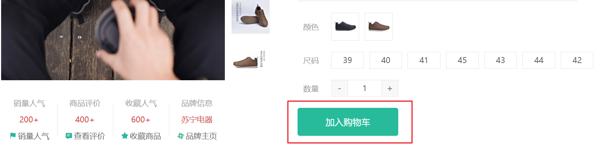

# 购物车功能分析


**思路流程**

1. 购物车的各种操作都会有俩种状态的区分，登录和未登录

2. 所有操作都封装到vuex中，组件只需要触发actions函数

3. 在actions中通过user信息去区分登录状态
   1. 未登录时，通过mutations修改vuex中的数据即可，vuex已经实现持久化，会同步保存在本地
   2. 已登录，通过API接口去服务端操作，响应成功会通过mutations修改vuex中的数据即可，它也会同步到本地
4. 不管何种状态下，actions函数始终返回一个promise对象，方便我们组件中能够判断操作是否成功，然后处理剩下的业务逻辑

**注意事项**

- 登录后，需要合并本地购物车到服务端

- 退出后，清空vuex数据也会同步清空本地数据

  

# 添加购物车功能实现



`本节目标:`  完成商品详情的添加购物车操作

**实现步骤**

1. 约定本地存储的信息内容 （定义state）
2. 编写mutaions添加购物车逻辑  （unshift + 同项数量加一）
3. 编写actions进行添加操作（区分登录和未登录）
4. 在商品详情页实现添加逻辑触发action函数

**代码落地**

1）vuex逻辑编写

```js
// 购物车状态
export default {
  namespaced: true,
  state: () => {
    return {
      list: [] // 购物车列表
    }
  },
  mutations: {
    insertCart(state, goods){
      const sameIndex = state.list.findIndex(item => item.skuId === goods.skuId)
      // 逻辑: 有相同的给goods累加数量，删除相同skuId的商品
      if (sameIndex >= 0) {
        state.list[sameIndex].count = state.list[sameIndex].count + goods.count
      } else {
        state.list.unshift(goods)
      }
    }
  },
  actions: {
    // 区分俩种状态
    asyncInsertCart (ctx, goods) {
      return new Promise((resolve, reject) => {
        if (ctx.rootState.user.profile.token) {
          // 已登录 TODO

        } else {
          // 未登录 把商品信息加入本地vuex中
          ctx.commit('insertCart', goods)
          resolve()
        }
      })
    }
  }
}
```

2）详情组件调用action函数加入购物车

**购物车商品规范参数**

| 参数字段名称 | 含义         | 是否必须 |
| ------------ | ------------ | -------- |
| id           | 商品id       | 是       |
| name         | 商品名称     | 是       |
| picture      | 商品图片     | 否       |
| skuId        | 有效skuId    | 是       |
| price        | 原价格       | 是       |
| nowPrice     | 现价格       | 是       |
| attrsText    | 规格文案     | 是       |
| stock        | 库存         | 是       |
| selected     | 是否选中     | 是       |
| isEffective  | 是否有效商品 | 是       |
| count        | 商品数量     | 是       |


```js
// 加入购物车逻辑
const num = ref(1)
const currSku = ref(null)
const store = useStore()
const insertCart = () => {
  // 没有完整的sku数据 直接return
  if (!currSku.value) {
    return false
  }
  // 没有商品梳理 直接return 
  if (num.value > goods.value.inventory) {
    return false
  }
  store.dispatch('cart/asyncInsertCart', {
    id: goods.value.id,
    name: goods.value.name,
    picture: goods.value.mainPictures[0],
    skuId: currSku.value.skuId, 
    price: currSku.value.oldPrice,
    nowPrice: currSku.value.price,
    attrsText: currSku.value.specsText,
    stock: currSku.value.inventory
    selected: true,
    isEffective: true,
    count: num.value
  }).then(() => {
	Message({type:'success',text:'加入购物车成功'})
  })
}
```

# 头部购物车实现


## 1. 基础布局

`本节目标:`  在网站头部购物车图片处，鼠标经过展示购物车列表

**实现步骤**

1. 提取头部购物车组件，完成基础布局
2. 通过`getters`返回有效商品总数和有效商品列表
3. 渲染头部购物车组件

**代码落地**

1）新建头部购物车组件

 `src/Layout/components/header/app-header-cart.vue`

```html
<template>
  <div class="cart">
    <a class="curr" href="javascript:;">
      <i class="iconfont icon-cart"></i><em>2</em>
    </a>
    <div class="layer">
      <div class="list">
        <div class="item" v-for="i in 4" :key="i">
          <RouterLink to="">
            
            <div class="center">
              <p class="name ellipsis-2">和手足干裂说拜拜 ingrams手足皲裂修复霜</p>
              <p class="attr ellipsis">颜色：修复绿瓶 容量：150ml</p>
            </div>
            <div class="right">
              <p class="price">&yen;45.00</p>
              <p class="count">x2</p>
            </div>
          </RouterLink>
          <i class="iconfont icon-close-new"></i>
        </div>
      </div>
      <div class="foot">
        <div class="total">
          <p>共 3 件商品</p>
          <p>&yen;135.00</p>
        </div>
        <XtxButton type="plain">去购物车结算</XtxButton>
      </div>
    </div>
  </div>
</template>
<script>
export default {
  name: 'AppHeaderCart'
}
</script>
<style scoped lang="less">
.cart {
  width: 50px;
  position: relative;
  z-index: 600;
  .curr {
    height: 32px;
    line-height: 32px;
    text-align: center;
    position: relative;
    display: block;
    .icon-cart {
      font-size: 22px;
    }
    em {
      font-style: normal;
      position: absolute;
      right: 0;
      top: 0;
      padding: 1px 6px;
      line-height: 1;
      background: @helpColor;
      color: #fff;
      font-size: 12px;
      border-radius: 10px;
      font-family: Arial;
    }
  }
  &:hover {
    .layer {
      opacity: 1;
      transform: none
    }
  }
  .layer {
    opacity: 0;
    transition: all .4s .2s;
    transform: translateY(-200px) scale(1, 0);
    width: 400px;
    height: 400px;
    position: absolute;
    top: 50px;
    right: 0;
    box-shadow: 0 0 10px rgba(0,0,0,0.2);
    background: #fff;
    border-radius: 4px;
    padding-top: 10px;
    &::before {
      content: "";
      position: absolute;
      right: 14px;
      top: -10px;
      width: 20px;
      height: 20px;
      background: #fff;
      transform: scale(0.6,1) rotate(45deg);
      box-shadow: -3px -3px 5px rgba(0,0,0,0.1);
    }
    .foot {
      position: absolute;
      left: 0;
      bottom: 0;
      height: 70px;
      width: 100%;
      padding: 10px;
      display: flex;
      justify-content: space-between;
      background: #f8f8f8;
      align-items: center;
      .total {
        padding-left: 10px;
        color: #999;
        p {
          &:last-child {
            font-size: 18px;
            color: @priceColor;
          }
        }
      }
    }
  }
  .list {
    height: 310px;
    overflow: auto;
    padding: 0 10px;
    &::-webkit-scrollbar{
      width:10px;
      height:10px;
    }
    &::-webkit-scrollbar-track{
      background: #f8f8f8;
      border-radius: 2px;
    }
    &::-webkit-scrollbar-thumb{
      background: #eee;
      border-radius:10px;
    }
    &::-webkit-scrollbar-thumb:hover{
      background: #ccc;
    }
    .item {
      border-bottom: 1px solid #f5f5f5;
      padding: 10px 0;
      position: relative;
      i {
          position: absolute;
          bottom: 38px;
          right: 0;
          opacity: 0;
          color: #666;
          transition: all .5s;
      }
      &:hover {
        i {
          opacity: 1;
          cursor: pointer;
        }
      }
      a {
        display: flex;
        align-items: center;
        img {
          height: 80px;
          width: 80px;
        }
        .center {
          padding: 0 10px;
          width: 200px;
          .name {
            font-size: 16px;
          }
          .attr {
            color: #999;
            padding-top: 5px;
          }
        }
        .right {
          width: 100px;
          padding-right: 20px;
          text-align: center;
          .price {
            font-size: 16px;
            color: @priceColor;
          }
          .count {
            color: #999;
            margin-top: 5px;
            font-size: 16px;
          }
        }
      }
    }
  }
}
</style>
```

2）header组件使用购物车组件

 `src/Layout/components/header/index.vue`

```html
<template>
  <header class='app-header'>
    <div class="container">
      <h1 class="logo"><RouterLink to="/">小兔鲜</RouterLink></h1>
      <AppHeaderNav />
      <div class="search">
        <i class="iconfont icon-search"></i>
        <input type="text" placeholder="搜一搜">
      </div>
      <!-- 购物车 -->
      <AppHeaderCart />
    </div>
  </header>
</template>

<script>
import AppHeaderNav from './app-header-nav'
import AppHeaderCart from './app-header-cart'
export default {
  name: 'AppHeader',
  components: { AppHeaderNav, AppHeaderCart }

}
</script>
```

## 2. 准备数据

`本节目标:`  使用vuex的getters属性计算得到模板需要的有效商品列表，有效商品总数，有效商品总金额

1）使用getters得到有效商品列表和总数量

```js
getters: {
    // 有效商品列表 (库存大于零且isEffective字段为true)
    validList (state) {
      return state.list.filter(item => item.stock > 0 && item.isEffective)
    },
    // 有效商品总件数
    validTotal (state, getters) {
      return getters.validList.reduce((p, c) => p + c.count, 0)
    },
    // 有效商品总金额(防止精度丢失)
    validAmount (state, getters) {
      return getters.validList.reduce((p, c) => p + c.nowPrice * 100 * c.count, 0) / 100
    }
}
```

2）渲染头部购物车模板

```html
<template>
  <div class="cart">
    <a class="curr" href="javascript:;">
      <i class="iconfont icon-cart"></i><em>{{$store.getters['cart/validTotal']}}</em>
    </a>
    <div class="layer">
      <div class="list">
        <div class="item" v-for="item in $store.getters['cart/validList']" :key="item.skuId">
          <RouterLink to="">
            
            <div class="center">
              <p class="name ellipsis-2">{{item.name}}</p>
              <p class="attr ellipsis">{{item.attrsText}}</p>
            </div>
            <div class="right">
              <p class="price">&yen;{{item.nowPrice}}</p>
              <p class="count">x{{item.count}}</p>
            </div>
          </RouterLink>
          <i class="iconfont icon-close-new"></i>
        </div>
      </div>
      <div class="foot">
        <div class="total">
          <p>共 {{$store.getters['cart/validTotal']}} 件商品</p>
          <p>&yen;{{$store.getters['cart/validAmount']}}</p>
        </div>
        <XtxButton type="plain">去购物车结算</XtxButton>
      </div>
    </div>
  </div>
</template>
```

## 3. 删除功能实现

`本节目标:`  实现头部购物车中的列表删除功能


**实现步骤**

1. 编写mutaions删除购物车商品逻辑
2. 编写actions进行删除操作
3. 在头部购物车进行action调用

**代码落地**

1）vuex的mutations和actions代码 

`src/store/module/cart.js`

```js
mutations: {
    // ... 省略
    // 删除购物车商品 根据唯一的skuId查找删除
    deleteCart (state, skuId) {
      const index = state.list.findIndex(item => item.skuId === skuId)
      state.list.splice(index, 1)
    }
},
actions: {
    // ... 省略
    // 删除购物车商品
    deleteCart (ctx, skuId) {
      return new Promise((resolve, reject) => {
        if (ctx.rootState.user.profile.token) {
          // 登录 TODO
        } else {
          // 本地
          ctx.commit('deleteCart', skuId)
          resolve()
        }
      })
    }
}
```

2）头部组件中调用action函数实现删除

```html
<script>
import { useStore } from 'vuex'
import Message from '@/components/Message'
export default {
  name: 'AppHeaderCart',
  setup () {
    // 删除功能
    const store = useStore()
    const deleteCart = (skuId) => {
      store.dispatch('cart/deleteCart', skuId).then(() => {
        Message({ type: 'success', text: '删除成功' })
      }).catch(e => {
        Message({ type: 'error', text: '删除失败' })
      })
    }
    return { deleteCart }
  }
}
</script>

 <i class="iconfont icon-close-new" @click="deleteCart(item.skuId)"></i>
```

3）小优化

> 购物车没有数据的时候，不显示移入鼠标效果

```html
<div class="layer" v-if="$store.getters['cart/validTotal']"></div>
```


# 列表购物车实现

## 1. 路由和组件

`本节目标:`  完成购物车组件基础布局和路由配置与跳转链接


1）新建购物车页面组件

 `src/views/cart/index.vue`

```vue
<template>
  <div class="xtx-cart-page">
    <div class="container">
      <XtxBread>
        <XtxBreadItem to="/">首页</XtxBreadItem>
        <XtxBreadItem>购物车</XtxBreadItem>
      </XtxBread>
      <div class="cart">
        <table>
          <thead>
            <tr>
              <th width="120"><XtxCheckbox>全选</XtxCheckbox></th>
              <th width="400">商品信息</th>
              <th width="220">单价</th>
              <th width="180">数量</th>
              <th width="180">小计</th>
              <th width="140">操作</th>
            </tr>
          </thead>
          <!-- 有效商品 -->
          <tbody>
            <tr v-for="i in 3" :key="i">
              <td><XtxCheckbox /></td>
              <td>
                <div class="goods">
                  <RouterLink to="/"></RouterLink>
                  <div>
                    <p class="name ellipsis">和手足干裂说拜拜 ingrams手足皲裂修复霜</p>
                    <!-- 选择规格组件 -->
                  </div>
                </div>
              </td>
              <td class="tc">
                <p>&yen;200.00</p>
                <p>比加入时降价 <span class="red">&yen;20.00</span></p>
              </td>
              <td class="tc">
                <XtxNumBox />
              </td>
              <td class="tc"><p class="f16 red">&yen;200.00</p></td>
              <td class="tc">
                <p><a class="green" href="javascript:;">删除</a></p>
              </td>
            </tr>
          </tbody>
        </table>
      </div>
      <!-- 操作栏 -->
      <div class="action">
        <div class="batch">
          <XtxCheckbox>全选</XtxCheckbox>
          <a href="javascript:;">删除商品</a>
          <a href="javascript:;">清空失效商品</a>
        </div>
        <div class="total">
          共 7 件商品，已选择 2 件，商品合计：
          <span class="red">¥400</span>
          <XtxButton type="primary">下单结算</XtxButton>
        </div>
      </div>

    </div>
  </div>
</template>
<script>
export default {
  name: 'XtxCartPage'
}
</script>
<style scoped lang="less">
.tc {
  text-align: center;
  .xtx-numbox {
    margin: 0 auto;
    width: 120px;
  }
}
.red {
  color: @priceColor;
}
.green {
  color: @xtxColor
}
.f16 {
  font-size: 16px;
}
.goods {
  display: flex;
  align-items: center;
  img {
    width: 100px;
    height: 100px;
  }
  > div {
    width: 280px;
    font-size: 16px;
    padding-left: 10px;
    .attr {
      font-size: 14px;
      color: #999;
    }
  }
}
.action {
  display: flex;
  background: #fff;
  margin-top: 20px;
  height: 80px;
  align-items: center;
  font-size: 16px;
  justify-content: space-between;
  padding: 0 30px;
  .xtx-checkbox {
    color: #999;
  }
  .batch {
    a {
      margin-left: 20px;
    }
  }
  .red {
    font-size: 18px;
    margin-right: 20px;
    font-weight: bold;
  }
}
.tit {
  color: #666;
  font-size: 16px;
  font-weight: normal;
  line-height: 50px;
}
.xtx-cart-page {
  .cart {
    background: #fff;
    color: #666;
    table {
      border-spacing: 0;
      border-collapse: collapse;
      line-height: 24px;
      th,td{
        padding: 10px;
        border-bottom: 1px solid #f5f5f5;
        &:first-child {
          text-align: left;
          padding-left: 30px;
          color: #999;
        }
      }
      th {
        font-size: 16px;
        font-weight: normal;
        line-height: 50px;
      }
    }
  }
}
</style>
```

## 2. 列表数据展示

`本节目标:`  实现本地状态下的，购物车商品列表展示功能

1）准备数据 `src/store/module/cart.js`

```js
// 选中商品列表 (selected字段为true 基于有效商品产出 因为要计算总钱数 无效不参与计算)
selectedList (state, getters) {
  return getters.validList.filter(item => item.selected)
},
// 选中商品件数
selectedTotal (state, getters) {
  return getters.selectedList.reduce((p, c) => p + c.count, 0)
},
// 选中商品总金额
selectedAmount (state, getters) {
  return getters.selectedList.reduce((p, c) => p + (c.nowPrice * 100 * c.count), 0) / 100
},
// 是否全选 (有效商品总数等于已选商品总数)
isCheckAll (state, getters) {
  return getters.validList.length === getters.selectedList.length && getters.selectedList.length !== 0
}
```

2）渲染列表页面

```html
 <div class="cart">
    <table>
      <thead>
        <tr>
          <th width="120">
              <XtxCheckBox :modelValue="$store.getters['cart/isCheckAll']">
                  全选
               </XtxCheckBox>
          </th>
          <th width="400">商品信息</th>
          <th width="220">单价</th>
          <th width="180">数量</th>
          <th width="180">小计</th>
          <th width="140">操作</th>
        </tr>
      </thead>
      <!-- 有效商品 -->
      <tbody>
        <tr v-for="item in $store.getters['cart/validList']" :key="item.skuId">
          <td><XtxCheckbox :modelValue="item.selected" /></td>
          <td>
            <div class="goods">
              <RouterLink :to="`/product/${item.id}`">
                
              </RouterLink>
              <div>
                <p class="name ellipsis">{{item.name}}</p>
                <!-- 选择规格组件 -->
                <p class="attr">{{item.attrsText}}</p>
              </div>
            </div>
          </td>
          <td class="tc">
            <p>&yen;{{item.nowPrice}}</p>
            <p v-if="item.price-item.nowPrice > 0">
              比加入时降价
              <span class="red">&yen;{{item.price-item.nowPrice}}</span>
            </p>
          </td>
          <td class="tc">
            <XtxNumBox :modelValue="item.count" />
          </td>
          <td class="tc"><p class="f16 red">&yen;{{item.nowPrice*100*item.count/100}}</p></td>
          <td class="tc">
            <p><a class="green" href="javascript:;">删除</a></p>
          </td>
        </tr>
      </tbody>
    </table>
  </div>
  <!-- 操作栏 -->
  <div class="action">
    <div class="batch">
     <XtxCheckbox :modelValue="$store.getters['cart/isCheckAll']">全选</XtxCheckbox>
      <a href="javascript:;">删除商品</a>
      <a href="javascript:;">清空失效商品</a>
    </div>
    <div class="total">
     共 {{$store.getters['cart/validTotal']}} 件商品，已选择 {{$store.getters['cart/selectedTotal']}} 件，商品合计：
     <span class="red">¥{{$store.getters['cart/selectedAmount']}}</span>
      <XtxButton type="primary">下单结算</XtxButton>
    </div>
  </div>
```

## 3. 单选操作实现

> 从单选开始，我们进入到一个vuex + 表单数据的交互功能实现，这里面有些小坑，我们先来看一下
>
> https://vuex.vuejs.org/zh/guide/forms.html#%E8%A1%A8%E5%8D%95%E5%A4%84%E7%90%86


`本节目标:`  实现本地状态下的商品单选功能

**思路分析**

1. 通过切换选择框组件获得当前的最新状态
2. 根据当前点击的单选框获得它所属的商品的skuId
3. 通过skuId在vuex中查找到对应的商品数据，然后把它的`selected属性`设置为选择框的最新状态

**代码落地**

1）获取到当前选择框的最新状态

> 因为需要查找对应的商品数据，除了把状态传下来还需要把当前的商品信息传下来

```jsx
<XtxCheckbox
  :modelValue="item.selected"
  @change="(selected) => checkChange(item, selected)"
/>

function checkChange (skuId, selected) {
  console.log(skuId, selected)
}
```


2）定义vuex中操作selected的mutation函数和action函数

```js
// mutation
singleCheck (state, { good, selected }) {
  const curItem = state.list.find(item => item.skuId === good.skuId)
  curItem.selected = selected
}

// action
singleCheck (ctx, { good, selected }) {
  return new Promise((resolve, reject) => {
    if (ctx.rootState.user.token) {
      // 已登录 TODO

    } else {
      // 未登录 把商品信息加入本地vuex中
      ctx.commit('singleCheck', { good, selected })
      resolve()
    }
  })
}
```

3）在选择框操作时调用action函数

```js
function checkChange (good, selected) {
  store.dispatch('cart/singleCheck', { good, selected })
}
```

## 4. 全选操作实现

`本节目标:`  实现本地状态下的商品全选功能

**思路分析**

1. 通过切换全选选择框组件获得当前的最新状态
2. 遍历vuex中的商品列表，把每一项的selected属性都设置为最新状态

**代码落地**

1）vuex中准备全选功能的action函数和mutation函数

```js
// mutaion
allCheck (state, selected) {
  state.list.forEach(item => {
    item.selected = selected
  })
}
// action
allCheck (ctx, selected) {
  return new Promise((resolve, reject) => {
    if (ctx.rootState.user.token) {
      // 已登录 TODO

    } else {
      // 未登录
      ctx.commit('allCheck', selected)
      resolve()
    }
  })
}
```

2）全选按钮切换时触发action函数

```jsx
<XtxCheckbox
  :model-value="$store.getters['cart/isCheckAll']"
  @change="checkAll"
  >全选</XtxCheckbox
>

function checkAll (selected) {
  store.dispatch('cart/allCheck', selected)
}
```

## 5. 删除操作实现

`本节目标:`  实现本地状态下的商品删除功能

**思路分析**

1. 点击删除按钮记录当前点击的商品skuId
2. 使用skuId在vuex中找到对应项删除（splice）

**代码落地**

> 删除按钮绑定事件触发删除action函数

```jsx
<td class="tc">
    <p><a class="green" href="javascript:;" @click="deleteCart(item.skuId)">删除</a></p>
</td>

function deleteCart (skuId) {
  store.dispatch('cart/deleteCart', skuId)
}
```

## 6. 修改数量实现

`本节目标:`  实现本地状态下的商品数量修改功能

**思路分析**

1. 点击删除按钮记录当前点击的商品skuId
2. 使用skuId在vuex中找到对应项把count字段自增

**代码落地**

1）准备mutation函数和action函数

```js
// 数量修改mutation
changeCount (state, { good, count }) {
  const item = state.list.find(item => item.skuId === good.skuId)
  item.count = count
}

// 修改数量action
changeCount (ctx, {good,count}) {
  return new Promise((resolve, reject) => {
    if (ctx.rootState.user.profile.token) {
      // 登录 TODO

    } else {
      // 本地
      ctx.commit('changeCount', { good, count })
      resolve()
    }
  })
}
```

2）绑定事件触发action

```jsx
// 修改数量
function changeCount (skuId) {
  store.dispatch('cart/changeCount', skuId)
}
<XtxNumbox :model-value="item.count" @change="count=>changeCount(i,count)"/>
```


# 登录后业务逻辑实现

## 1. 合并购物车

`本节目标:`  登录后把本地的购物车数据合并到后端服务

**实现思路**

1. 编写合并购物车的API接口函数
2. 编写合并购物车的action函数
4. 在登录完成后调用合并购物车的action函数

**落地代码**

1）编写合并购物车的API接口函数

 `src/api/cart.js`

```js
/**
 * 合并本地购物车
 * @param {Array<object>} cartList - 本地购物车数组
 * @param {String} item.skuId - 商品skuId
 * @param {Boolean} item.selected - 是否选中
 * @param {Integer} item.count - 数量
 */
export const mergeLocalCart = (cartList) => {
  return request('/member/cart/merge', 'post', cartList)
}
```

2）编写合并购物车的actions函数

`src/store/module/cart.js`

```js
// 购物车状态
import { mergeLocalCart } from '@/api/cart'
// 合并本地购物车
async mergeLocalCart (ctx) {
  // 存储token后调用合并API接口函数进行购物合并
  const cartList = ctx.state.list.map(({ skuId, selected, count }) => {
    return { skuId, selected, count }
  })
  await mergeLocalCart(cartList)
  // 合并成功后从后端获取最新购物车列表替换本地
}
```

3）在登录完成（绑定成功，完善信息成功）后调用合并购物车函数

> 找到我们登陆成功之后的action函数，在登录完毕之后，做合并操作

`store/modules/user.js`

```js
async asyncSetProfile (ctx, { account, password }) {
  // 1. 调用登录接口
  const res = await userAccountLogin({ account, password })
  // 2. 数据成功之后通过调用mutation函数存入state
  ctx.commit('setProfile', res)
  // 跳转逻辑
  router.push('/')
  // 给出一个用户提示
  message({ type: 'success', text: '登录成功' })
  // 调用合并购物车的action函数 跨模块调用action
  ctx.dispatch('cart/asyncMergeCartList', null, { root: true })
}
```

合并完毕之后，我们需要从服务端拿到最新的购物车列表，然后替换掉本地的state中的list，接下来我们去获取最新的购物车列表

## 2. 获取最新的购物车列表

> 当我们完成使用本地的购物车数据到服务端合并成功之后，后端那边已经生成了有效的购物车数据，我们需要做的是拉取一下服务端的数据，然后覆盖我们本地的购物列表数据

`本节目标:`  登录后调用接口获取最新的购物车商品列表

**实现步骤**

1. 编写获取最新购物车列表的API接口函数
2. 合并购物车成功之后调用API接口获取最新购物车列表
3. **退出登录需要清空购物车（重要防止无效叠加）**

**代码落地**

1）编写获取商品列表的API接口函数 `src/api/cart.js`

```js
/**
 * 获取登录后的购物车列表
 * @returns Promise
 */
export const findCartList = () => {
  return request('/member/cart', 'get')
}
```

2）合并购物车完毕之后获取最新购物车列表

 `src/store/module/cart.js`

```js
// 设置list的mutation
setList(state,list){
    state.list = list
}

// 合并购物车之后调用mutation
async asyncMergeCartList (ctx) {
  // 调用合并购物车接口
  // 处理数据
  const reqArr = ctx.state.list.map(({ skuId, selected, count }) => {
    return {
      skuId, selected, count
    }
  })
  // 合并购物车
  await mergeLocalCart(reqArr)
  // 立刻获取最新的购物车列表
  findCartList().then((res) => {
    // 1.把成功返回的最新的购物车列表交给我们本地的state中的list
    ctx.commit('setList', res.data.result)
  })
}
```


3）退出登录需要清空购物车

 `src/components/app-navbar.vue`

```js
// 退出登录
// 1. 清空本地存储信息和vuex的用户信息
// 2. 跳转登录
const router = useRouter()
const logout = () => {
  store.commit('user/setUser', {})
  // 清空购物车
  store.commit('cart/setCartList', [])
  router.push('/login')
}
```

## 3. 加入购物车

`本节目标:`  登录后加入购物车

**实现步骤**

1. 编写加入购物车的API接口函数
2. 在actions原有预留TODO位置加入购物车
   1. 调用加入购物车API
   2. 重新获取最新购物车商品数据

**代码落地**

1）编写加入购物车的API接口函数 

`src/api/cart.js`

```js
/**
 * 加入购物车
 * @param {String} skuId - 商品SKUID
 * @param {Integer} count - 商品数量
 * @returns Promise
 */
export const insertCart = ({ skuId, count }) => {
  return request('/member/cart', 'post', { skuId, count })
}
```

2）在actions原有预留TODO位置加入购物车 

`src/store/module/cart.js`

```js
// 加入购物车
insertCart (ctx, goods) {
  return new Promise((resolve, reject) => {
    if (ctx.rootState.user.profile.token) {
      // 已登录 TODO
      // 先执行加入购物车
      insertCart(goods).then(() => {
        // 再拉去最新购物车列表
        findCartList().then(res => {
          ctx.commit('setCartList', res.data.result)
          resolve()
        })
      })
    } else {
      // 未登录 把商品信息加入本地vuex中
      ctx.commit('insertCart', goods)
      resolve()
    }
  })
}
```

## 4. 删除购物车

`本节目标:`  实现登录之后的删除操作

**实现步骤**

1. 编写删除购物车商品的API接口函数
2. 在actions原有预留TODO位置删除购物车商品
3. 在执行完删除之后重新拉取最新购物车数据

**落地代码**

1）编写删除购物车商品的API接口函数 

`src/api/cart.js`

```js
/**
 * 删除商品（支持批量删除）
 * @param {Array<string>} ids - skuId集合
 * @returns Promise
 */
export const deleteCart = (ids) => {
  return request('/member/cart', 'delete', {ids})
}
```

2）在actions原有预留TODO位置删除购物车商品 

`src/store/module/cart.js`

```js
// 删除购物车
deleteCart (ctx, skuId) {
  return new Promise((resolve, reject) => {
    if (ctx.rootState.user.profile.token) {
      // 登录 TODO
      deleteCart([skuId]).then(() => {
        findCartList().then((res) => {
          ctx.commit('setCartList', res.data.result)
          resolve()
        })
      })
    } else {
      // 本地
      ctx.commit('deleteCart', skuId)
      resolve()
    }
  })
}
```

## 5. 选中状态切换&修改数量

`本节目标:`  实现登录状态下的商品选中状态的切换和修改商品数量

**实现步骤**

1. 编写修改购物车商品的API接口函数
2. 在actions原有预留TODO位置修改购物车商品选中状态
3. 选中状态接口执行完毕重新获取最新商品列表

**代码落地**

1）编写修改购物车商品的API接口函数

 `src/api/cart.js`

```js
/**
 * 修改购物车商品的状态和数量
 * @param {String} goods.skuId - 商品sku
 * @param {Boolean} goods.selected - 选中状态
 * @param {Integer} goods.count - 商品数量
 * @returns Promise
 */
export const updateCart = (goods) => {
  return request('/member/cart/' + goods.skuId, 'put', goods)
}
```

2）在actions原有预留TODO位置修改购物车商品 

`src/store/module/cart.js`

```js
// 单选功能mutation
singleCheck (state, { skuId, curCheck }) {
  const curItem = state.list.find(item => item.skuId === skuId)
  curItem.selected = curCheck
}
// 修改数量功能muation
deleteCart (state, skuId) {
  const index = state.list.findIndex(item => item.skuId === skuId)
  state.list.splice(index, 1)
}

// 单选action
singleCheck (ctx, { good, selected }) {
  return new Promise((resolve, reject) => {
    if (ctx.rootState.user.profile.token) {
      // 已登录 TODO
      // 合并参数
      updateCart({ ...good, selected }).then(() => {
        findCartList().then(data => {
          ctx.commit('setCartList', data.result)
          resolve()
        })
      })
    } else {
      // 未登录 把商品信息加入本地vuex中
      ctx.commit('singleCheck', { skuId: good.skuId, selected })
      resolve()
    }
  })
}
// 修改数量action
changeCount (ctx, { good, count }) {
  return new Promise((resolve, reject) => {
    if (ctx.rootState.user.profile.token) {
      // 登录 TODO
      updateCart({ ...good, count }).then(() => {
        findCartList().then(data => {
          ctx.commit('setCartList', data.result)
          resolve()
        })
      })
    } else {
      // 本地
      ctx.commit('changeCount', { skuId: good.skuId, count })
      resolve()
    }
  })
```

**注意事项**

1. vuex配合表单时默认是没有双向绑定效果的，需要我们手动触发事件然后修改

2. 如果我们想出了接受自定义事件默认抛出来的参数之外，还需要传下来其它参数，可以这样来写

   ` <XtxNumbox :modelValue="item.count" @change="count=>changeCount(item,count)"/>`

## 6. 全选取消全选

`本节目标:`  实现登录状态下商品选中状态的切换

**实现步骤**

1. 准备全选与反选的API接口函数
2. 全选和反选成功之后重新获取最新的购物车列表

**代码落地**

1）准备接口 `src/api/cart.js`

```js
/**
 * 全选反选
 * @param {Boolean} selected - 选中状态
 * @param {Array<string>} ids - 有效商品skuId集合
 * @returns Promise
 */
export const checkAllCart = ({ selected, ids }) => {
  return request('/member/cart/selected', 'put', { selected, ids })
}
```

2）actions中补充逻辑

`src/store/modules/cart.js`

```js
allCheck (ctx, selected) {
  return new Promise((resolve, reject) => {
    if (ctx.rootState.user.profile.token) {
      // 登录 TODO
      // 准备id list
      const ids = ctx.getters.validList.map(item => item.skuId)
      checkAllCart({ selected, ids }).then(() => {
        findCartList().then(res => {
          ctx.commit('setCartList', res.data.result)
          resolve()
        })
      })
    } else {
      // 未登录
      ctx.commit('allCheck', selected)
      resolve()
    }
  })
}
```

# 下单结算实现

`本节目标:`  实现下单结算跳转

> 下单结算环节的主要任务就是做各种判断，其中包括
>
> 1. 判断是否选中有效商品  数量不能为零
> 2. 判断是否登录  token
> 3. 满足以上条件跳转去填写订单(结算)页面

1）准备结算页面

`views/settlement/index.vue`

```html
<template>
  <div>
    结算页面  
  </div>
</tempalte>
```

`router/index.js`

```js
import Settlement from '@/views/Settlement'
{
    path: '/settlement',
    component: Settlement
}
```

2）判断逻辑

```jsx
import Message from '@/components/Message'
// 跳转结算页面
const router = useRouter()
const goCheckout = () => {
  // 1. 判断是否选择有效商品
  // 2. 判断是否已经登录，未登录 弹窗提示
  // 3. 进行跳转 （需要做访问权限控制）
  if (store.getters['cart/selectedTotal'] === 0){
     return Message({ type:'warn', text: '至少选中一件商品才能结算' })
  } 
  if (!store.state.user.profile.token) {
    return Message({ type:'warn', text: '请先登录' })
  } else {
     router.push('/settlement')
  }
}

<XtxButton type="primary" @click="goCheckout()">下单结算</XtxButton>
```

