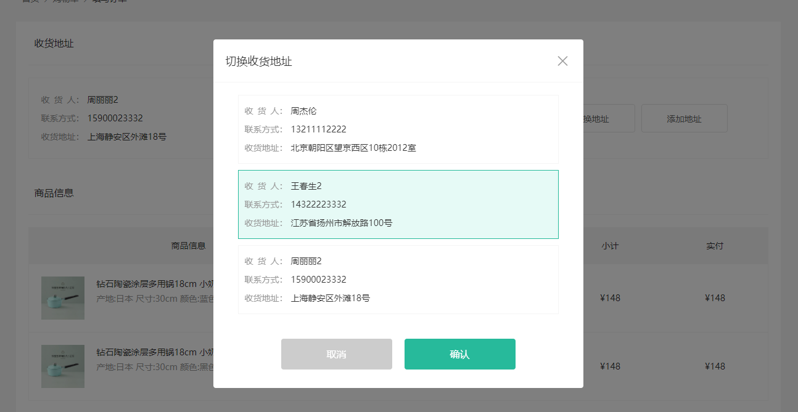
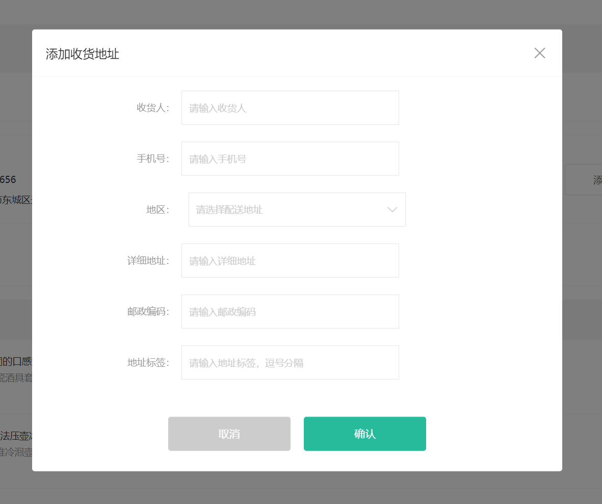

# 结算页功能实现

## 路由和组件

`任务目标:` 完成结算页路由和组件

1）定义组件基础结构 `src/views/Settlement.vue` 

```html
<template>
  <div class="xtx-pay-checkout-page">
    <div class="container">
      <XtxBread>
        <XtxBreadItem to="/">首页</XtxBreadItem>
        <XtxBreadItem to="/cart">购物车</XtxBreadItem>
        <XtxBreadItem >填写订单</XtxBreadItem>
      </XtxBread>
      <div class="wrapper">
        <!-- 收货地址 -->
        <h3 class="box-title">收货地址</h3>
        <div class="box-body">
          <div class="address">
            <div class="text">
              <!-- <div class="none">您需要先添加收货地址才可提交订单。</div> -->
              <ul>
                <li><span>收<i/>货<i/>人：</span>朱超</li>
                <li><span>联系方式：</span>132****2222</li>
                <li><span>收货地址：</span>海南省三亚市解放路108号物质大厦1003室</li>
              </ul>
            </div>
            <div class="action">
              <XtxButton class="btn">切换地址</XtxButton>
              <XtxButton class="btn">添加地址</XtxButton>
            </div>
          </div>
        </div>
        <!-- 商品信息 -->
        <h3 class="box-title">商品信息</h3>
        <div class="box-body">
          <table class="goods">
            <thead>
              <tr>
                <th width="520">商品信息</th>
                <th width="170">单价</th>
                <th width="170">数量</th>
                <th width="170">小计</th>
                <th width="170">实付</th>
              </tr>
            </thead>
            <tbody>
              <tr v-for="i in 4" :key="i">
                <td>
                  <a href="javascript:;" class="info">
                    
                    <div class="right">
                      <p>轻巧多用锅雪平锅 麦饭石不粘小奶锅煮锅</p>
                      <p>颜色：白色 尺寸：10cm 产地：日本</p>
                    </div>
                  </a>
                </td>
                <td>&yen;100.00</td>
                <td>2</td>
                <td>&yen;200.00</td>
                <td>&yen;200.00</td>
              </tr>
            </tbody>
          </table>
        </div>
        <!-- 配送时间 -->
        <h3 class="box-title">配送时间</h3>
        <div class="box-body">
          <a class="my-btn active" href="javascript:;">不限送货时间：周一至周日</a>
          <a class="my-btn" href="javascript:;">工作日送货：周一至周五</a>
          <a class="my-btn" href="javascript:;">双休日、假日送货：周六至周日</a>
        </div>
        <!-- 支付方式 -->
         <h3 class="box-title">支付方式</h3>
        <div class="box-body">
          <a class="my-btn active" href="javascript:;">在线支付</a>
          <a class="my-btn" href="javascript:;">货到付款</a>
          <span style="color:#999">货到付款需付5元手续费</span>
        </div>
        <!-- 金额明细 -->
        <h3 class="box-title">金额明细</h3>
        <div class="box-body">
          <div class="total">
            <dl><dt>商品件数：</dt><dd>5件</dd></dl>
            <dl><dt>商品总价：</dt><dd>¥5697.00</dd></dl>
            <dl><dt>运<i></i>费：</dt><dd>¥0.00</dd></dl>
            <dl><dt>应付总额：</dt><dd class="price">¥5697.00</dd></dl>
          </div>
        </div>
        <!-- 提交订单 -->
        <div class="submit">
          <XtxButton type="primary">提交订单</XtxButton>
        </div>
      </div>
    </div>
  </div>
</template>
<script>
export default {
  name: 'XtxPayCheckoutPage'
}
</script>
<style scoped lang="less">
.xtx-pay-checkout-page {
  .wrapper {
    background: #fff;
    padding: 0 20px;
    .box-title {
      font-size: 16px;
      font-weight: normal;
      padding-left: 10px;
      line-height: 70px;
      border-bottom: 1px solid #f5f5f5;
    }
    .box-body {
      padding: 20px 0;
    }
  }
}
.address {
  border: 1px solid #f5f5f5;
  display: flex;
  align-items: center;
  .text {
    flex: 1;
    min-height: 90px;
    display: flex;
    align-items: center;
    .none {
      line-height: 90px;
      color: #999;
      text-align: center;
      width: 100%;  
    }
    > ul {
      flex: 1;
      padding: 20px;
      li {
        line-height: 30px;
        span {
          color: #999;
          margin-right: 5px;
          > i {
            width: 0.5em;
            display: inline-block;
          }
        }
      }
    }
    > a {
      color: @xtxColor;
      width: 160px;
      text-align: center;
      height: 90px;
      line-height: 90px;
      border-right: 1px solid #f5f5f5;
    }
  }
  .action {
    width: 420px;
    text-align: center;
    .btn {
      width: 140px;
      height: 46px;
      line-height: 44px;
      font-size: 14px;
      &:first-child {
        margin-right: 10px;
      }
    }
  }
}
.goods {
  width: 100%;
  border-collapse: collapse;
  border-spacing: 0;
  .info {
    display: flex;
    text-align: left;
    img {
      width: 70px;
      height: 70px;
      margin-right: 20px;
    }
    .right {
      line-height: 24px;
      p {
        &:last-child {
          color: #999;
        }
      }
    }
  }
  tr {
    th {
      background: #f5f5f5;
      font-weight: normal;
    }
    td,th {
      text-align: center;
      padding: 20px;
      border-bottom: 1px solid #f5f5f5;
      &:first-child {
        border-left: 1px solid #f5f5f5;
      }
      &:last-child {
        border-right: 1px solid #f5f5f5;
      }
    }
  }
}
.my-btn {
  width: 228px;
  height: 50px;
  border: 1px solid #e4e4e4;
  text-align: center;
  line-height: 48px;
  margin-right: 25px;
  color: #666666;
  display: inline-block;
  &.active,&:hover {
    border-color: @xtxColor;
  }
}
.total {
  dl {
    display: flex;
    justify-content: flex-end;
    line-height: 50px;
    dt {
      i {
        display: inline-block;
        width: 2em;
      }
    }
    dd {
      width: 240px;
      text-align: right;
      padding-right: 70px;
      &.price {
        font-size: 20px;
        color: @priceColor;
      }
    }
  }
}
.submit {
  text-align: right;
  padding: 60px;
  border-top: 1px solid #f5f5f5;
}
</style>
```

2）配置路由表 `src/router/index.js`

> 二级路由

```js
const Settlement = () => import('@/views/Settlement')
{
	path: '/settlement',
	component: Settlement
}
```

## 接口数据渲染

`任务目标:` 使用接口数据渲染结算页

**实现步骤**

1. 定义获取结算信息API接口
2. 页面组件获取数据，传入地址组件，渲染页面内容
3. 渲染地址组件

**代码落地**

1）定义接口`src/api/order.js` 

```js
import request from '@/utils/request'

/**
 * 获取结算信息
 */
export const findCheckoutInfo = () => {
  return request('/member/order/pre', 'get')
}
```

2）组件获取数据

```js
import { findCheckoutInfo } from '@/api/order'
export default {
  name: 'XtxPayCheckoutPage',
  setup () {
    // 获取订单信息
    const checkoutInfo = ref(null)
    async function loadCheckoutInfo () {
      const res = await findCheckoutInfo()
      checkoutInfo.value = res.result
    }
    onMounted(() => {
      loadCheckoutInfo()
    })

    return { checkoutInfo}
  }
}
```

3）渲染页面

```html
<!--商品信息 -->
<tbody>
  <tr v-for="item in checkoutInfo.goods" :key="item.id">
    <td>
      <a href="javascript:;" class="info">
        
        <div class="right">
          <p>{{item.name}}</p>
          <p>{{item.attrsText}}</p>
        </div>
      </a>
    </td>
    <td>&yen;{{item.payPrice}}</td>
    <td>{{item.count}}</td>
    <td>&yen;{{item.totalPrice}}</td>
    <td>&yen;{{item.totalPayPrice}}</td>
  </tr>
</tbody>
<!-- 金额明细 -->    
<div class="box-body">
    <div class="total">
    <dl><dt>商品件数：</dt><dd>{{checkoutInfo.summary.goodsCount}}件</dd></dl>
    <dl><dt>商品总价：</dt><dd>¥{{checkoutInfo.summary.totalPrice}}</dd></dl>
    <dl><dt>运<i></i>费：</dt><dd>¥{{checkoutInfo.summary.postFee}}</dd></dl>
    <dl><dt>应付总额：</dt><dd class="price">¥{{checkoutInfo.summary.totalPayPrice}}</dd></dl>
  </div>
</div>
```

4）渲染收货地址 

> 收货地址字段比较特殊一些，一个用户可能有多个地址，也有可能随时切换收获地址，所以我们单独设置一个响应式数据用来渲染收获地址

```jsx
<div v-if="!curAddress" class="none">
	您需要先添加收货地址才可提交订单
</div>
<ul v-if="curAddress">
<li>
  <span>收<i />货<i />人：</span>{{ curAddress.receiver }}
</li>
<li><span>联系方式：</span>{{ curAddress.contact }}</li>
<li>
  <span>收货地址：</span
  >{{ curAddress.fullLocation + curAddress.address }}
</li>
</ul>

async function loadCheckoutInfo () {
  const res = await findCheckoutInfo()
  checkoutInfo.value = res.result
  curAddress.value = checkoutInfo.value.userAddresses[0]
}
```

## 对话框组件封装

`任务目标:`  完成对话框组件的封装（设置标题，动态插入内容，动态插入底部操作按钮，打开关闭功能）


### 1. 定义一个基础布局

`src/components/Dialog.vue` 定义组件

```vue
<template>
  <div class="xtx-dialog" :class="{fade}">
    <div class="wrapper" :class="{fade}">
      <div class="header">
        <h3>切换收货地址</h3>
        <a href="JavaScript:;" class="iconfont icon-close-new"></a>
      </div>
      <div class="body">
        对话框内容
      </div>
      <div class="footer">
        <XtxButton type="gray" style="margin-right:20px">取消</XtxButton>
        <XtxButton type="primary">确认</XtxButton>
      </div>
    </div>
  </div>
</template>
<script>
import { ref, onMounted } from 'vue'
export default {
  name: 'XtxDialog',
  setup () {
    const fade = ref(false)
    onMounted(() => {
      // 结构和样式同时加上无过度效果，需要些延时。
      setTimeout(() => {
        fade.value = true
      }, 0)
    })
    return { fade }
  }
}
</script>
<style scoped lang="less">
.xtx-dialog {
  position: fixed;
  left: 0;
  top: 0;
  width: 100%;
  height: 100%;
  z-index: 8887;
  background: rgba(0,0,0,0);
  &.fade {
    transition: all 0.4s;
    background: rgba(0,0,0,.5);
  }
  .wrapper {
    width: 600px;
    background: #fff;
    border-radius: 4px;
    position: absolute;
    top: 50%;
    left: 50%;
    transform: translate(-50%,-60%);
    opacity: 0;
    &.fade {
      transition: all 0.4s;
      transform: translate(-50%,-50%);
      opacity: 1;
    }
    .body {
      padding: 20px 40px;
      font-size: 16px;
      .icon-warning {
        color: @priceColor;
        margin-right: 3px;
        font-size: 16px;
      }
    }
    .footer {
      text-align: center;
      padding: 10px 0 30px 0;
    }
    .header {
      position: relative;
      height: 70px;
      line-height: 70px;
      padding: 0 20px;
      border-bottom: 1px solid #f5f5f5;
      h3 {
        font-weight: normal;
        font-size: 18px;
      }
      a {
        position: absolute;
        right: 25px;
        top: 25px;
        font-size: 24px;
        width: 20px;
        height: 20px;
        line-height: 20px;
        text-align: center;
        color: #999;
        &:hover {
          color: #666;
        }
      }
    }
  }
}
</style>
```

### 2. 实现设置标题

1）定义 prop

`src/components/Dialog.vue` 

```jsx
props: {
    title: {
      type: String,
      default: ''
    }
}
<div class="header">
    <h3>{{title}}</h3>
    <a href="JavaScript:;" class="iconfont icon-close-new"></a>
</div>
```

 2）使用组件title

`src/views/playground/index.vue`

```vue
<XtxDialog title="切换收货地址" />
```

### 3. 实现插入内容

1）增加插槽占位 

`src/components/Dialog.vue` 

```html
<div class="body">
    <slot />
</div>
```

2）使用插槽功能 

`src/views/playground/index.vue`

```vue
<XtxDialog title="切换收货地址" >
  对话框内容
</XtxDialog>
```

### 4. 实现插入底部操作按钮

1）增加具名插槽占位 

`src/components/Dialog.vue` 

```html
<div class="footer">
	<slot name="footer" />
</div>
```

2）使用具体插槽加入操作按钮

`src/views/playground/index.vue`

```vue
<XtxDialog title="切换收货地址">
  对话框内容
  <!-- vue3.0 仅支持v-slot+template写法 -->  
  <template v-slot:footer>
    <XtxButton type="gray" style="margin-right:20px">取消</XtxButton>
    <XtxButton type="primary">确认</XtxButton>
  </template>
</XtxDialog>
```

### 5. 实现打开关闭功能

> 使用方式：`<XtxDialog v-model:visible="visible"></XtxDialog>`
>
> 说明：
>
> 1. visible数据为true时，弹框展示，为false时弹框消失
> 2. v-model:visible 相当于给Dialog组件传入一个名称为`visible`的属性和一个名称为`updae:visible` 的事件

```html
<template>
  <div class="xtx-dialog" :class="{fade}" v-if="visible">
    <div class="wrapper" :class="{fade}">
      <div class="header">
        <!-- 标题区域 prop -->
        <h3>{{title}}</h3>
        <!-- 小叉号 -->
        <a href="JavaScript:;" class="iconfont icon-close-new" @click="close"></a>
      </div>
      <!-- 主要内容区域 slot -->
      <div class="body">
        <slot/>
      </div>
      <!-- 操作按钮 slot 具名 footer-->
      <div class="footer">
        <slot name="footer"/>
      </div>
    </div>
  </div>
</template>
<script>
import { ref, onMounted } from 'vue'
export default {
  name: 'XtxDialog',
  props: {
    title: {
      type: String
    },
    visible: {
      type: Boolean
    }
  },
  setup (props, { emit }) {
    // 控制动画显示
    const fade = ref(false)
    onMounted(() => {
      setTimeout(() => {
        fade.value = true
      }, 0)
    })
    // 弹框关闭
    function close () {
      // 关闭弹框 修改父组件传下来的visible
      emit('update:visible', false)
    }
    return { fade, close }
  }
}
</script>
```

## 收货地址 - 切换

`任务目标:`  能够切换当前显示的地址

> 测试账号 zhousg  123456  该账号下有多个收货地址



**实现步骤**

1. 对话框中渲染一个地址列表
2. 实现可以选中的效果，点击确认后变更显示地址

**代码落地**

1）渲染地址列表

```html
<XtxDialog title="切换收获地址" v-model:visible="visible">
    <div class="addressWrapper">
      <div class="text item" v-for="item in addressList" :key="item.id">
        <ul>
          <li>
            <span>收<i />货<i />人：</span>{{ item.receiver }}
          </li>
          <li><span>联系方式：</span>{{ item.contact }}</li>
          <li><span>收货地址：</span>{{ item.fullLocation + item.address }}</li>
        </ul>
      </div>
    </div>
    <template v-slot:footer>
      <XtxButton type="gray" style="margin-right: 20px" @click="visible = false"
        >取消</XtxButton
      >
      <XtxButton type="primary" @click="visible = false">确认</XtxButton>
    </template>
</XtxDialog>
<script>
    // 收获地址list
    const addressList = ref([])
    async function loadCheckoutInfo () {
      const res = await findCheckoutInfo()
      checkoutInfo.value = res.result
      // 赋值列表
      addressList.value = checkoutInfo.value.userAddresses
    }
</script>
<style>
.xtx-dialog {
  .addressWrapper {
    max-height: 500px;
    overflow-y: auto;
  }
  .text {
    flex: 1;
    min-height: 90px;
    display: flex;
    align-items: center;
    &.item {
      border: 1px solid #f5f5f5;
      margin-bottom: 10px;
      cursor: pointer;
      &.active,
      &:hover {
        border-color: @xtxColor;
        background: lighten(@xtxColor, 50%);
      }
      > ul {
        padding: 10px;
        font-size: 14px;
        line-height: 30px;
      }
    }
  }
}
</style></style>
```

2）实现选中交互效果

```jsx
// 当前选中项目
const selectedAddress = ref({})
// 通过id判断active类名是否存在
<div class="text item"
    v-for="item in addressList"
    :key="item.id"
    @click="selectedAddress = item"
    :class="{active:selectedAddress.id === item.id}"
    >
</div>
```

3）确定按钮之后修改地址

```jsx
function confirmChange () {
  // 确定按钮点击之后把当前选择的赋值给curAddress
  curAddress.value = selectedAddress.value
  visible.value = false
}
function cancelChange () {
  // 清空当前激活的地址
  selectedAddress.value = {}
  visible.value = false
}

<template v-slot:footer>
  <XtxButton type="gray" style="margin-right: 20px" @click="cancelChange"
    >取消</XtxButton
  >
  <XtxButton type="primary" @click="confirmChange">确认</XtxButton>
</template>
```

## 收货地址 - 添加

> 当用户账户下还没有收货地址的情况下，我们支持他进行收货地址的添加操作

`任务目标:`  实现收货地址的添加操作



**实现思路**

1. 完成表单布局
2. 完成确认添加操作

**代码落地**

1）准备添加功能弹框

```html
<!-- 弹框布局 -->
<XtxDialog title="添加收货地址" v-model:visible="addVisible">
    <div class="address-edit">
      <div class="xtx-form">
        <div class="xtx-form-item">
          <div class="label">收货人：</div>
          <div class="field">
            <input class="input" placeholder="请输入收货人" />
          </div>
        </div>
        <div class="xtx-form-item">
          <div class="label">手机号：</div>
          <div class="field">
            <input class="input" placeholder="请输入手机号" />
          </div>
        </div>
        <div class="xtx-form-item">
          <div class="label">地区：</div>
          <div class="field">
            <XtxCity placeholder="请选择所在地区" />
          </div>
        </div>
        <div class="xtx-form-item">
          <div class="label">详细地址：</div>
          <div class="field">
            <input class="input" placeholder="请输入详细地址" />
          </div>
        </div>
        <div class="xtx-form-item">
          <div class="label">邮政编码：</div>
          <div class="field">
            <input class="input" placeholder="请输入邮政编码" />
          </div>
        </div>
        <div class="xtx-form-item">
          <div class="label">地址标签：</div>
          <div class="field">
            <input class="input" placeholder="请输入地址标签，逗号分隔" />
          </div>
        </div>
      </div>
    </div>
    <template v-slot:footer>
      <XtxButton type="gray" style="margin-right: 20px">取消</XtxButton>
      <XtxButton type="primary">确认</XtxButton>
    </template>
  </XtxDialog>

<!-- 准备控制弹框展示的响应式数据 -->
<script>
  export default {
      setup(){
         const addVisible = ref(false)
      }
  }
</script>

<!-- 点击按钮打开弹框 -->
<XtxButton class="btn" @click="addVisible = true">添加地址</XtxButton>
```

2）实现表单数据和双向绑定

```jsx
 // 表单数据
const formData = reactive({
  receiver: '',
  contact: '',
  provinceCode: '',
  cityCode: '',
  countyCode: '',
  address: '',
  postalCode: '',
  addressTags: '',
  isDefault: 0,
  fullLocation: ''
})
// 选择地区
const changeCty = (data) => {
  formData.provinceCode = data.provinceCode
  formData.cityCode = data.cityCode
  formData.countyCode = data.countyCode
  formData.fullLocation = data.fullLocation
}

// 模板双向绑定
<input v-model="formData.receiver" class="input" placeholder="请输入收货人" />
<input v-model="formData.contact" class="input" placeholder="请输入手机号" />
<XtxCity placeholder="请选择所在地区"  @change="changeCty"/>
<input  v-model="formData.address" class="input" placeholder="请输入详细地址" />
<input  v-model="formData.postalCode" class="input" placeholder="请输入邮政编码" />
<input v-model="formData.addressTags" class="input" placeholder="请输入地址标签，逗号分隔" />
```

3）准备新增接口函数`src/api/order.js` 

```js
/**
 * 添加收货地址信息
 * @param {Object} address - 地址对象
 */
export const addAddress = (address) => {
  return request('/member/address', 'post', address)
}
```

4）调用接口完成新增

```js
// 提交操作
async function submit () {
  const res = await addAddress(formData)
  Message({type:'success',text:'新增地址成功'})
  // 关闭弹框
  addVisible.value = false
  // 重新拉取数据
  loadCheckoutInfo()
}
```

## 提交订单

`任务目标:`  汇总提交订单需要的数据，进行提交

**实现步骤**

1. 定义需要提交的数据对象
2. 绑定提交订单点击事件，进行提交即可
3. 提交成功之后 跳转到支付页
4. 重新拉取一下购物车列表

**代码落地**

1）准备接口

```js
/**
 * 提交订单
 * @param {Object} order - 订单信息对象
 *  deliveryTimeType: 1,
 *  payType: 1,
 *  buyerMessage: '',
 *  addressId: null, // 地址id
 *  goods: [] // { skuId, count } 由所有商品的skuId 和 count字段组成的数组
 */
export const createOrder = (order) => {
  return request('/member/order', 'post', order)
}
```

2）准备数据处理数据提交接口

```js
// 提交订单
// 需要提交的字段
const reqParams = reactive({
  deliveryTimeType: 1,
  payType: 1,
  buyerMessage: '',
  addressId: null, // 地址id
  goods: [] // {skuId, count}
})
function submitOrder () {
  // 处理参数
  reqParams.addressId = curAddress.value.id
  reqParams.goods = checkoutInfo.value.goods.map(item => {
    return {
      skuId: item.skuId,
      count: item.count
    }
  })
  // 调用接口
  const router = useRouter()
  createOrder(reqParams).then(res => {
    router.push({ path: '/pay', query: { id: res.data.result.id } })
  })
}
```

3）重新拉取购物车列表

```js
createOrder(reqParams).then(res => {
    router.push({ path: '/pay', query: { id: res.data.result.id } })
    // 更新购物车防止重复点击
    findCartList().then((res) => {
      store.commit('cart/setList', res.data.result)
    })
})
```


到此，我们就i完成了结算页面的所有核心功能，接下来我们就可以进行正式的支付环节了

# 支付页功能实现

## 路由和组件

`任务目标:` 完成支付页路由和组件


1）准备组件

`views/pay/index.vue`

```html
<template>
  <div class="xtx-pay-page">
    <div class="container">
      <XtxBread>
        <XtxBreadItem to="/">首页</XtxBreadItem>
        <XtxBreadItem to="/cart">购物车</XtxBreadItem>
        <XtxBreadItem>支付订单</XtxBreadItem>
      </XtxBread>
      <!-- 付款信息 -->
      <div class="pay-info">
        <span class="icon iconfont icon-queren2"></span>
        <div class="tip">
          <p>订单提交成功！请尽快完成支付。</p>
          <p>支付还剩 <span>24分59秒</span>, 超时后将取消订单</p>
        </div>
        <div class="amount">
          <span>应付总额：</span>
          <span>¥5673.00</span>
        </div>
      </div>
      <!-- 付款方式 -->
      <div class="pay-type">
        <p class="head">选择以下支付方式付款</p>
        <div class="item">
          <p>支付平台</p>
          <a class="btn wx" href="javascript:;"></a>
          <a class="btn alipay" href="javascript:;"></a>
        </div>
        <div class="item">
          <p>支付方式</p>
          <a class="btn" href="javascript:;">招商银行</a>
          <a class="btn" href="javascript:;">工商银行</a>
          <a class="btn" href="javascript:;">建设银行</a>
          <a class="btn" href="javascript:;">农业银行</a>
          <a class="btn" href="javascript:;">交通银行</a>
        </div>
      </div>
    </div>
  </div>
</template>
<script>
export default {
  name: 'XtxPayPage'
}
</script>
<style scoped lang="less">
.pay-info {
  background: #fff;
  display: flex;
  align-items: center;
  height: 240px;
  padding: 0 80px;
  .icon {
    font-size: 80px;
    color: #1dc779;
  }
  .tip {
    padding-left: 10px;
    flex: 1;
    p {
      &:first-child {
        font-size: 20px;
        margin-bottom: 5px;
      }
      &:last-child {
        color: #999;
        font-size: 16px;
      }
    }
  }
  .amount {
    span {
      &:first-child {
        font-size: 16px;
        color: #999;
      }
      &:last-child {
        color: @priceColor;
        font-size: 20px;
      }
    }
  }
}
.pay-type {
  margin-top: 20px;
  background-color: #fff;
  padding-bottom: 70px;
  p {
    line-height: 70px;
    height: 70px;
    padding-left: 30px;
    font-size: 16px;
    &.head {
      border-bottom: 1px solid #f5f5f5;
    }
  }
  .btn {
    width: 150px;
    height: 50px;
    border: 1px solid #e4e4e4;
    text-align: center;
    line-height: 48px;
    margin-left: 30px;
    color: #666666;
    display: inline-block;
    &.active,
    &:hover {
      border-color: @xtxColor;
    }
    &.alipay {
      background: url(https://cdn.cnbj1.fds.api.mi-img.com/mi-mall/7b6b02396368c9314528c0bbd85a2e06.png) no-repeat center / contain;
    }
    &.wx {
      background: url(https://cdn.cnbj1.fds.api.mi-img.com/mi-mall/c66f98cff8649bd5ba722c2e8067c6ca.jpg) no-repeat center / contain;
    }
  }
}
</style>
```

2）配置路由

```js
const Pay = () => import('@/views/Pay')
{ path: '/pay', component: Pay }
```

## 真实数据渲染

`任务目标:` 渲染真实支付数据

**实现步骤**

1. 准备API接口函数获取订单详情
2. 在组件获取数据渲染
3. 完成倒计时效果

**代码落地**

1）准备API接口函数获取订单详情 `src/api/order.js`

```js
/**
 * 获取订单详情
 * @param {String} id - 订单ID
 */
export const findOrder = (id) => {
  return request('/member/order/' + id, 'get')
}
```

2）在组件获取数据渲染 `src/views/Pay/index.vue`

```html
<script>
import { onMounted, ref } from 'vue'
import { findOrder } from '@/api/order'
import { useRoute } from 'vue-router'
export default {
  name: 'XtxPayPage',
  setup () {
    // 订单
    const order = ref(null)
    // 路由信息
    const route = useRoute()
    // 查询订单
    async function loadOrder () {
      const res = await findOrder(route.query.id)
      order.value = res.data.result
    }
    onMounted(() => {
      loadOrder()
    })
    return { order }
  }
}
</script>
```

3）完成倒计时效果

```js
import dayjs from 'dayjs'
export function useCountDown () {
  // 准备时间数据
  const countTime = ref(0) // 60 ->  16分24秒 dayjs   dayjs.unix(毫秒数)
  // 计算属性基于现在的countTime做一个转换处理
  const countTimeText = computed(() => {
    // 完成转换逻辑
    return dayjs.unix(countTime.value).format('mm分ss秒')
  })
  // 开始计时函数
  // resume -> 开始执行逻辑  pause -> 暂停执行逻辑
  const { resume, pause } = useIntervalFn(() => {
    /* your function */
    // 拿到传下来的time 然后执行--逻辑
    if (countTime.value <= 0) {
      pause()
    } else {
      countTime.value--
    }
  }, 1000, false)

  // 清理一下定时器
  // 组件的卸载之后
  onUnmounted(() => {
    pause()
  })

  function start (time) {
    countTime.value = time
    resume()
  }
  return {
    countTime,
    start,
    countTimeText,
    pause
  }
}

```

```js
const { countTimeText, start, countTime } = useCountDown()
async function loadOrderInfo () {
  const res = await findOrder(route.query.orderId)
  orderInfo.value = res.data.result
  // 真理开启倒计时
  start(dayjs(orderInfo.value.countdown))
}
```


## 理解支付流程

`任务目标:` 了解支付的前后端业务流程


1. PC前台点击支付按钮，新开标签页打开后台提供的支付链接带上`订单ID和回跳地址`
2. 后台服务发起支付，等待支付结果，修改订单状态，回跳PC前台结果页
3. PC前台在结果页获取回跳URL参数订单ID查询支付状态，展示支付结果

**支付宝回跳地址（根据当前业务制定）**

```yaml
http://www.corho.com:8080/#/pay/callback
```

**测试支付**

如果使用客户端需要下载 `沙箱支付宝` 开放平台扫码下载

```text
买家账号: jfjbwb4477@sandbox.com
登录密码: 111111
支付密码: 111111
```

## 跳转支付

`任务目标:` 携带关键参数进行支付操作

**关键参数**

1. 订单id  orderId
2. 回跳地址  redirect

`src/views/Pay/index.vue`

```js
// 支付地址
// const payUrl = '后台服务基准地址+支付页面地址+订单ID+回跳地址'
const baseURL = 'http://pcapi-xiaotuxian-front-devtest.itheima.net/'
const redirect = encodeURIComponent('http://www.corho.com:8080/#/pay/callback')
const payUrl = `${baseURL}pay/aliPay?orderId=${route.query.id}&redirect=${redirect}`

return { order, payUrl }
```

## 支付结果展示

`任务目标:` 对支付完的结果进行展示


**实现步骤**

1. 准备一个基础页面
2. 根据地址订单ID查询订单状态进行展示，或者是地址栏支付结果

**代码落地**

1）准备结果页面

`views/views/Pay/callback.vue`

```vue
<template>
  <div class="xtx-pay-page">
    <div class="container">
      <XtxBread>
        <XtxBreadItem to="/">首页</XtxBreadItem>
        <XtxBreadItem to="/cart">购物车</XtxBreadItem>
        <XtxBreadItem>支付结果</XtxBreadItem>
      </XtxBread>
      <!-- 支付结果 -->
      <div class="pay-result">
        <span class="iconfont icon-queren2 green"></span>
        <!-- <span class="iconfont icon-shanchu red" ></span> -->
        <p class="tit">订单支付成功</p>
        <p class="tip">我们将尽快为您发货，收货期间请保持手机畅通</p>
        <p>支付方式：<span>微信支付</span></p>
        <p>支付金额：<span>¥1899.00</span></p>
        <div class="btn">
          <XtxButton type="primary" style="margin-right:20px">查看订单</XtxButton>
          <XtxButton type="gray">进入首页</XtxButton>
        </div>
        <p class="alert">
          <span class="iconfont icon-tip"></span>
          温馨提示：小兔鲜儿不会以订单异常、系统升级为由要求您点击任何网址链接进行退款操作，保护资产、谨慎操作。
        </p>
      </div>
    </div>
  </div>
</template>
<script>
export default {
  name: 'XtxPayResultPage'
}
</script>
<style scoped lang="less">
.pay-result {
  padding: 100px 0;
  background: #fff;
  text-align: center;
  > .iconfont {
    font-size: 100px;
  }
  .green {
    color: #1dc779;
  }
  .red {
    color: @priceColor;
  }
  .tit {
    font-size: 24px;
  }
  .tip {
    color: #999;
  }
  p {
    line-height: 40px;
    font-size: 16px;
  }
  .btn {
    margin-top: 50px;
  }
  .alert {
    font-size: 12px;
    color: #999;
    margin-top: 50px;
  }
}
</style>
```

2）准备接口

```js
/**
 * 获取订单详细
 * @param {String} orderId - 订单ID
 * @returns
 */
export const findOrderDetail = (orderId) => {
  return request('/member/order/' + orderId, 'get')
}
```

3）根据地址订单ID查询订单状态进行展示

```vue
<template>
  <div class="xtx-pay-page">
    <div class="container">
      <XtxBread>
        <XtxBreadItem to="/">首页</XtxBreadItem>
        <XtxBreadItem to="/cart">购物车</XtxBreadItem>
        <XtxBreadItem>支付结果</XtxBreadItem>
      </XtxBread>
      <!-- 支付结果 -->
      <div class="pay-result">
        <span class="iconfont icon-queren2 green" v-if="$route.query.payResult"></span>
        <span class="iconfont icon-shanchu red" v-else></span>
        <p class="tit">{{$route.query.payResult?'支付成功':'支付失败'}}</p>
        <p class="tip">我们将尽快为您发货，收货期间请保持手机畅通</p>
        <p>支付方式：<span>支付宝</span></p>
        <p>支付金额：<span>¥{{payResultInfo.payMoney}}</span></p>
        <div class="btn">
          <XtxButton type="primary" style="margin-right:20px">查看订单</XtxButton>
          <XtxButton type="gray">进入首页</XtxButton>
        </div>
        <p class="alert">
          <span class="iconfont icon-tip"></span>
          温馨提示：小兔鲜儿不会以订单异常、系统升级为由要求您点击任何网址链接进行退款操作，保护资产、谨慎操作。
        </p>
      </div>
    </div>
  </div>
</template>
<script>
import { findOrderDetail } from '@/api/order'
import { onMounted, ref } from 'vue'
import { useRoute } from 'vue-router'
export default {
  name: 'XtxPayResultPage',
  setup () {
    const payResultInfo = ref({})
    const route = useRoute()
    async function loadInfo () {
      const res = await findOrderDetail(route.query.orderId)
      payResultInfo.value = res.data.result
    }
    onMounted(() => {
      loadInfo()
    })
    return {
      payResultInfo
    }
  }
}
</script>
<style scoped lang="less">
.pay-result {
  padding: 100px 0;
  background: #fff;
  text-align: center;
  > .iconfont {
    font-size: 100px;
  }
  .green {
    color: #1dc779;
  }
  .red {
    color: @priceColor;
  }
  .tit {
    font-size: 24px;
  }
  .tip {
    color: #999;
  }
  p {
    line-height: 40px;
    font-size: 16px;
  }
  .btn {
    margin-top: 50px;
  }
  .alert {
    font-size: 12px;
    color: #999;
    margin-top: 50px;
  }
}
</style>
```

